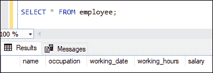

# SQL Server 截断表

> 原文：<https://www.javatpoint.com/sql-server-truncate-table>

SQL Server 中的 TRUNCATE TABLE 语句是一个 DDL(数据定义语言)命令。该语句用于**从表或指定分区中移除所有行，而不移除表结构**。它类似于 DELETE 命令，但是它不允许过滤表记录，因为我们不能在这个命令中使用 **WHERE** 子句。然而，在时间和资源使用方面，TRUNCATE 比 DELETE 快得多。

该命令在删除表中的数据时释放数据页。这类似于再次删除并重新创建表。与 DELETE 语句不同，它只记录页面解除分配，而不是逐行记录在事务日志中。

**在使用 TRUNCATE 命令时，我们应该考虑以下几点:**

*   它不支持 WHERE 子句，因此无法过滤记录。
*   它不维护操作日志，因此我们无法在执行此命令后回滚已删除的数据。
*   当表被外键引用或参与索引视图时，不能使用它。
*   从删除命令开始，它不能触发删除触发器。因此，当系统需要触发删除触发器时，我们不能使用这个命令。

### 句法

以下语法解释了从表中删除数据的 TRUNCATE 命令:

```

TRUNCATE TABLE schema_name.table_name

```

这里 **schema_name** 表示存储表的模式的名称。这是一个可选参数。**表名**是将从中截断数据的表的名称。

如果我们想在一条语句中截断多个表，我们需要为每个表分别执行一条 truncate 语句。

### 截断表格示例

让我们通过一个例子来演示如何截断表。首先，我们将通过执行以下命令创建一个“**员工**”表:

```

CREATE TABLE employee(  
    name varchar(45) NOT NULL,    
    occupation varchar(35) NOT NULL,    
    working_date date,  
    working_hours varchar(10),
    salary INT
);

```

接下来，我们将向该表中插入一些数据，如下所示:

```

INSERT INTO employee VALUES    
('Jolly Evans', 'HR', '2020-10-04', 9, 25000),  
('Brayden Simmons', 'Engineer', '2020-10-04', 12, 65000),  
('Rose Huges', 'Writer', '2020-10-04', 13, 35000),  
('Laura Paul', 'Manager', '2020-10-04', 10, 45000),  
('Diego Simmons', 'Teacher', '2020-10-04', 12, 30000),  
('Antonio Bennet', 'Writer', '2020-10-04', 13, 35000);

```

我们可以使用 SELECT 语句来验证插入的数据:


假设我们需要**删除该表的所有数据，但不想删除其结构**。在这种情况下， [SQL Server](https://www.javatpoint.com/sql-server-tutorial) 提供如下截断表语句:

```

TRUNCATE TABLE employee;

```

通过再次执行 SELECT 语句来验证数据的删除。此命令给出以下输出，显示表中没有记录的表列名:



### 如何在 SQL Server 中回滚 TRUNCATE？

我们知道，我们不能在提交后回滚截断操作。但是，SQL Server 使我们能够做一些事情来获得全部数据或至少部分数据。这是由于数据在执行截断操作后仍然存储在 **MDF 文件**中。我们无法看到此文件，因为 SQL Server 将此文件用作可用空间。

我们可以通过读取解除分配的数据页来获得截断的数据，并在可用空间被新数据覆盖之前将它们转换为可读数据。

SQL Server 中回滚截断数据的唯一方法是使用如下事务操作:

```

-- Create a transaction
BEGIN TRAN;
-- Truncate table
TRUNCATE TABLE employee;
-- Rollback truncate table
ROLLBACK;
SELECT * FROM employee;

```

SELECT 语句将返回截断的数据。请参见以下输出:


### 如何用外键截断表？

SQL Server 不允许对具有外键约束的表执行 TRUNCATE 操作。然而，我们有一个解决办法。但是这两种解决方案都存在丢失数据完整性的风险。

**解决方案 1:** 首先，移除约束，然后执行 TRUNCATE 操作。

**解决方案 2:** 登录数据库服务器，在 TRUNCATE 操作之前禁用外键检查，然后重新启用，如下所示:

```

SET FOREIGN_KEY_CHECKS = 0; 
TRUNCATE table $table_name; 
SET FOREIGN_KEY_CHECKS = 1;

```

### 截断表优于删除表

与删除操作相比，TRUNCATE 的主要优势如下:

**更少的事务日志空间**

DELETE 语句一次删除一行，并为事务日志中删除的每一行插入一个条目。相反，TRUNCATE 语句释放页面，从而从表中删除数据，并在事务日志中只插入页面释放。

**少用锁**

当我们使用行锁执行 DELETE 命令时，表中的每一行都会被锁定以便删除。另一方面，TRUNCATE 语句锁定的是表和页，而不是单个行。

**身份重置**

如果通过 TRUNCATE 命令删除了带有 IDENTITY 列的表数据，则该列的计数器将重置为种子值。但是，DELETE 语句不能这样做。

* * *