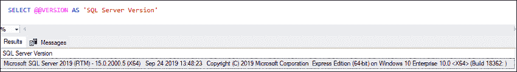
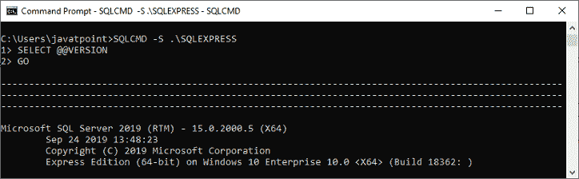
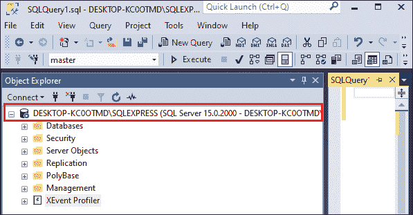
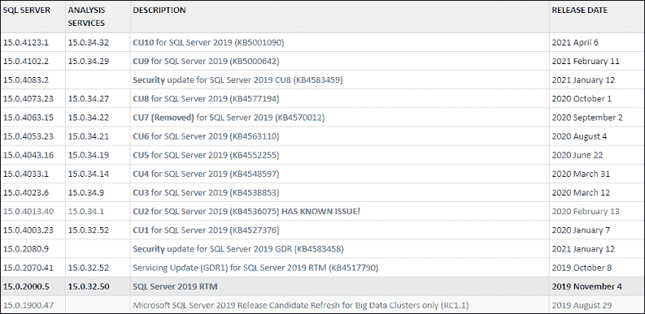
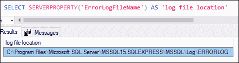
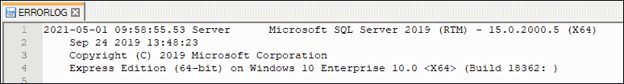
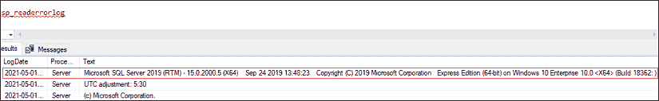
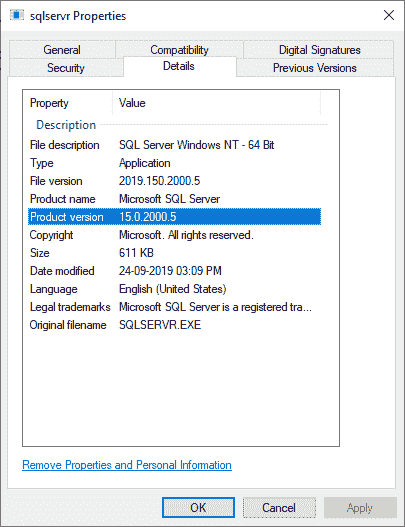

# 如何查找 SQL Server 版本

> 原文：<https://www.javatpoint.com/how-to-find-sql-server-version>

版本是不同于同一版本的其他形式的特定形式。本文将解释完整的概述，以找到在您的系统上运行的 SQL Server 版本。

**我们可以通过多种方式获取 SQL Server 版本，下面列出了其中一些:**

*   使用查询
*   使用控制台/命令提示符
*   使用 SQL Server 管理工作室
*   使用 PowerShell
*   使用日志文件
*   使用 SQL 服务器属性

让我们详细讨论每一个。

## 使用查询

这是查看我们系统上安装的 SQL Server 版本的最简单方法。我们可以使用 **@@VERSION 函数**来获取所有的 SQL Server 实例的版本详细信息。这个函数**返回一个单行字符串**输出，包含所有关于 SQL Server 的相关信息。它将在输出中显示以下信息:

*   SQL 服务器版本
*   处理器架构
*   SQL 服务器构建日期
*   版权声明
*   SQL Server 版本
*   操作系统版本

现在，我们将执行下面的查询来查看 SQL Server 的当前版本:

```

SELECT @@VERSION AS 'SQL Server Version'

```

以下是输出:



**下表将以有意义的形式解释该信息:**

| SQL 服务器版本 | Microsoft SQL Server 2019(RTM)-15 . 0 . 2000 . 5 |
| 处理器架构 | X64 |
| SQL 服务器构建日期 | 2019 年 9 月 24 日 13:48:23 |
| 版权声明 | 版权所有(三)2019 微软公司 |
| SQL Server 版本 | 快速版(64 位) |
| 操作系统版本 | Windows 10 企业版 10.0 <x64>(构建 18362:</x64> |

### 使用控制台/命令提示符

命令提示符使用窗口图形用户界面模拟基于文本的用户界面屏幕中的输入字段。它可用于运行命令和执行高级管理任务。

**我们可以使用控制台通过以下步骤找到 SQL Server 版本:**

1.  打开控制台/命令提示符(开始>搜索 **CMD** ，点击**进入**)。
2.  键入以下命令:

```

	    	SQLCMD -S servername\instancename

```

这里我们需要更改名称来代替 servername 和 instancename。

3.  键入选择@ @版本，然后单击输入。
4.  键入 **GO** 并点击**回车。**

下图显示了 cmd 屏幕上的 SQL Server 版本。我们可以在其他情况下重复这个过程。



### 使用 SQL Server 管理工作室

SSMS 是管理 SQL Server 安装的一个有价值的工具。当我们为任何一个 SQL Server 实例打开 SSMS 时，我们可以看到产品版本出现在**括号之间的对象资源管理器选项卡下。**我们可以通过这组数字来识别 SQL Server 产品版本。见下图，产品版本显示在**红色矩形框中:**



让我们把这组无意义的数字转换成有意义的产品版本。产品版本指定为 **15.0.2000** ，我们将其转换为更有意义、更有用的信息。在这组数字中，**前两位数字** ( **1** 5)表示 SQL Server 产品名称的**数字定义**。

借助下表，我们可以根据产品名称快速找到 SQL Server 版本:

| SQL Server 产品名称 | SQL Server 产品版本 |
| SQL Server 2019 | 15.0.xxxx.xx |
| SQL Server 2017 | 14.0.xxxx.xx |
| SQL Server 2016 | 13.0.xxxx.xx |
| SQL Server 2014 | 12.0.xxxx.xx |
| SQL Server 2012 | 11.0.xxxx.xx |
| 2008 | 10.5.xxxx.xx |
| SQL Server 2008 | 10.0.xxxx.xx |
| SQL Server 2005 | 9.0.xxxx.xx |
| SQL Server 2000 | 8.0.xxxx.xx |

但是，前两位数字提供了产品名称，我们可以获得关于 SQL Server 实例的更多信息。剩余的数字(0.2000)决定了**服务包**和累计升级等级的详细信息。我们可以得到更多关于剩余数字的细节；我们需要访问[建筑编号](https://buildnumbers.wordpress.com/sqlserver/)网站:



### 使用 PowerShell

PowerShell 是一个强大的跨平台工具，用于由命令行 Shell、脚本语言和简化配置组成的自动化任务。它可以自动化几乎每一个 Windows、Linux 和 macOS 活动，包括活动目录和交换。微软有两个模块的 SQL Server PowerShell，但从 17.0 版开始，这两个模块都没有安装在 SSMS 系统上:

1.  SqlServer:较新，需要 PowerShell 5.0
2.  不再被更新

通过输入以下命令，我们还可以使用 PowerShell 找到已安装的 SQL server 版本:

```

Invoke-SqlCmd -query "SELECT @@VERSION" -ServerInstance "localhost"

```

### 使用日志文件

我们还可以在 SS 错误日志文件中找到 SQL Server 版本。此文件可用于解决 SQL Server 问题，因为它记录了用户定义的事件以及特定的设备事件。它还将帮助我们获得 SQL Server 版本的详细信息。该文件的前几行提供了有关 SQL Server 版本的详细信息。

默认情况下，错误日志位于**“程序文件\微软 SQL Server \ MSSQL . n \ MSSQL \ LOG”**。但是，我们也可以选择**服务器属性功能**来获取错误日志文件的位置。我们可以使用以下查询找到错误日志文件的位置:

```

SELECT SERVERPROPERTY('ErrorLogFileName') AS 'log file location'

```

它将显示以下输出:



现在，我们可以在给定的位置打开错误日志文件。在这里，我们可以看到关于 SQL Server 构建的详细信息。



我们也可以使用存储过程 **sp_readerrorlog 读取错误日志。**其输出的第一行显示了 SQL Server 实例的详细信息:



### 使用 SQL 服务器属性

我们还可以使用 SQL server 属性方法来获取 SQL Server 版本信息。这是获取 SQL server 版本详细信息的最简单方法之一。

在这个方法中，我们需要导航到**C:\程序文件\微软 SQL Server\MSSQL12。MSSQLSERVER\MSSQL\Binn** 。现在，搜索**SQL server**可执行文件，右键单击打开上下文菜单，选择**属性**选项。我们将进入向导，点击**详细信息选项卡**查看产品版本和产品名称。



**结论**

本文将解释检查 SQL Server 版本的各种方法，并学习如何将它们转换为有意义的信息。

* * *