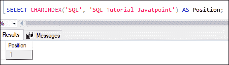
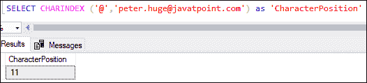
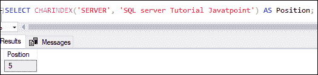
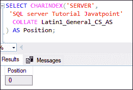
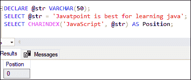
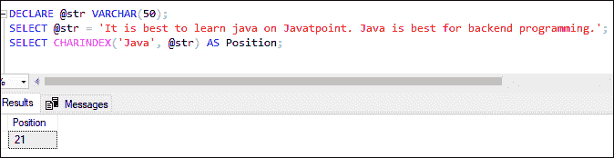
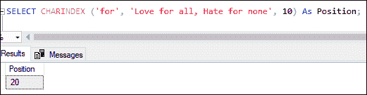

# SQL Server CHARINDEX()函数

> 原文：<https://www.javatpoint.com/sql-server-charindex-function>

SQL Server 中的 CHARINDEX 函数对于处理和操纵字符串数据非常有用。最常见的是**用来定位字符串中子串或表达式的开始位置。**简单来说，我们可以说这个函数是用来从一个指定的位置搜索字符串内部的一个或多个指定的字符。一个字符可以出现在字符串的多个位置。该函数将返回字符串中的第一个字符位置，并忽略其余匹配的字符位置。

**我们用下面的例子来理解这个函数的概念。**

招聘公司的在线门户是解释其概念的一个很好的例子。招聘公司收集每个学生或客户的详细信息，并注册他们以获得安置帮助。假设公司老板需要查看每个员工的电子邮件地址格式是否正确；在这种情况下，他们可以通过使用 CHARINDEX()函数来做到这一点。例如，他们可以验证字符' @ '是否存在于输入的邮件 id 中。

### 句法

以下是说明 SQL Server 中 CHARINDEX 函数的基本语法:

```sql

CHARINDEX ( expression_to_find , expression_to_search [ , starting_position  ] )

```

我们可以在 CHARINDEX 函数中看到以下参数:

**expression_to_find:** 它是定义一个字符或字符串的必需参数，我们将在另一个字符串中找到它。

**expression_to_search:** 是必选参数，表示我们要在其中搜索子串的字符串或表达式。

**start _ position:**这是一个可选参数，取整数值指定搜索字符串的起始位置。如果我们想在给定的字符串中搜索子字符串，我们需要指定一个起始位置。但是，如果我们不为此参数指定值，默认情况下，它将在索引位置 0 开始搜索。如果我们用零或负值指定字符串，这个函数也将从开始搜索字符串。

### 返回

*   此函数返回给定表达式或字符串中子字符串的位置。
*   如果字符串中不包含子字符串，函数将返回 0。

### 支持的版本

CHARINDEX 函数将适用于以下版本的 SQL Server:

SQL Server 2019、SQL Server 2018、SQL Server 2017、SQL Server 2016、SQL Server 2014、SQL Server 2012、SQL Server 2008 R2、SQL Server 2008、SQL Server 2005、Azure SQL 数据库、Azure SQL 数据仓库和并行数据仓库。

#### 注意:CHARINDEX 函数可以执行搜索，而不会干扰区分大小写或不区分大小写的字符。

### CHARINDEX 函数示例

让我们了解一下在 SQL Server 中 CHARINDEX 函数的工作原理。

**1。单次搜索的 CHARINDEX 功能**

下面的例子将使用 CHARINDEX 函数在给定的字符串**“SQL 教程 Javatpoint”**中找到一个搜索字符串**“SQL”**，并返回其位置:

```sql

SELECT CHARINDEX('SQL', 'SQL Tutorial Javatpoint') AS Position;

```

执行该语句将显示以下输出:



**2。搜索字符串中的字符位置**

这个例子将给出@字符在指定的**电子邮件**地址中的位置。

```sql

SELECT CHARINDEX ('@','peter.huge@javatpoint.com') as 'CharacterPosition'

```

执行该语句将显示以下输出:



**3。在字符串中执行不区分大小写的搜索**

本示例将返回搜索到的字符串在指定字符串中的位置，不区分大小写:

```sql

SELECT CHARINDEX('SERVER', 'SQL server Tutorial Javatpoint') AS Position;

```

执行该语句将显示以下输出:



**4。使用 COLLATE 子句**执行区分大小写的搜索

本示例显示了使用 COLLATE 子句对搜索到的字符串“**中的字符串**“服务器”**进行区分大小写的搜索。**

```sql

SELECT CHARINDEX('SERVER', 
 'SQL server Tutorial Javatpoint' 
  COLLATE Latin1_General_CS_AS
) AS Position;

```

执行该语句将显示以下输出，因为它在指定的字符串中不包含字符串“SERVER”。



**5。搜索不存在的子字符串**

以下示例搜索字符串**“Javatpoint 最适合学习 Java”**中的子字符串**“JavaScript”**:

```sql

DECLARE @str VARCHAR(50);  
SELECT @str = 'Javatpoint is best for learning java';  
SELECT CHARINDEX('JavaScript', @str) AS Position;

```

执行该语句将显示以下输出:



**6。搜索多个匹配的子字符串**

下面的示例搜索指定字符串中具有多个匹配项的子字符串。这里我们要**搜索 java** 并找到它的位置。

```sql

DECLARE @str VARCHAR(50);  
SELECT @str = 'It is best to learn java on Javatpoint. Java is best for backend programming';  
SELECT CHARINDEX('Java', @str) AS Position;

```

执行该语句将返回第一个匹配的子字符串位置:



**7。CHARINDEX 功能从特定位置搜索**

在本例中，我们将使用**start _ position**参数开始在给定字符串的**第十个字符**处的子字符串**中搜索“**:

```sql

SELECT CHARINDEX ('for', 'Love for all, Hate for none', 10) As Position;

```

执行该语句将显示以下输出:



* * *