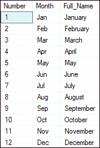
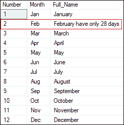
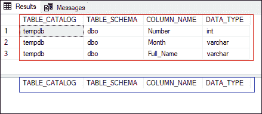
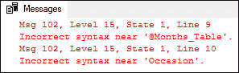
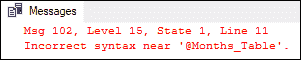
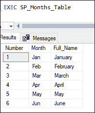
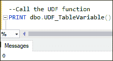

# SQL Server 中的表变量

> 原文：<https://www.javatpoint.com/table-variable-in-sql-server>

表变量是局部变量的特殊部分，允许我们**临时保存完整的表记录。**类似于 SQL Server 中的临时表。它最初是由微软在 SQL Server 2000 中引入的，作为临时表的替代。通常，表变量支持局部变量的所有属性，但是与临时或标准表不同，局部变量有一些限制。

表变量的声明类似于局部变量。一个表变量的名字以 **@符号**开头，它有一个表的类型。它的声明还可以用数据类型和约束定义列名。我们还可以在 SELECT、INSERT、UPDATE 和 DELETE 语句的范围内使用表变量。与永久表或常规表不同，我们不能在 SELECT 语句中使用 INTO 子句创建表变量。

### 句法

以下是在 SQL Server 中声明表变量的语法:

```

DECLARE @table_variable_name TABLE (
    column_name1 data_type,  
    column_name2 data_type,  
    column_name3 data_type,  
    .........  
);

```

在语法中，我们将首先在 **DECLARE** 关键字后写入**表变量名**。我们必须确保表变量的名称以@符号开头。接下来，我们将把它的结构定义为标准表，包括列名、数据类型、大小和约束。

### 表变量范围

SQL Server 可以在批处理、函数和存储过程中声明表变量。表变量在批处理结束时超出范围，类似于局部变量。当我们在函数或存储过程中声明表变量时，表变量也将在存储过程或函数退出后超出范围。

## 表格变量示例

让我们通过一些例子来了解如何在 SQL Server 中声明和使用表变量。下面的示例声明了一个名为 **@months_table，**的表变量，该表变量由三列组成:**数字、月份、**和**名称:**

```

DECLARE @Months_Table TABLE (
 Number INT, 
 Month VARCHAR(20), 
 Full_Name VARCHAR(40)
)

```

声明表变量后，我们将使用 insert 语句向其中插入数据:

```

INSERT INTO @Months_Table VALUES (1, 'Jan', 'January'),
(2, 'Feb', 'February'),
(3, 'Mar', 'March'),
(4, 'Apr', 'April'),
(5, 'May', 'May'),
(6, 'Jun', 'June'),
(7, 'Jul', 'July'),
(8, 'Aug', 'August'),
(9, 'Sep', 'September'),
(10, 'Oct', 'October'),
(11, 'Nov', 'November'),
(12, 'Dec', 'December');

```

我们可以使用 SELECT 语句作为临时表来查询表变量中的数据。我们应该注意，我们将同时执行整个批处理。否则，SQL Server 会通过错误消息**“必须声明表变量@Months_Table。”**现在，执行以下语句:

```

SELECT * FROM @Months_Table;

```

下图显示了部分输出:



如果要将**中的任何数据**更新为表变量，必须使用以下语句:

```

UPDATE @Months_Table SET Full_Name ='February have only 28 days' WHERE Number = 2;

```

执行整个批处理，我们可以看到第二行将成功更新:



### 表变量的存储位置

SQL Server 总是将表变量存储在 **tempdb 数据库中。**正如我们所知，表变量的**生命周期从声明点开始，到批处理结束时结束。**所以在批处理结束时会自动放到 SQL Server 中。我们可以借助下面的例子来理解这个概念:

```

DECLARE @Months_Table TABLE (
 Number INT, 
 Month VARCHAR(20), 
 Full_Name VARCHAR(40)
)
SELECT TABLE_CATALOG, TABLE_SCHEMA, COLUMN_NAME, DATA_TYPE
FROM tempdb.INFORMATION_SCHEMA.COLUMNS; 
GO
SELECT TABLE_CATALOG, TABLE_SCHEMA, COLUMN_NAME, DATA_TYPE
FROM tempdb.INFORMATION_SCHEMA.COLUMNS;

```

一起执行上述批处理将显示两个结果集。我们可以分别看到红色矩形和蓝色矩形。



**红色矩形**输出显示定义的表变量的列名、模式名和数据类型，**蓝色矩形**输出不显示任何数据。这是因为第一个信息模式。COLUMNS 语句与表变量一起执行。因此，SQL Server 将显示临时数据库中表变量@月 _ 表的信息。另一方面，第二**信息 _ 图式。列**语句将不显示任何关于@月 _ 表的数据。这背后的原因是 GO 语句结束批处理，表变量生命周期终止。因此，它证明了 tempdb 数据库是 SQL Server 中一个表变量的存储位置。

### 对表变量的限制

表变量在 SQL Server 中有一些限制。其中一些描述如下:

*   一旦在声明期间定义了表变量的结构，我们就不能将表变量的结构更改为标准表或临时表。**例如:**

```

            DECLARE @Months_Table TABLE (
			  Number INT, 
			  Month VARCHAR(20), 
			  Full_Name VARCHAR(40)
			)
			ALTER TABLE @Months_Table 
			ADD Occasion VARCHAR(40);

```

上述语句将显示以下错误:



*   我们知道，统计信息对于查询优化器构建有效的查询执行计划非常有用。不幸的是，它没有提供表变量。因此，表变量不能用于存储大量行。
*   与其他数据类型不同，SQL Server 不允许表变量使用**输入或输出参数**。另一方面，用户定义的函数可以返回一个表变量。
*   表变量不适用于**非聚集索引**，因此我们无法在表变量中创建它们。然而，**隐含指数**的定义可以解决这个问题。这背后的原因是，SQL Server 可以通过使用 PRIMARY KEY 约束或 UNIQUE 约束定义自动创建索引，我们可以使用这些 index 语句创建单个或复合非聚集索引。
*   表变量不允许我们使用外键约束。
*   表变量不能使用 TRUNCATE 语句从表中删除所有数据。**例如:**

```

           DECLARE @Months_Table TABLE (
             Number INT, 
             Month VARCHAR(20), 
             Full_Name VARCHAR(40)
           )
           INSERT INTO @Months_Table VALUES (1, 'Jan', 'January');
           TRUNCATE TABLE @Months_Table;

```

该语句将显示以下错误:



*   如果我们将表变量与 **JOIN** 一起使用，我们需要为表名使用一个**别名**来执行查询。**例如:**

```

        SELECT brand, product, price
        FROM brands B
        INNER JOIN @product_table P 
        ON B.brand_id = P.brand_id;

```

### 交易记录和表变量

SQL Server 中的事务是用于管理 **CRUD** (插入、选择、更新和删除)操作的单个逻辑单元。我们可以使用 ***BEGIN TRANSACTION*** 语句开始一个显式事务，并使用***【COMMIT】***或***roll***语句完成它。让我们执行下面的查询，然后分析它们的结果:

```

DECLARE @Months_Table TABLE (
 Number INT, 
 Month VARCHAR(20), 
 Full_Name VARCHAR(40)
)
BEGIN TRAN
  INSERT INTO @Months_Table VALUES (1, 'Jan', 'January');
ROLLBACK TRAN
SELECT * FROM @Months_Table;

```

在这个输出中，我们可以看到修改后的数据不能擦除表变量，因为在这里，CRUD 操作由显式事务管理。

### 存储过程中的表变量

存储过程是一组由一个或多个预编译的 SQL 语句组成的逻辑单元。SQL Server 中的每个过程总是包含一个名称、参数列表和 Transact-SQL 语句。下面的示例将解释我们如何在存储过程中使用表变量。

```

CREATE PROCEDURE SP_Months_Table
AS
BEGIN
DECLARE @Months_Table TABLE (
 Number INT, 
 Month VARCHAR(20), 
 Full_Name VARCHAR(40)
)
INSERT INTO @Months_Table VALUES (1, 'Jan', 'January'),
(2, 'Feb', 'February'),
(3, 'Mar', 'March'),
(4, 'Apr', 'April'),
(5, 'May', 'May'),
(6, 'Jun', 'June');
SELECT * FROM @Months_Table;
END;

```

上面的语句创建了一个名为**‘SP _ Months _ Table’**的存储过程，其中我们也使用了表变量。我们可以使用 **EXEC** 语句调用这个过程。请参见以下输出:



### 用户定义函数中的表变量

由用户定义的执行特定任务的功能称为用户定义的功能。用户将根据自己的需求创建这种类型的功能。下面的例子将解释我们如何在用户定义的函数中使用表变量。

```

--User-defined function with a Table Variable
CREATE FUNCTION UDF_TableVariable()
RETURNS INT
AS
BEGIN
    --Declaration of Table Variable
    DECLARE @TableVariable TABLE(Name VARCHAR(50)) 
    IF EXISTS(SELECT 1 FROM @TableVariable)
        RETURN 1 
    RETURN 0
END
GO;

```

上面的语句创建了一个名为**‘UDF _ TableVariable’**的用户定义函数，我们在这里也使用了 TableVariable。我们可以使用下面的语句调用这个函数:

```

--Call the UDF function
PRINT dbo.UDF_TableVariable()

```

我们将获得以下输出:



### 表变量与临时表的一些主要区别

以下是表变量和临时表之间的主要区别:

*   当我们在存储过程中使用表变量而不是临时表时，我们得到的重新编译更少。
*   SQL Server 中的表变量将比临时表使用更少的资源。
*   就锁定和日志开销而言，表变量使用的资源比临时表少，因此我们可以尽可能使用它们。
*   表变量不能执行截断操作，而临时表可以执行。
*   当表变量使用事务时，它不能回滚数据。另一方面，临时表可以通过事务操作回滚数据。
*   表变量存储在 tempdb 数据库中，而不是像临时表那样存储在内存中。

* * *