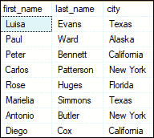
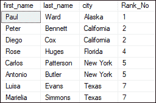
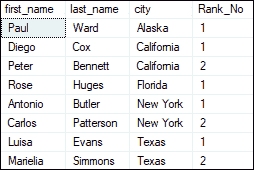
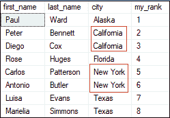
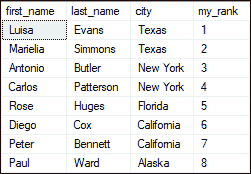
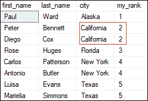
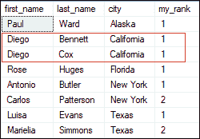
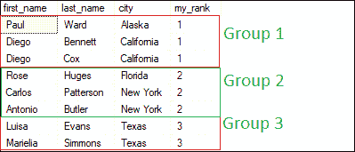

# SQL Server 中的秩函数

> 原文：<https://www.javatpoint.com/rank-function-in-sql-server>

SQL Server 中的排名函数是一种排名函数。该功能将**为输出**分区内的每一行分配编号。它将每行的等级指定为 1 加上前一行的等级。当 RANK 函数在同一个分区中找到两个相同的值时，它会为它们分配相同的秩号。此外，排名中的下一个数字将是上一个排名加上重复的数字。因此，此函数并不总是按连续顺序分配行的排名。

RANK 函数也是窗口函数的一个子部分。**使用此功能**时，应记住以下几点:

*   它总是与 OVER()子句一起使用。
*   它根据 ORDER BY 子句为每一行指定一个等级。
*   它以连续的顺序为每一行分配一个等级。
*   它总是给行分配一个等级，从每个新分区一个开始。

#### 注意:执行查询时，Rank 为分区内的行分配临时值。

**SQL Server 提供以下排名功能**:

*   RANK()
*   行号()
*   密集 _ 等级()
*   NTILE()

让我们详细学习每个秩函数。首先，我们将创建一个表来演示所有这些功能。以下语句创建了一个名为 **rank_demo** 的表，该表有三列:

```

CREATE TABLE rank_demo (
	first_name VARCHAR(60),
	last_name VARCHAR(40),
	city VARCHAR(30)
);

```

接下来，我们将在该表中插入一些行，如下所示:

```

INSERT INTO rank_demo (first_name, last_name, city)       
VALUES ('Luisa', 'Evans', 'Texas'),       
('Paul', 'Ward', 'Alaska'),       
('Peter', 'Bennett', 'California'),    
('Carlos', 'Patterson', 'New York'),       
('Rose', 'Huges', 'Florida'),  
('Marielia', 'Simmons', 'Texas'),
('Antonio', 'Butler', 'New York'),       
('Diego', 'Cox', 'California');

```

我们可以使用 SELECT 语句来验证该表。它显示以下输出:



### RANK()函数

该函数用于确定结果集中每行的排名。以下语法说明了在 SQL Server 中 RANK 函数的使用:

```

SELECT column_name   
RANK() OVER (  
    PARTITION BY expression  
    ORDER BY expression [ASC|DESC])  
AS 'my_rank' FROM table_name;  

```

在这个语法中，

*   **OVER 子句**在应用相关窗口函数之前设置结果的划分和排序。
*   **PARTITION BY 子句**将 FROM 子句产生的输出划分到分区中。然后将该函数应用于每个分区，并在分区边界跨越分区时重新初始化。如果我们没有定义这个子句，函数将把所有的行当作一个分区。
*   **ORDER BY** 是一个必需的子句，它在应用函数之前根据一个或多个列名以降序或升序确定行的顺序。

### 例子

让我们看看 RANK()函数在 SQL Server 中是如何工作的。下面的语句将使用 rank 函数为每行分配编号:

```

SELECT first_name, last_name, city, 
RANK () OVER (ORDER BY city) AS Rank_No 
FROM rank_demo;

```

因为我们没有使用 **PARTITION BY 子句**，所以该函数将整个结果视为单个分区。执行该语句将显示以下输出:



在这个输出中，我们可以看到一些行获得了相同的排名，因为它们在**城市列**中具有相同的值。排名中的下一个数字将是它之前的排名加上一些重复的数字。

下面的语句是**另一个例子**，我们将使用一个 partition by 子句，它将根据**城市**列划分行，并为分区内的每一行分配一个等级。输出的顺序基于**名字**:

```

SELECT first_name, last_name, city, 
RANK () OVER (PARTITION BY city ORDER BY first_name) AS Rank_No 
FROM rank_demo;

```

它将显示以下输出:



### 行号()函数

该函数用于**返回其分区内每一行**的唯一序号。行编号从 1 开始，增加 1，直到达到分区的总行数。它将为具有相似值的行返回不同的等级，这些值使它不同于 RANK()函数。

以下语法说明了在 SQL Server 中使用 ROW_NUMBER()函数:

```

SELECT column_name   
ROW_NUMBER() OVER (  
    PARTITION BY expression  
    ORDER BY expression [ASC|DESC])  
AS 'rank_name' FROM table_name;  

```

### 例子

执行以下查询，为每一行分配一个序号:

```

SELECT first_name, last_name, city, 
ROW_NUMBER() OVER(ORDER BY city) AS my_rank 
FROM rank_demo;

```

它会根据他们所在的**城市**为该表分配排名。这里我们可以看到，它为具有相同城市值的行分配了不同的等级。



如果我们用 ORDER BY 子句将排序顺序从**升序改为**降序，这个函数也会相应地改变 RANK。请参见以下声明:

```

SELECT first_name, last_name, city, 
ROW_NUMBER() OVER(ORDER BY city DESC) AS my_rank 
FROM rank_demo;

```

结果如下:



### 密集 _ 等级()函数

该函数根据指定的列值为分区中的每一行指定唯一的等级**，没有任何间隙。它总是以连续的顺序指定排名。如果我们得到一个**重复值**，这个函数将赋予它相同的等级，下一个等级是下一个序号。该特性不同于 DENSE _ RANK()函数和 RANK()函数。**

以下语法说明了在 SQL Server 中使用密集秩()函数:

```

SELECT column_name   
DENSE_RANK() OVER (  
    PARTITION BY expression  
    ORDER BY expression [ASC|DESC])  
AS 'rank_name' FROM table_name;  

```

### 例子

下面的查询使用 DENSE _ RANK()函数为每一行分配一个等级号:

```

SELECT first_name, last_name, city, 
DENSE_RANK() OVER(ORDER BY city) AS my_rank 
FROM rank_demo;

```

它将返回下面的输出，我们可以看到重复的值具有相同的等级，并且下面的等级将是下一个序列号。



这是使用 PARTITION BY 子句的 DENSE _ RANK()函数的另一个例子。该子句将根据城市列划分行，结果集的顺序基于名字:

```

SELECT first_name, last_name, city, 
DENSE_RANK() OVER(PARTITION BY city ORDER BY first_name) AS my_rank 
FROM rank_demo;

```

我们将得到下面的输出，因为没有两个名字是相同的。在这种情况下，输出类似于 RANK()函数。


让我们用以下查询更新名称:

```

Update rank_demo set first_name = 'Diego' WHERE city = 'California'

```

现在，再次执行相同的查询。我们会看到这张桌子在**加州城**同名。因此，两个名字的排名也是一样的。



### 函数

该函数用于将有序分区的行分布到预定义数量的近似相等的组中。每个行组根据定义的条件获得其等级，并从一个组开始编号。它为代表其所属组的组中的每一行分配一个**桶号**。

以下语法说明了 NTILE()函数在 SQL Server 中的使用:

```

SELECT column_name   
NTILE(N) OVER (  
    PARTITION BY expression  
    ORDER BY expression [ASC|DESC])  
AS 'my_rank' FROM table_name;  

```

**例**

下面的查询使用 NTILE()函数为每一行分配一个等级号:

```

SELECT first_name, last_name, city, 
NTILE(3) OVER(ORDER BY city) AS my_rank 
FROM rank_demo;

```

指定表有**八条记录**。因此， **NTILE(3)** 告诉结果集必须有一组**的三条记录**。执行该语句将显示以下输出:



本文将通过各种例子解释 SQL Server 中使用的所有 RANK 函数。它还显示了这些功能之间的主要区别。这些功能对于开发人员很好地探索和管理他们的数据非常有用。

* * *