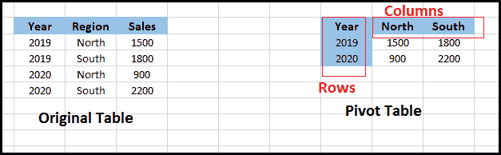
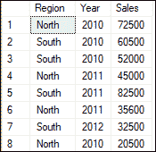
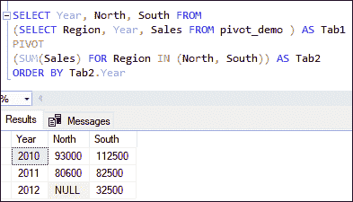
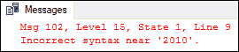
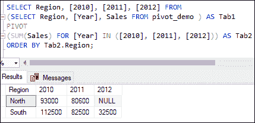
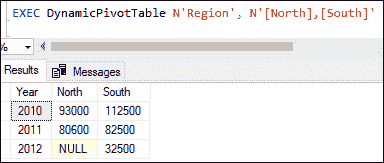
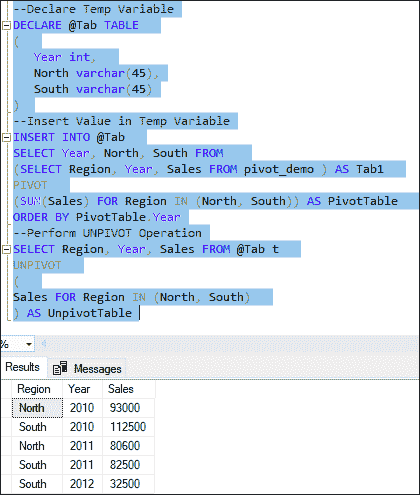
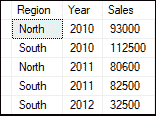

# SQL Server 透视

> 原文：<https://www.javatpoint.com/sql-server-pivot>

本文将给出在 SQL Server 中使用 PIVOT 和 UNPIVOT 操作符的完整概述。PIVOT 和 UNPIVOT 操作符类似于关系操作符，允许**将表值表达式转换为另一个表**。这两种运算符都生成多维报告，有助于快速组合和比较大量数据。

当我们需要转换表值表达式时，可以使用**透视运算符**。在最终结果中，它将一列中的**唯一值拆分为多列**。它还**聚合**最终结果中所需的剩余列值。 **UNPIVOT 运算符**将表值表达式的列中的数据转换为列值，这是 PIVOT 的逆运算。

让我们借助下面给出的简单图表来理解它:



在该图的左侧，我们可以看到**原始数据集**，它有三列:**年份、地区、**和**销量**。接下来，我们可以看到右侧的 PIVOT 表，它是通过将**区域(行)旋转为**的南北(列)而构建的。将行转换为列后，我们可以对 PIVOT 表的列和行之间的每个交集进行**Sales 列值的聚合**。

让我们首先创建一个名为 **pivot_demo** 的表来演示 pivot 和 UNPIVOT 操作符。以下语句在我们指定的数据库中创建新表:

```sql

CREATE TABLE pivot_demo  
(  
   Region varchar(45),  
   Year int,  
   Sales int  
)  

```

接下来，将一些数据插入下表:

```sql

INSERT INTO pivot_demo
VALUES ('North', 2010, 72500),
('South', 2010, 60500),
('South', 2010, 52000),
('North', 2011, 45000),
('South', 2011, 82500),  
('North', 2011, 35600),
('South', 2012, 32500), 
('North', 2010, 20500); 

```

我们可以使用 SELECT 语句来验证数据。我们将获得以下输出:



## 透视运算符

此运算符用于旋转表值表达式。它最早是在 SQL Server 2005 版本中引入的。它将数据从行转换为列。它将一列中的唯一值拆分为许多列，然后将最终结果中所需的其余列值聚合在一起。

**我们必须按照以下步骤创建一个 PIVOT 表:**

*   选择要旋转的基础数据集。
*   借助派生表或 CTE(通用表表达式)创建临时结果。
*   使用 PIVOT 运算符。

### 句法

以下语法说明了透视在 SQL Server 中的使用:

```sql

SELECT <non-pivoted column>, <list of pivoted column>  
FROM  (<SELECT query  to produces the data>)  AS <alias name>  
PIVOT ( <aggregation function>(<column name that will aggregated>)  
FOR  [<column name that  will become column headers>]  
    IN ( [list of  pivoted columns]) ) AS <alias name  for  PIVOT table>  
<ORDER BY clause>

```

如果我们断开这个脚本，我们可以看到它有两个独立的部分。第一部分从主表中选择数据，第二部分确定如何构造 PIVOT 表。第二部分还包含一些特殊的关键字，如 SUM、FOR 和 IN。让我们看看 PIVOT 运算符中这些关键字的含义。

**SUM**

该运算符用于**汇总指定列中的值**，以便在 PIVOT 表中使用。我们必须将其与 PIVOT 运算符一起使用，以获得值部分的聚合列显示。

**为关键字**

这个关键字用于 PIVOT 表语句**来指示 PIVOT 操作符**应该在哪个列上应用 PIVOT 函数。基本上，它表示将从行转换为列的列名。

**输入关键字**

此关键字**列出了来自 PIVOT 列的所有唯一值**，以显示为 PIVOT 表的列。

### 例子

让我们借助各种例子来理解它。

1.以下语句首先选择“年份”、“北方”和“南方”列作为透视的基础数据。然后，使用派生表创建一个临时结果，最后应用 PIVOT 运算符生成最终输出。这个输出也是在上升年排序的。

```sql

SELECT Year, North, South FROM   
(SELECT Region, Year, Sales FROM pivot_demo ) AS Tab1  
PIVOT  
(SUM(Sales) FOR Region IN (North, South)) AS Tab2  
ORDER BY Tab2.Year

```

执行此语句将产生以下输出。这里可以看到**计算出的南北区域销售额之和对应的年值**。



2.这是另一个示例，我们将计算对应于区域值的每一年的销售额总和:

```sql

SELECT Region, 2010, 2011, 2012 FROM   
(SELECT Region, [Year], Sales FROM pivot_demo ) AS Tab1  
PIVOT  
(SUM(Sales) FOR [Year] IN (2010, 2011, 2012)) AS Tab2
ORDER BY Tab2.Region;

```

执行该语句将产生一个错误**，因为我们不能直接将数值指定为列名。**

**

但是，SQL Server 允许我们通过在每个整数值前使用括号来避免这个问题。下面的代码片段显示了更新后的语句:

```sql

SELECT Region, [2010], [2011], [2012] FROM   
(SELECT Region, [Year], Sales FROM pivot_demo ) AS Tab1  
PIVOT  
(SUM(Sales) FOR [Year] IN ([2010], [2011], [2012])) AS Tab2
ORDER BY Tab2.Region; 

```

此语句成功执行，并显示对应于区域值的每年销售额的计算总和:



3.当我们知道所有可能的 PIVOT 列值时，前面获取 PIVOT 表的示例很有帮助。但是假设在即将到来的一年，列的数量增加了。考虑到前面的例子，我们有 2010 年、2011 年和 2012 年作为 PIVOT 列。但是，不能保证这些列将来不会改变。如果我们有 2013 年或 2014 年的数据，甚至更多，会发生什么？在这种情况下，我们需要使用**动态 PIVOT 表**查询来解决这个问题。

***动态 PIVOT 表查询将整个 PIVOT 脚本封装在一个存储过程中。这个过程将提供可调整的选项，允许我们通过改变一些参数化的值来修改我们的需求。*T3】**

下面的 SQL 代码解释了动态 PIVOT 表的工作原理。在这个脚本中，我们首先从 PIVOT 列中检索了所有不同的值，然后编写了一个 SQL 语句，用于在运行时与 PIVOT 查询一起执行。让我们看看执行这个脚本后的输出:

```sql

CREATE PROCEDURE DynamicPivotTable
  @PivotColumn NVARCHAR(255),
  @PivotList NVARCHAR(255)
AS
BEGIN
 DECLARE @Query NVARCHAR(MAX);  
 SET @Query = N'
    SELECT * FROM (SELECT [Region], [Year], [Sales] FROM pivot_demo) AS tab1
    PIVOT (SUM([Sales]) FOR ['+@Pivot_Column+'] IN ('+@Pivot_List+')) AS PivotTable';
  EXEC(@Query)
END 

```

在这个脚本中，我们创建了两个参数化变量。其描述如下:

**@PivotColumn** :该变量将从创建 PIVOT 表的原始表中获取列的名称。**例如**，在这里，“区域”列显示列中所有可用的区域。

**@PivotList** :这个变量会把我们想要显示的列列表作为 PIVOT 表中的输出列。

**执行动态存储过程**

成功创建动态存储过程后，我们就可以执行它了。以下语句用于调用动态存储过程，以便在运行时显示 PIVOT 表:

```sql

EXEC DynamicPivotTable N'Region', N'[North], [South]'

```

这里我们已经指定了列名“ **Region** ”作为第一个参数，PIVOT 列列表作为第二个参数。执行脚本将显示以下输出:



现在，我们可以在将来运行时添加更多的列来显示 PIVOT 表，这在前两个示例中是不可能的。

## 逆透视算子

它是 SQL Server 中 PIVOT 运算符的反向方法。该操作符通过将数据从列转换为行来执行枢轴的**相反操作。UNPIVOT 操作符还将 PIVOT 表旋转到常规表中。它最早是在 SQL Server 2005 版本中引入的。**

**语法**

以下语法说明了在 SQL Server 中的 UNPIVOT:

```sql

SELECT (column_names) 
FROM (table_name) 
UNPIVOT
 ( 
   Aggregate_function (column to be aggregated)
   FOR PivotColumn IN (pivot column values)
 ) AS (alias_name)

```

**例**

让我们通过例子来了解如何取消透视操作。我们将首先创建一个**原始表和 PIVOT 表**，然后在这个表上应用 UNPIVOT 操作符。

下面的代码片段首先声明了一个临时表变量@Tab:

```sql

DECLARE @Tab TABLE  
(  
   Year int,  
   North varchar(45),
   South varchar(45)
)

```

接下来，我们将在下表中插入值:

```sql

INSERT INTO @Tab  
SELECT Year, North, South FROM   
(SELECT Region, Year, Sales FROM pivot_demo ) AS Tab1  
PIVOT  
(SUM(Sales) FOR Region IN (North, South)) AS PivotTable  
ORDER BY PivotTable.Year

```

现在，我们可以使用下面的语句执行 UNPIVOT 操作:

```sql

SELECT Region, Year, Sales FROM @Tab t  
UNPIVOT  
(  
Sales FOR Region IN (North, South)  
) AS UnpivotTable

```

执行代码片段将返回以下输出:



下面的代码片段是另一个示例，它首先对单个查询中的同一表执行 PIVOT 操作，然后执行 UNPIVOT 操作:

```sql

SELECT Region, Year, Sales FROM (
SELECT Year, North, South FROM   
(SELECT Region, Year, Sales FROM pivot_demo ) AS Tab1  
PIVOT  
(SUM(Sales) FOR Region IN (North, South)) AS PivotTable  
) P
--Perform UNPIVOT Operation
UNPIVOT  
(  
Sales FOR Region IN (North, South)  
) AS UnpivotTable

```

执行代码片段将显示相同的输出:



#### 注意:取消透视过程是透视过程的反向操作，但不是精确的反向。因为 PIVOT 计算聚合时行已经被合并，并且在结果中将许多行合并成一行，因此，UNPIVOT 操作无法使表像原始表一样。但是，如果 PIVOT 操作符没有将许多行合并到一行中，那么 UNPIVOT 操作符可以从 PIVOT 输出中获取原始表。

### 结论

本文将全面概述 SQL Server 中的 PIVOT 和 UNPIVOT 运算符，并将一个表表达式转换为另一个表表达式。永远不要忘记，UNPIVOT 是 PIVOT 的反向操作，但它不是 PIVOT 结果的精确反向。

* * ***