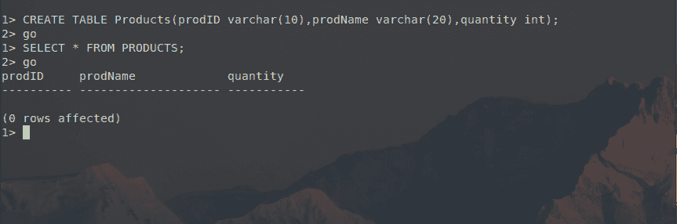
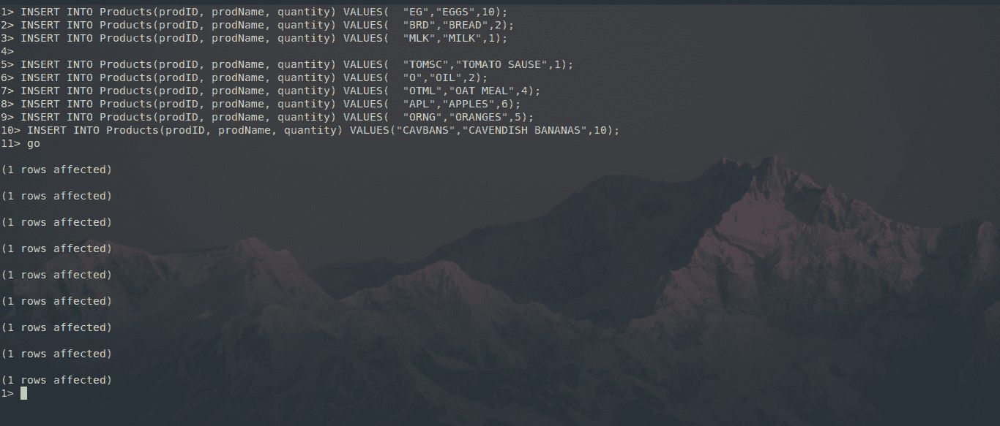
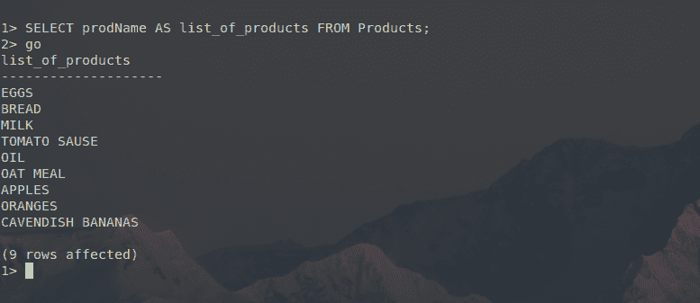
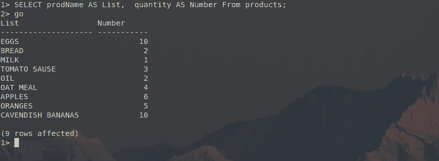

# SQL Server 别名

> 原文：<https://www.javatpoint.com/sql-server-alias>

我们可以在执行 SQL Server 别名查询时为列或表达式分配一个临时名称。当我们想要显示 SQL Server 表中的一些特定数据，以便以一种有礼貌的方式标记这些数据，从而更好地表示数据时，SQL Server 别名是非常有用的。SQL Server 别名也用于增加列的可读性。

**SQL Server 别名的语法**

```sql

The syntax for SQL Server Alias is:
The syntax for Column Alias:

```

选择 _ 列的名称作为 _ 别名的名称从 _ 表的名称；

在上面写的语法中:

*   列名:列名表示我们要为其分配别名的列的名称。
*   别名的名称:别名的名称表示我们将赋予表中指定列的别名的名称。
*   表的名称:表的名称显示表的名称。

**表别名的语法:**

**SELECT _ name of _ column FROM _ name of _ table AS _ name of _ alias；**

在上面写的语法中:

*   列名:列名表示我们要为其分配别名的列的名称。
*   别名的名称:别名的名称表示我们将赋予表中指定列的别名的名称。
*   表的名称:表的名称显示表的名称。

**如何在 SQL Server 中使用别名？**

让我们借助一个例子来了解别名在 SQL Server 中的用法和工作原理。让我们创建一个名为“产品”的表，该表有三列，分别名为“产品标识”、“产品名称”和“数量”，分别存储产品的标识、产品名称和数量。使用上述模式在 SQL server 中创建表的命令是:

```sql

CREATE TABLE Products(
	prodID varchar(10),
	prodName varchar(20),
	quantity int
);

```



如图所示，我们已经成功创建了一个具有上述模式的表:三列，两列(prodID 和 prodName)的数据类型为 varchar，一列(quantity)为 int。

现在，让我们向产品表中添加一些数据。SQL Server 中的 INSERT 命令在学生表中添加数据的语法是:

```sql

INSERT INTO Products(prodID, prodName, quantity) VALUES(  "EG","EGGS",10);
INSERT INTO Products(prodID, prodName, quantity) VALUES(  "BRD","BREAD",2);
INSERT INTO Products(prodID, prodName, quantity) VALUES(  "MLK","MILK",1);
INSERT INTO Products(prodID, prodName, quantity) VALUES(  "TOMSC","TOMATO SAUSE",1);
INSERT INTO Products(prodID, prodName, quantity) VALUES(  "O","OIL",2);
INSERT INTO Products(prodID, prodName, quantity) VALUES(  "OTML","OAT MEAL",4);
INSERT INTO Products(prodID, prodName, quantity) VALUES(  "APL","APPLES",6);
INSERT INTO Products(prodID, prodName, quantity) VALUES(  "ORNG","ORANGES",5);
INSERT INTO Products(prodID, prodName, quantity) VALUES("CAVBANS","CAVENDISH BANANAS",10);

```




如图所示，我们已经成功地向 Products 表中添加了九行数据，在 SELECT 查询的结果中也可以看到同样的情况。

现在，如果我们想要显示“产品”表的 prodName 列并给它一个特定的名称，我们可以为此使用 SQL Server Alias，并且在特定名称下显示“产品”表的特定列的语法是:

从产品中选择产品列表；



如图所示，在 SQL Server 别名的帮助下，prodName 列显示在“产品列表”名称下。

对于两列也可以这样做，这也意味着我们可以使用 SQL server 别名显示多个具有替代名称的列。使用别名在 SQL server 中将多个列显示为替代名称的语法是:

**从产品中选择产品名称作为列表，数量作为编号；**



从图中我们可以清楚地看到，“产品”表的两行(prodName 和数量)分别显示在替代名称“列表”和“编号”下，并带有“SQL Server 别名”。

上面的例子是列别名，但是当在一个 SQL 查询中关联了多个表时，表别名也可以用于在对表使用联接操作时给表提供替代名称。然后可以使用这些别名或替代名称来引用这些表。

因此，本文帮助我们了解别名在 SQL Server 中的工作原理，以及如何根据我们的问题需求来使用别名。

* * *