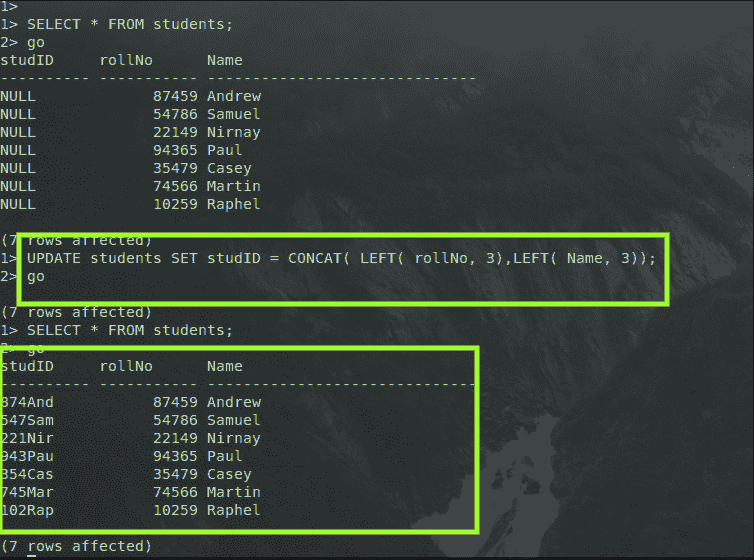
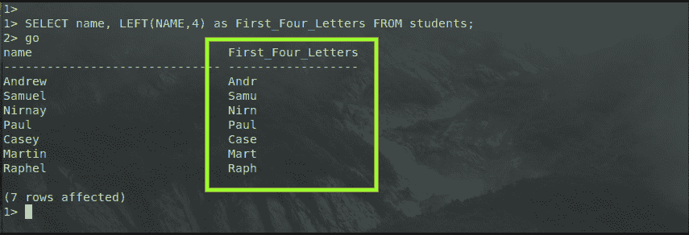

# 左函数

> 原文：<https://www.javatpoint.com/sql-server-left-function>

SQL Server 左函数用于从应用左函数的列的左侧开始获取前 n 个字符。

**SQL Server 中 LEFT 函数的语法是这样的:**

```

LEFT ( string_value , number_of_characters_to_be_returned )  

```

**在上面写的语法中:**

*   字符串值是作为左函数的输入提供的输入值，该输入值可以是任何文字变量、字符串或列。
*   除了文本或 NTEXT 之外，任何数据类型都可以是 string_value 的输出，它被隐式转换为 VARCHAR 或 NVARCHAR。
*   作为左函数输入的第二个参数是**返回的字符数，**，它是一个正整数，指定左函数将返回的**字符串值**的字符数。
*   LEFT()函数的输出或结果是一个 VARCHAR 值，主要取决于第一个输入参数的数据类型，即 string_value。

**如何在 SQL Server 中使用 LEFT 函数？**

让我们借助一个例子来理解左函数在 SQL Server 中的用法和功能。让我们创建一个名为“学生”的表，该表有三列，分别名为“学习”、“学号”、“姓名”，分别存储学生的学号、学号和姓名。使用上述模式在 SQL server 中创建表的命令是:

```

CREATE TABLE students (
	studID varchar(10),
	rollNo int,
	Name varchar(30)
);

```


如图所示，我们已经成功地创建了一个具有上述模式的三列表，其中两列的数据类型为 varchar，一列为 int。

现在，让我们给学生的表格添加一些数据。SQL Server 中的 INSERT 命令在学生表中添加数据的语法是:

```

INSERT INTO students(rollNo, Name) VALUES(87459, "Andrew");
INSERT INTO students(rollNo, Name) VALUES(54786, "Samuel");
INSERT INTO students(rollNo, Name) VALUES(22149, "Nirnay");
INSERT INTO students(rollNo, Name) VALUES(94365, "Paul");
INSERT INTO students(rollNo, Name) VALUES(35479, "Casey");
INSERT INTO students(rollNo, Name) VALUES(74566, "Martin");
INSERT INTO students(rollNo, Name) VALUES(10259, "Raphel");

```


如图所示，我们已经成功地向学生的表中添加了七行，在 SELECT 查询的结果中也可以看到同样的情况。

我们只为学生表中的两列添加了数据，这两列是 **rollNo** 和 **name** 列，但是为了向 **studID** 列添加数据，我们将使用 LEFT 函数。

我们将用于向学生表的 studID 列添加数据的语法是:

```

UPDATE students SET studID = CONCAT( LEFT( rollNo, 3),LEFT( Name, 3));

```

因此，通过这个查询，我们使用学生的学号和学生的姓名自动生成学生的身份证。 **studID** 列的数据不是由用户获取的，而是使用学生 ID 将由卷号的前三位数字和学生姓名的前三个字母组成的逻辑自动计算的。



如图所示，我们可以看到我们已经成功地根据学生的姓名和学号创建了学生的身份证。

这是可以使用 LEFT 函数的一种情况，另一种情况可能是我们希望只显示学生表中姓名列的前四个字母。

显示学生表中“名称”列前四个字母的语法是:

```

SELECT name, LEFT(NAME,4) as First_Four_Letters FROM students;

```



正如我们在 adobe image 中清楚看到的，显示的第一列是学生的姓名，显示的下一列是学生表的姓名列中每个数据的前四个字母。

这两个场景只是为了举例，我们可以根据问题语句的要求使用这个 LEFT 函数，并根据它构造查询，得到我们想要的输出。

因此，在本文的帮助下，我们能够更好地了解如何在 SQL server 中使用 LEFT 函数，以及它是如何工作的。

* * *