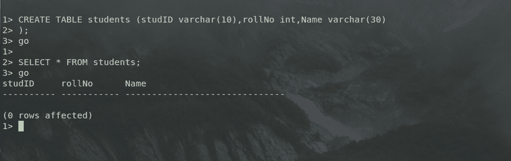
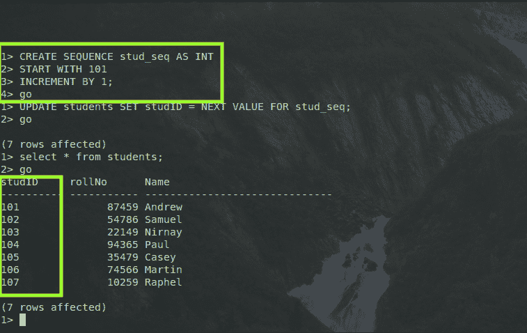

# SQL Server 序列

> 原文：<https://www.javatpoint.com/sql-server-sequence>

SQL Server 序列用于创建序列对象，也可以指定其属性。

序列对象可以定义为用户定义的对象，该对象绑定到根据序列创建时定义的增量值生成数值序列的模式。

根据已经预设的增量值，生成的数值序列可以按降序或升序排列，当达到终止极限时，也可以重新开始(循环)。与标识列不同，序列不与某些特定的表相关联。为了获得生成的序列的下一个值，应用程序可以引用序列的对象。

应用程序控制表和序列之间的关系。序列可以被视为任何用户都可以访问的模式级对象。与过程不同，序列不属于任何用户。

**创建序列对象的语法是:**

```

CREATE SEQUENCE [name_of_schema.] name_of_sequence  
    [ AS type_as_integer ]  
    [ START WITH starting_value_of_sequence ]  
    [ INCREMENT BY incremental_index ]  
    [ { MINVALUE [ minimum_value ] } | { NO MINVALUE } ]  
    [ { MAXVALUE [ maximum_value ] } | { NO MAXVALUE } ]  
    [ CYCLE | { NO CYCLE } ]  
    [ { CACHE [ size_of_cache ] } | { NO CACHE } ];

```

在上面写的语法中:

*   **schema 的名称:**schema 的名称指定了该序列所属的模式。
*   **Type_as_integer:**Sequence 对象的 Type _ as _ integer 数据类型。Sequence 对象支持的一些数据类型有 NUMERIC、BIGINT、INT、TINYINT、DECIMAL 和 SMALLINT。
    我们可以根据自己的要求选择任何一款:
    *   bigint -范围从-9，223，372，036，854，775，808 到 9，223，372，036，854，775，807
    *   int -范围从-2，147，483，648 到 2，147，483，647
    *   小数和数字，小数位数为 0
    *   smallint -范围从-32，768 到 32，767
    *   tinyint -范围从 0 到 255
*   序列的起始值:序列的起始值代表序列的起始值。序列对象用该值初始化，并对该值进行进一步的递增或递减。
*   增量索引:增量索引表示每次获取序列对象的下一个值时，序列的起始值将递增的值或索引。
*   最小值:最小值代表序列对象可以达到的最小值。它充当下限。
*   最大值:最大值代表序列对象可以达到的最大值。它充当上限。
*   缓存大小:缓存大小表示为提高序列对象的性能而要缓存的值的数量。

**如何在 SQL Server 中使用序列？**

让我们举个例子来更好地理解。让我们创建一个名为“学生”的表，该表有三列，分别名为“学习”、“学号”、“姓名”，分别存储学生的学号、学号和姓名。使用上述模式在 SQL server 中创建表的命令是:

```

CREATE TABLE students (
	studID varchar(10),
	rollNo int,
	Name varchar(30)
);

```



如图所示，我们成功地创建了一个具有上述模式的表，该表有三列，两列的数据类型为 varchar，一列为 int。

现在，让我们给学生的表格添加一些数据。SQL Server 中的 INSERT 命令在学生表中添加数据的语法是:

```

INSERT INTO students(rollNo, Name) VALUES(87459, "Andrew");
INSERT INTO students(rollNo, Name) VALUES(54786, "Samuel");
INSERT INTO students(rollNo, Name) VALUES(22149, "Nirnay");
INSERT INTO students(rollNo, Name) VALUES(94365, "Paul");
INSERT INTO students(rollNo, Name) VALUES(35479, "Casey");
INSERT INTO students(rollNo, Name) VALUES(74566, "Martin");
INSERT INTO students(rollNo, Name) VALUES(10259, "Raphel");

```


如图所示，我们已经成功地向学生表中添加了七行，在 SELECT 查询的结果中也可以看到同样的情况。

现在我们使用序列对象在 studID 列中添加数据。为此，需要创建一个序列对象。同样的语法是:

```

CREATE SEQUENCE stud_seq 
AS INT
START WITH 101
INCREMENT BY 1;

```



如上图所示，我们创建了一个名为 stud_seq 的序列对象，它的初始值为 101，在获取名为 stud_seq 的序列对象的值时，它会增加 1。要从序列对象中检索下一个值，语法是:

```

NEXT VALUE FOR name_of_seq_object;

```

因此，我们使用查询将数据添加到学生表的 studID 列中:

```

UPDATE students SET studID = NEXT VALUE FOR stud_seq;

```

因此，本文帮助我们了解序列在 SQL Server 中的工作方式，以及如何根据我们的问题需求来使用它。

* * *