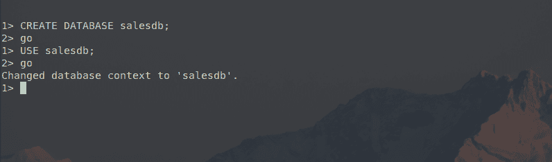
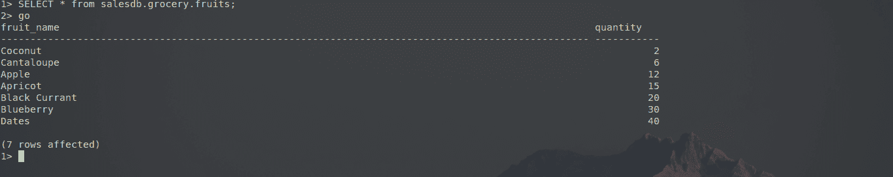
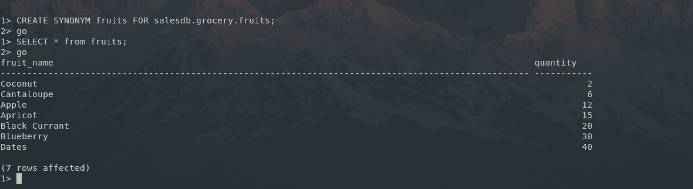

# SQL 服务器同义词

> 原文：<https://www.javatpoint.com/sql-server-synonym>

在 SQL Server 同义词的帮助下，可以为任何数据库对象(如表、视图、存储过程、用户定义函数和序列)指定别名或替代名称。

每当我们在数据库中创建一个 SQL Server 同义词时，该同义词都引用一个特定的数据库对象，该数据库对象称为基本对象。同义词所引用的基本对象的位置可以在同一数据库中，也可以在同一服务器的其他数据库中，甚至可以在另一服务器上运行的其他实例中。

我们可以在各种场景中使用 SQL Server 同义词，并充分利用它们。一些场景是:

*   由于代码中有 100 个或者有时 1000 个对特定对象的引用，因此在这种情况下，我们可以为该对象分配一个同义词。
*   一个额外的抽象层可以被添加到实际的基础对象中，这个同义词被分配给这个基础对象。
*   数据库查询可以很容易地引用当前数据库中的对象，即使它们实际上存在于其他数据库中。
*   还可以向旧的遗留基础对象提供向后兼容性，这是较新版本的数据库所需要的。
*   在 SQL Server 同义词的帮助下，可以提供一个额外的安全层来保护基本对象。
*   有些情况下，我们希望移动到另一个数据库，在 SQL Server 同义词的帮助下，我们可以引用基本对象，而不用考虑迁移。
*   借助于 SQL Server 同义词，可以简化数据库中冗长且混乱的对象名称。
*   作为持续集成构建过程的一部分，开发、测试和质量保证等下游环境中跨数据库和服务器依赖关系的各种问题可以通过使用 SQL Server 同义词轻松消除。

**在 SQL Server 数据库中创建同义词的语法是:**

```

CREATE SYNONYM [ name_of_schema. ] name_of_synonym 
FOR name_of_base_object;

```

在上面写的语法中:

*   模式的名称:模式的名称是模式的名称
*   ym 将被创建。
*   同义词的名称:同义词的名称代表同义词的名称。
*   基础对象的名称:基础对象的名称表示将为其分配同义词的基础对象的名称。

**如何在 SQL Server 数据库中使用同义词？**

让我们借助一个例子来理解 SQL Server 同义词。让我们创建一个数据库并选择那个特定的数据库。创建和选择该数据库的语法是:

```

CREATE DATABASE salesdb;

USE salesdb;

```



如图所示，名为**‘sales db’**的数据库已经创建并成功选择。

现在，我们将创建一个模式和该模式中的一个表。创建模式和表的语法是:

```

CREATE SCHEMA grocery;

CREATE TABLE grocery.fruits(
      fruit_name VARCHAR(100) NOT NULL,
      quantity  INT PRIMARY KEY IDENTITY 
   );

```


如图所示，一个名为“**杂货**的模式已经成功创建，一个名为水果的表也成功创建，该表有两列，用于存储杂货模式中水果的数量和名称。

现在让我们给水果表添加一些数据。同样的语法是:

```

INSERT INTO grocery.fruits(fruit_name,quantity) VALUES('Apple',12);
INSERT INTO grocery.fruits(fruit_name,quantity) VALUES('Coconut',2);
INSERT INTO grocery.fruits(fruit_name,quantity) VALUES('Blueberry',30);
INSERT INTO grocery.fruits(fruit_name,quantity) VALUES('Apricot',15);
INSERT INTO grocery.fruits(fruit_name,quantity) VALUES('Black Currant',20);
INSERT INTO grocery.fruits(fruit_name,quantity) VALUES('Cantaloupe',6);
INSERT INTO grocery.fruits(fruit_name,quantity) VALUES('Dates',40);

```



如图所示，七行数据已经插入到水果表中。这可以看作是 SELECT 命令的输出。

每当我们想要引用水果表时，首先我们需要写数据库名，然后是模式名，然后是表名。为了减少这种开销，我们可以使用以下语法创建同义词:

```

CREATE SYNONYM fruits FOR salesdb.grocery.fruits;

```



名为“水果”的同义词已成功创建，现在我们可以使用它了。

因此，本文有助于我们理解同义词在 SQL Server 中的作用，以及如何根据我们的问题需求来使用它。

* * *