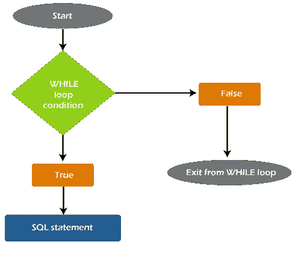
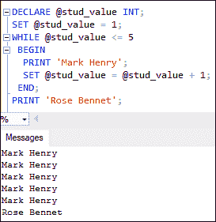
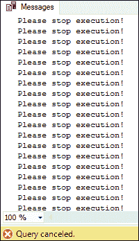
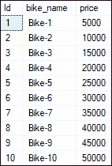
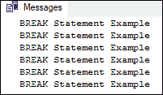
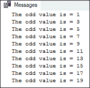
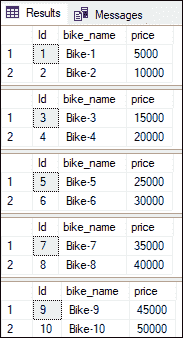
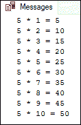

# SQL Server WHILE 循环

> 原文：<https://www.javatpoint.com/sql-server-while-loop>

本文将教您在 SQL Server 中使用 WHILE 循环的完整概述。一个 **WHILE 循环是一个控制流语句，用于重复执行该组语句，直到满足指定的条件**。这个循环从一个给定的条件开始，评估它，如果它为真，语句将进入循环内部进一步执行。如果条件变为假，它将不会运行。这意味着 SQL Server 中的 while 循环可以运行零次或更多次。

### WHILE 循环流程图

以下流程图将解释 [SQL Server](https://www.javatpoint.com/sql-server-tutorial) 中 WHILE 循环的完整工作流程:



我们可以在这个图表中看到，每次迭代都会检查指定的条件，并根据评估结果确定代码流。如果结果评估为真，则控制流程进入循环内部，以便进一步执行。如果评估结果为假，控制流将退出循环，并且将执行循环之外的任何语句或查询。

### 句法

以下语法说明了 SQL Server 中的 WHILE 循环:

```sql

WHILE boolean_condition
BEGIN
   {SQL_statement | statement_block | BREAK | CONTINUE}
END;

```

在这个语法中，我们有以下参数或参数:

*   **boolean_condition:** 这是一个必需的条件，将在每次迭代中进行测试，以返回真或假的结果。如果是 SELECT 语句，它必须用括号括起来。
*   **sql_statement 或 statement _ block:**SQL 语句或分组在 BEGIN 和 END 关键字内定义。它将在每次迭代中执行，直到循环变为假。
*   **Break:** 瞬间结束最里面的循环，控制流在循环后的下一条语句处恢复。
*   **继续:**它跳到下一个迭代，而不跳过循环中剩余的语句。通常，它会导致循环从头开始。

### WHILE 循环示例

让我们通过一个例子来了解 WHILE 循环在 SQL Server 中是如何工作的。在给定的示例中，我们首先声明了一个**整数类型**的值，并将其值设置为 1。接下来，WHILE 循环检查条件，如果是**真**，打印语句将被打印。当循环变为**假**时，将打印 WHILE 循环后的下一条语句。

```sql

DECLARE @stud_value INT;
SET @stud_value = 1;
WHILE @stud_value <= 5
 BEGIN
  PRINT 'Mark Henry';
  SET @stud_value = @stud_value + 1;
 END;
PRINT 'Rose Bennet';

```

执行此语句将返回以下输出:



在上面的 WHILE 循环代码片段中，我们必须在每次迭代后增加变量的值。见上面代码行的下面部分为**SET @ stud _ value = @ stud _ value+1**。如果我们不写这个语句，循环将无限执行，因为它不能变成 FALSE。

```sql

BEGIN
  PRINT 'Mark Henry';
  SET @stud_value = @stud_value + 1;
 END;

```

### 无限 WHILE 循环

当条件的评估永远不会为假时，就会出现无限循环。因此，循环永远不会结束，永远不会执行。以下代码片段中的循环是无限的，因为变量的值没有递增。

```sql

DECLARE @stud_value INT;
SET @stud_value = 1;
WHILE @stud_value <= 5
 BEGIN
  PRINT 'Please stop execution!'
 END;

```

执行循环将显示以下输出。这个循环永远不会结束它的执行，直到我们不手动取消他们的查询执行。



### 使用 WHILE 循环插入记录

我们还可以使用 WHILE 循环将记录插入到定义的表中。让我们看看如何将虚拟记录插入数据库。首先，我们将创建一个名为**‘bike shop’**的表，该表包含三列:**身份证、bike_name、**和**价格**。执行以下语句创建此表:

```sql

CREATE TABLE bikeshop
(
 Id INT PRIMARY KEY IDENTITY,
 bike_name VARCHAR (50) NOT NULL,
 price FLOAT
)

```

接下来，我们将通过执行以下脚本，使用 WHILE 循环向该表中插入十条记录:

```sql

DECLARE @count INT;
SET @count = 1; 
WHILE @count <= 10
BEGIN
   INSERT INTO bikeshop VALUES('Bike-' + CAST(@count as varchar), @count*5000)
   SET @count = @count + 1;
END;

```

在这段代码中，我们声明了一个变量@ **count** ，然后使用 SET 子句用 1 初始化它的值。接下来，我们必须定义执行 INSERT 语句的循环体，以便在每次执行中添加一条记录。**自行车 _ 名称列**将在字符串**自行车**中附加@计数变量的值，而**价格列**由@计数变量的值乘以 **5000** 确定。循环将一直执行，直到@count 变量的值变为 FALSE。这意味着 WHILE 循环将执行十次，**将十条记录**插入表 bikeshop。

现在，我们可以用 SELECT 语句验证 bikeshop 表的所有记录。它将显示以下输出:



### break 语句

SQL Server 还允许我们像编程语言一样在 WHILE 循环中使用 BREAK 语句。该语句用于**立即停止循环**的当前迭代，控制流程从循环后的下一条语句恢复。一般来说，我们会使用[T3【IF】...ELSE 语句](https://www.javatpoint.com/sql-server-if-else) 检查条件是否已经发生。

以下示例将解释如何在 WHILE 循环中使用 BREAK 语句:

```sql

DECLARE @count INT;
SET @count = 1; 
WHILE @count <= 10
BEGIN
  PRINT 'BREAK Statement Example'
  IF @Count >= 6
  BEGIN
   BREAK
  END
  SET @Count  = @Count + 1
END;

```

执行代码将显示以下输出:



在这段代码中首先计算变量值。如果为真，控件进入循环并打印语句。当变量值大于或等于 6 时，控制进入中频...ELSE 块并执行 BREAK 语句来终止循环。如果一个中频...否则块不满足条件；然后，循环将继续运行，直到条件变为假。

### 连续语句

SQL Server 还允许我们像编程语言一样在 WHILE 循环中使用 CONTINUE 语句。该语句在满足指定条件时立即**终止循环的当前执行**，控制流程返回循环开始。总的来说，综合框架...ELSE 语句将用于测试是否满足某个条件。

下面的示例演示了 WHILE 循环中的 CONTINUE 语句。在这个例子中，我们假设我们希望使用 WHILE 循环来**只打印奇数**。CONTINUE 语句可以用来实现这一点。本例首先**测试**变量值是**奇数还是偶数**。如果是偶数，则执行进入 IF…ELSE 语句块，并将变量值减 1。然后，它将执行 CONTINUE 语句，并从头开始新的迭代。

```sql

DECLARE @Count INT 
SET @Count = 1
WHILE (@Count <= 20)
BEGIN
  IF @Count % 2 = 0
  BEGIN
  SET @Count = @Count + 1
  CONTINUE
  END
    PRINT 'The odd value is = ' + CONVERT(VARCHAR, @Count)
    SET @Count = @Count + 1
END 

```

执行代码片段将显示以下输出:



### 如何在 SQL Server 中用 WHILE 循环实现分页？

我们也可以使用 WHILE 循环来实现分页。分页允许在任何特定时间显示表中的记录子集。下面的例子将解释这个概念。代码中的 WHILE 循环将一次从 bikeshop 表中选择两条记录。然后，已选择的记录将显示在输出中。

```sql

DECLARE @count INT
DECLARE @limit INT;
SET @count = 0
SET @limit = 2;
WHILE @count < 10
BEGIN
   SELECT * FROM bikeshop ORDER BY Id
   OFFSET @count ROWS
   FETCH NEXT @limit ROWS ONLY
   SET @count = @count + 2;
END;

```

执行代码片段将返回以下输出:



### 嵌套 WHILE 循环

SQL Server 中的嵌套 WHILE 循环只是一个写在另一个 WHILE 循环中的 WHILE 循环。当我们处理多层数据时，嵌套 WHILE 循环是必不可少的。因为当我们想要选择分层数据时，这个概念在提取分层数据时很有用，所以建议在使用嵌套循环时要小心。

**语法**

以下语法说明了嵌套的 WHILE 循环在 SQL Server 中的工作方式:

```sql

WHILE Expression
 BEGIN
	WHILE @Val2 <= 10
		BEGIN
			--Second WHILE Loop Statements
			SQL Statements
		END
	--This statement is outside the second WHILE loop
	--Which is the first WHILE loop statement
	SQL Statements
 END
-- This statement is outside the first WHILE loop

```

让我们一步一步解释这个语法:

**步骤 1:** 循环从检查第一个 While 循环条件开始，如果发现错误结果，将从 WHILE 循环退出。否则，如果结果为真，控件将进入 BEGIN 和 END 块进行进一步执行。这个块将开始执行第二个 WHILE 循环。请参见第 2 步。

**步骤 2:** 该步骤将检查嵌套 WHILE 循环中的条件，如果为假，则第二个循环将退出并执行该循环之外的语句。否则，如果结果为真，控件将进入 BEGIN 和 END 块进行进一步执行。

**步骤 3:** 一旦所有语句从第二个 WHILE 循环开始执行，控制转到第一个 WHILE 并重复第一步。

**例**

以下示例将使用嵌套的 WHILE 循环打印 5 到 10 的乘法表。

```sql

DECLARE @val1 INT
DECLARE @val2 INT
SET @val1 = 5
SET @val2 = 1 
WHILE @val1 <= 5
BEGIN     
 WHILE @val2 <= 10   
  BEGIN       
   PRINT CONVERT(VARCHAR, @val1) + ' * ' + CONVERT(VARCHAR, @val2)
      + ' = ' + CONVERT(VARCHAR, @val1 * @val2)       
   SET @val2 = @val2 + 1   
  END   
 SET @val1 = @val1 + 1
END 

```

执行该语句将显示乘法表 5。以下是输出:



## 结论

当需要重复执行一个 SQL 脚本时，WHILE 循环是一个有用的方法。本文通过一个简单的例子解释了如何在 MS SQL Server 中使用 WHILE 循环来执行记录插入和分页等操作。在这里，我们还学习了控制 WHILE 循环迭代的 BREAK 和 CONTINUE 语句。

* * *