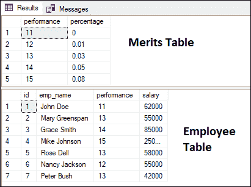
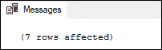
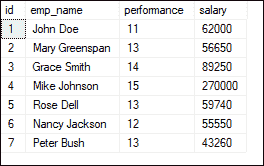
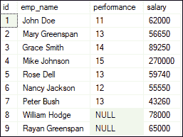
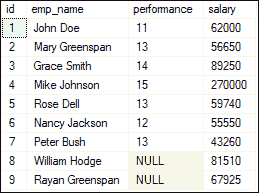

# SQL SERVER UPDATE JOIN

> 原文：<https://www.javatpoint.com/sql-server-update-join>

本文的主要目的是向您展示如何使用 UPDATE JOIN 命令，使用两个表之间的连接来编辑表中的现有记录。我们可以单独或一起使用 UPDATE 语句和 JOIN 语句。

**更新查询**是一个修改表中现有数据的 DML 语句。我们必须在更新查询中使用 **SET** 和 **WHERE** 子句。SET 子句用于更改 WHERE 子句中指定的列的值。 **JOIN 子句**用于通过在一个查询中连接多个表来获取数据。

### 什么是 UPDATE JOIN？

UPDATE JOIN 是 UPDATE 查询的一种特殊情况，在这种情况下，目标表中的行使用源表中同一列或字段的值进行更新。换句话说，**这个语句执行跨表更新**，这意味着我们可以使用带有 JOIN 子句条件的另一个表来更新一个表。借助**主**和**外键**以及一个连接条件，可以在连接多个表时更新和更改数据。我们可以使用 update 查询一次更新一列或多列。

### 句法

UPDATE JOIN 语句的语法如下:

```

UPDATE Tab1, Tab2
SET Tab1.C2 = Tab2.C2, Tab2.C3 = expression  
FROM Tab1 [INNER JOIN | LEFT JOIN] Tab2 ON join_condition  
WHERE where_condition;  

```

**以上语法参数解释如下**:

首先我们要指定表名( **Tab1 和 Tab2** )进行修改。我们必须在**更新**条款后指定至少一个表格。之后，我们必须为修改后的表的每一列分配新的值。然后，在 **FROM** 子句中，我们指定要更新的源表。接下来，我们需要写连接类型，要么 **INNER** 要么 **LEFT JOIN** ，然后在 **ON** 关键字后写一个连接条件。最后，可选的 WHERE 子句用于限制要更新的行。

### 更新连接示例

让我们首先创建下面的表来执行各个语句，然后再来研究连接如何与 UPDATE 语句一起工作。下面的示例代码将创建两个名为**绩效** s 和**员工**的表，这两个表通过外键相关联。这里，“优点”是父表，“员工”是子表。

**功德表的代码脚本:**

```

-- it will create a merit table
CREATE TABLE Merits (  
    performance INT NOT NULL PRIMARY KEY, 
    percentage FLOAT NOT NULL 
);  
-- it will insert data into merit table
INSERT INTO Merits(performance, percentage)  
VALUES(11, 0),  
      (12, 0.01),  
      (13, 0.03),  
      (14, 0.05),  
      (15, 0.08);

```

**员工表的代码脚本:**

```

-- it will create an employee table
CREATE TABLE Employee (
id INT NOT NULL IDENTITY PRIMARY KEY,
emp_name VARCHAR(255) NOT NULL,
performance INT DEFAULT NULL,
salary FLOAT DEFAULT NULL,
CONSTRAINT fk_perf FOREIGN KEY(performance)
REFERENCES Merits(performance)
);

-- it will insert data into the employee table
INSERT INTO Employee(emp_name, performance, salary)
VALUES('John Doe', 11, 62000),
('Mary Greenspan', 13, 55000),
('Grace Smith', 14, 85000),
('Mike Johnson', 15, 250000),
('Rose Dell', 13, 58000),
('Nancy Jackson', 12, 55000),
('Peter Bush', 13, 42000);

```

我们可以使用下面的 SELECT 语句来验证该表:

```

SELECT * FROM Merits;
SELECT * FROM Employee;

```

执行上述语句将返回以下输出:



### 用内部连接更新

如果我们想根据员工的表现更新他们的工资，我们需要使用 UPDATE INNER JOIN 语句。此语句将根据“绩效”表中包含的绩效百分比(%)，更新“员工”表中员工的工资。我们必须使用常见的现场绩效来加入员工和绩效表。考虑以下查询来完成此任务:

```

UPDATE Employee
SET salary = salary + salary * percentage
FROM Employee e
INNER JOIN Merits m   
ON e.performance = m.performance;

```

执行该语句将显示以下消息:



如果我们再次查询 Employee 表，我们将看到薪资列中的值已成功更新:



让我们看看 [SQL Server](https://www.javatpoint.com/sql-server-tutorial) 是如何处理这个查询的。在查询中，我们刚刚提到了 UPDATE 子句之后的 Employee 表，因为我们只想编辑 Employee 表中的记录，而不是两者都编辑。

该查询将“**员工**”表的绩效列的值与“**优点**”表的绩效列的值进行比较。如果找到匹配的绩效字段，则绩效表的百分比用于更新员工表的薪资列。此查询将更新 Employees 表的每条记录，因为我们没有在 UPDATE JOIN 语句中指定 WHERE 子句。

### 用左连接更新

在前面的示例中，我们使用了一个内部连接来更新员工的工资，其中在“优点”和“员工”表中都有一个类似的绩效列。现在，我们将看到如何将 UPDATE 语句与 LEFT JOIN 一起使用。为了更好地理解这个概念，我们首先需要在 Employees 表中添加另外两行:

```

INSERT INTO Employee(emp_name, performance, salary)
VALUES('William Hodge', NULL, 78000),
('Rayan Greenspan', NULL, 65000);

```

这些员工的绩效记录不可用，因为他们是新员工。看看下面的输出:



假设我们要**更新新入职员工的工资**。在这种情况下，不能使用 UPDATE INNER JOIN 查询。这是因为他们在“优点”表中的性能数据不可用。因此，我们将使用 UPDATE LEFT JOIN 语句来满足这一需求。当在另一个表的相应行中没有找到匹配的记录时，UPDATE LEFT JOIN 语句更新表中的一行。

**例如**，如果我们想给最近入职的员工增加 4.5%的薪酬，我们可以使用以下语句来完成这个任务:

```

UPDATE Employee
SET salary = salary + salary * 0.045  
FROM Employee e
LEFT JOIN Merits m   
ON e.performance = m.performance   
WHERE m.percentage IS NULL;

```

执行该语句将返回以下结果，该结果显示新雇用员工的工资已成功更新。



本文将帮助我们了解 UPDATE JOIN 语句，允许我们使用 JOIN 子句条件用另一个表中的新数据替换一个表中的现有数据。当我们需要更改 WHERE 子句中的某些列以及 INNER JOIN 或 LEFT JOIN 子句时，此查询非常有用。在生产实例中更新关系表时，我们应该小心，因为错误的值、列名或其他错误可能会导致问题。

* * *