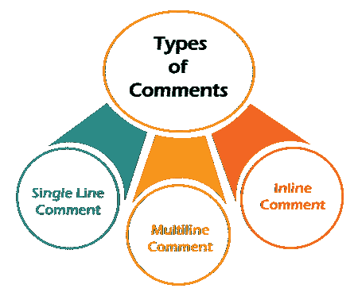
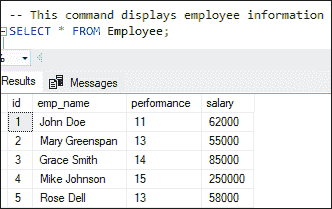
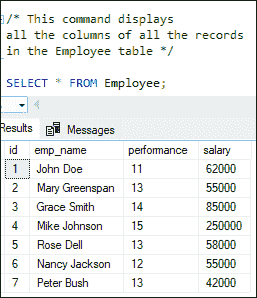
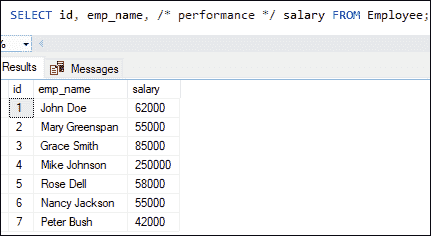

# SQL 服务器注释

> 原文：<https://www.javatpoint.com/sql-server-comments>

**注释是程序员可读的解释或注释，用于不影响其执行的 SQL 语句中**。它用于使 SQL 语句对人类来说更容易理解。我们可以在语句中的任何关键字、参数或标点符号之间包含注释。在解析 SQL 代码的过程中，SQL Server 引擎通常会忽略它们。在像编程语言这样的 SQL 查询中，这很重要。

**使用注释的一些例子有:**

*   它可以用来标记一段代码，使其他人更容易理解。
*   它还允许我们在以后删除 SELECT 语句输出中显示的列时修改内容，但仍然保留查询中的名称。
*   要检查数据和性能，请禁用 WHERE 子句的行。

**SQL Server 提供三种类型的注释，如下所示:**

1.  单行注释
2.  多行 Comment
3.  内嵌注释



注释主要用于记录代码，并提供代码功能的描述。让我们用例子详细描述每种类型的评论。

### 单行注释

**以单行**开始和结束的注释称为单行注释。我们可以用相同的 SQL 语句添加注释，嵌套在 SQL 语句的末尾或单独的一行中。SQL Server 引擎不评估注释。单行注释由**双破折号(---)表示**。

我们可以使用下面的单行注释:

```

-- the text of comment written here

```

**例**

以下语句正确执行并显示**员工详细信息:**

```

-- This command displays employee information
SELECT * FROM Employee;

```

执行该语句将给出以下输出，而无需解析注释:



以下示例是在 SQL server 中编写单行注释的另一种方法:

```

SELECT * FROM Employee; -- This command displays employee information

```

### 多行注释

我们使用多行注释来记录 SQL 语句块。它可以跨越几行。多行注释由 **(/*和*/)符号**表示。以“/*”开头的行被视为注释的起点，当遇到“*/”时终止。SQL Server 引擎会忽略写在这些符号之间的内容。

我们可以使用如下多行注释:

```

/*   
   The content description is written here.   
   The content description is written here.  
*/

```

### 例子

以下语句执行正确，并返回了员工详细信息:

```

/* This command displays 
all the columns of all the records 
in the Employee table */  

SELECT * FROM Employee;

```

执行该语句将给出以下输出，而无需解析注释:



### 内嵌注释

是多行注释的扩展，用于**忽略一行的部分**。它在语句之间声明，并包含在“/*”和“*/”符号之间。

**例**

正确执行以下语句，并从**员工表中返回所选列:**

```

SELECT id, emp_name, /* performance */ salary FROM Employee;

```

执行该语句将得到下面的输出，我们可以看到 SQL Server 引擎忽略了性能列:



### 结论

本文将讨论在 SQL Server 中使用的不同类型的注释。在这里，我们深入了解了单行注释、多行注释和内联注释。

* * *