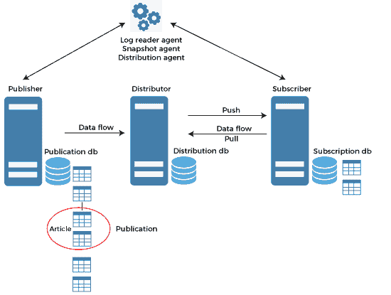
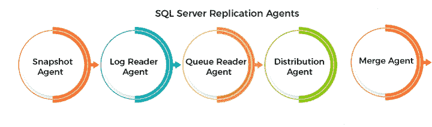
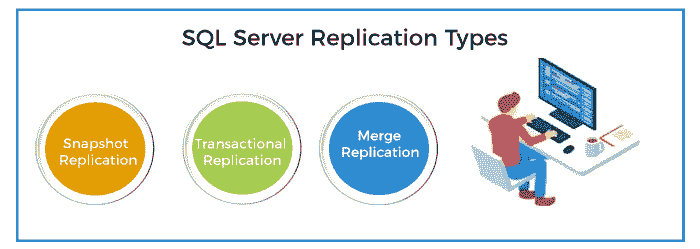
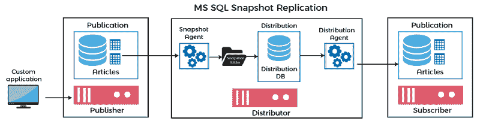
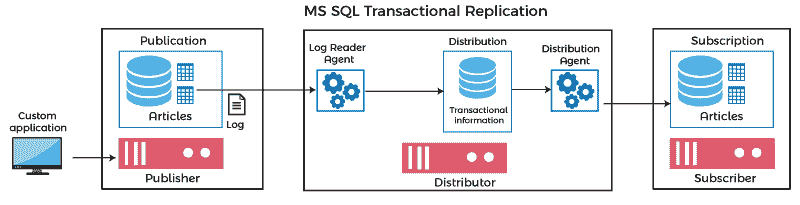
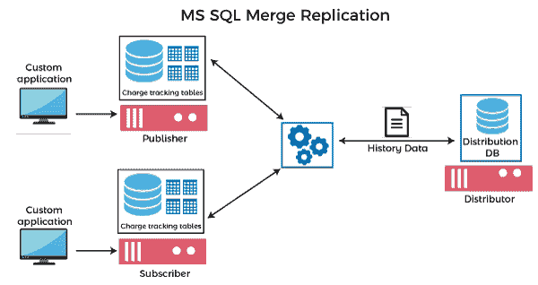

# SQL Server 复制

> 原文：<https://www.javatpoint.com/sql-server-replication>

SQL Server 中的复制是一种**技术，用于将数据和数据库对象从一个数据库复制和分发到另一个数据库，以及同步数据库以确保数据的一致性和完整性。**这种技术分发数据库的选定部分，如表和视图，不像其他复制技术那样分发整个数据库。它允许在不同的位置同时使用多个数据副本。它还用于连续复制和同步数据，或者可以计划以预定义的时间间隔运行。

### 复制的优势

以下是在 SQL Server 中使用复制的主要好处:

*   当几个用户在不同的位置工作时，它减少了锁定冲突并提高了性能。
*   与其他数据库相比，它易于维护并提高了可用性。
*   它使网站能够自主运行。每个站点都可以建立自己的规则和程序来处理自己的数据副本。
*   它有助于让数据更接近用户。

## SQL Server 复制体系结构

SQL Server 中的复制技术基于**“发布和订阅”**概念。下图有助于理解复制体系结构的每个实体或组件:



### 文章

它是复制技术的基本单位，由表、视图、函数和存储过程组成。可以使用过滤器选项垂直或水平缩放。可以在同一对象上创建几篇文章，但有一些限制。

我们可以使用**新出版物向导**来浏览文章。该向导使我们能够查看文章的属性并根据需要设置权限。我们也可以在创建发布时设置属性，但这些只是只读权限。

如果要在创建发布后更改其属性，则必须生成新的复制快照。如果发布包含一个或多个订阅，则修改需要独立地重新初始化所有订阅。

**我们可以用下面的 SQL 语句列出所有发布的文章:**

```

SELECT
     Pub.[publication]    [PublicationName]
    ,Art.[publisher_db]   [DatabaseName]
    ,Art.[article]        [Article Name]
    ,Art.[source_owner]   [Schema]
    ,Art.[source_object]  [Object]
FROM
    [distribution].[dbo].[MSarticles]  Art
    INNER JOIN [distribution].[dbo].[MSpublications] Pub
        ON Art.[publication_id] = Pub.[publication_id]
ORDER BY
    Pub.[publication], Art.[article]

```

如果我们希望**在发布的数据库中获取事务或合并复制**中的文章详细信息，我们需要执行下面的 SQL 语句:

```

SELECT st.name [published object], st.schema_id, st.is_published , st.is_merge_published, is_schema_published  
FROM sys.tables st WHERE st.is_published = 1 or st.is_merge_published = 1 or st.is_schema_published = 1  
UNION  
SELECT sp.name, sp.schema_id, 0, 0, sp.is_schema_published  
FROM sys.procedures sp WHERE sp.is_schema_published = 1  
UNION  
SELECT sv.name, sv.schema_id, 0, 0, sv.is_schema_published  
FROM sys.views sv WHERE sv.is_schema_published = 1;

```

如果我们想要**在一个列出的发布者中获取文章信息，**使用下面的 SQL 语句:

```

DECLARE @publication AS sysname;
SET @publication = N'PROD_HIST_Pub';
USE MES_PROD_AP
EXEC sp_helparticle
  @publication = @publication;

```

### 发表

这是一个存在于出版商数据库中的文章的逻辑集合。该出版物使我们能够在更高的级别定义和配置文章属性，以便将属性继承到组中的所有文章。它表示数据库的最后一组实体。文章独立分发很重要。

```

EXEC sp_helppublication; 

```

### 发布者数据库

这是一个数据库，**保存一个已被识别为复制项目的对象列表**。它可以有一个或多个发布，其中每个发布者一起创建许多内部复制存储过程来定义数据传播方法。

### 出版者

它指示复制开始的源数据库，并使数据可用于配置用于复制过程的其他服务器。

### 经销商

它是与一个或多个发布者相关联的复制数据的**仓库。**有时，发行者同时充当发行者和发行者。在 SQL Server 复制的上下文中，它被称为“本地分发服务器”，其中单个服务器实例同时运行发布服务器和分发服务器。当分布在不同的服务器上时，它被称为“远程分布器”。每个发布服务器都与分发数据库和分发服务器相关联。

它还识别并存储复制状态数据和发布元数据。它有时充当数据从发布者移动到订阅者的队列。它还告诉订阅了发布的订阅服务器，根据复制类型，项目已经更改。

### 分发数据库

文章详细信息、复制元数据和数据都存储在该数据库中。一个分发服务器应该至少有一个分发数据库，在某些情况下，它可能有多个数据库。我们确保由单个发布者定义的所有发布都使用同一个数据库进行分发。

**我们可以使用以下语句来检查服务器是否是分发服务器:**

```

SELECT @@ServerName Servername, case when is_distributor=1 
 then 'Yes' 
 else 'No' 
 end status 
FROM sys.servers WHERE name='repl_distributor' AND data_source=@@servername; 

```

**以下命令检查是否安装了分发数据库:**

```

SELECT name FROM sys.databases WHERE is_distributor = 1

```

以下命令**检查发布者是否使用该分发器:**

```

EXEC sp_get_distributor

```

以下命令用于获取分发服务器和分发数据库属性:

```

EXEC sp_helpdistributor;  
EXEC sp_helpdistributiondb;  
EXEC sp_helpdistpublisher; 

```

### 订户

订阅服务器是从发布中接收复制数据的**数据库实例。**每个订阅者可以从一个或多个发布者和出版物接收数据。当只有一个订户时，就实现了单订户模型。当许多订阅者链接到一个发布时，就实现了多订阅者技术。根据复制设计和模型，订阅服务器还可以将数据修改发送回发布服务器，或将数据重新发布给其他订阅服务器。

```

EXEC sp_helpsubscriberinfo;

```

### 捐款

术语“订阅”是指向订阅者发送发布副本的请求。订阅指定了必须获取的发布数据，以及将在何时何地传递这些数据。我们可以将订阅分为推送和拉取两种形式。

*   **推送订阅:**是分发方直接向订阅方发送更新数据的订阅。不需要从订户那里获得请求。
*   **拉订阅:**这是一种订阅，订阅者定期检查分发服务器的新修改。如果可用，它会更新订阅数据库本身中的数据。

```

EXEC sp_helpsubscription;

```

### 订阅数据库

它指的是 SQL Server 复制技术中的目标数据库。

## 复制代理

代理是一组预定义的独立程序和事件，用于执行与数据相关的任务。默认情况下，它们被配置为在 SQL Server 代理下作为计划作业执行。我们还可以从命令行或使用复制管理对象(RMO)的应用程序启动它。我们使用复制监视器和 SQL Server 管理工作室来监视和管理复制代理。

**我们可以将复制代理分为五种类型，如图所示:**



### 快照代理

它是一个可执行程序，有助于创建快照文件，包括模式、发布的文章、快照文件、记录和数据库对象。它与所有类型的复制技术一起使用，因为它为发布数据库和订阅数据库的初始数据同步提供了所需的数据集。数据通常保存在快照文件夹中，同步作业保存在分布式数据库中。

### 分销代理

它仅用于事务复制和快照复制。初始复制快照通过此代理应用于订阅数据库，数据更新在应用于订阅数据库之前会在分发数据库中进行跟踪和记录。分发服务器可以使用它来推送订阅，订阅服务器可以使用它来提取订阅。

### 日志读取器代理

它仅与事务复制结合使用，事务复制将事务从发布数据库事务日志移动到分发数据库。每个数据库都有自己的日志读取器代理，它运行在分发服务器上，可以与发布服务器通信。

### 合并代理

它与合并复制模型一起使用。默认情况下，它将订阅服务器修改上载到发布服务器，然后将发布服务器更新下载到订阅服务器。它与每个订阅相关联，后者与发布者和订阅者进行通信，以使他们保持最新状态。对于推送订阅，它在分发服务器上运行，对于请求订阅，它在订阅服务器上运行。在这种情况下，同步是双向的。支持整个流程的一组触发器处理数据冲突。

### 队列读取器代理

事务复制将此代理与排队更新选项一起使用。队列读取器代理始终在分发服务器上运行，如果在订阅服务器上发现任何更改，它会将它们传输到发布服务器。只有一个队列读取器代理实例来处理授权分发数据库的所有发布和发布者。

## 复制类型

SQL Server 将复制技术分为三种主要类型，如下图所示:



### 快照复制

快照复制是**用于复制和分发数据**，就像拍摄数据库快照时一样。当数据不经常修改，或者数据库副本比主数据库旧并不重要，或者在短时间内完成大量更改时，我们可以使用这种复制类型。此方法不记录更改。

**例如，**假设一个单一产品公司一年改变一两次他们的物品价格。在这种情况下，强烈建议在这种情况下复制数据的整个快照。



**快照复制是如何工作的？**

我们可以通过以下几点了解快照复制的工作原理:

*   快照代理负责维护分发服务器和发布服务器之间的链接，并通过设置锁在快照文件夹中创建新快照。
*   接下来，他们为每篇文章编写一份表模式的副本。
*   它正在从发布的表中复制数据，并将数据发布到**中的快照文件夹。bcp 文件。**最后，它追加行并释放已发布表上的锁。

简单来说，快照复制就像它的名字一样。在这里，发布者拍摄完整数据库的图片，并与订阅者共享。我们在以下两个主要场景中使用它:

1.  它用于不经常更改的数据库。
2.  它作为建立系统复制的基准，未来的更新通过合并或事务复制传播。

**事务复制**

它为频繁更改的数据库提供了更灵活的解决方案。复制代理监视发布服务器的数据库更改，并将其发送给订阅服务器。这些传输可以定期或定期进行调度。这使得它与快照复制相比更加复杂。在事务复制过程开始时，会将快照应用于订阅服务器，然后在数据被更改后，数据会不断从主数据库发送到数据库副本。单向复制通常用于事务复制。



**合并复制**

它是服务器到客户端环境中使用的双向复制，用于在多个数据库服务器无法连续连接时同步它们的数据。建立连接后，合并复制代理检测数据库的修改和更改以进行同步并更新其状态。它类似于事务复制，但这里发布者和订阅者分别对数据库进行更改。如果修改中存在任何冲突，代理将使用预定义的冲突解决程序检查适当的数据。它很少使用，因为它是所有复制类型中最复杂的。



* * *