# SQL Server 约束

> 原文：<https://www.javatpoint.com/sql-server-constraints>

约束是应用于表或列的一组预定义的规则和限制，用于限制未授权的值插入到表中。他们负责确保表中列的数据准确性、完整性和可靠性。约束还告诉我们，当插入的数据满足约束规则时，数据将被插入到表中。否则，如果插入的数据违反定义的约束，插入操作将终止。

SQL Server 将约束分为两种类型:

1.  **表级约束:**这些约束适用于整个表，限制了可以输入到表中的数据类型。它的定义是在使用 ALTER 语句创建表后指定的。
2.  **列级约束:**这些约束适用于单列或多列，以限制可以输入到列中的数据类型。它的定义是在创建表时指定的。

## SQL Server 中使用的约束

以下是在 SQL Server 中使用的最常见的约束，我们将通过示例对其进行深入描述:

*   不为空
*   独一无二的
*   主关键字
*   外键
*   支票
*   系统默认值

### 非空约束

默认情况下，SQL Server 中的列存储空值。我们可以通过使用非空约束来限制空值插入给定的列。如果我们试图在该列中插入空值，它将被视为无效值。这意味着在使用 INSERT 或 UPDATE 操作时，我们必须在表中提供有效的非空值，因为该列将始终有数据。

我们可以在创建表的过程中或者在使用 ALTER 语句创建表之后应用 NOT NULL 约束。

**以下示例将在创建表时在列中应用 NOT NULL 约束:**

```sql

CREATE TABLE Sales (
    Id int NOT NULL,
    Amount int NOT NULL,
    Vendor_Name varchar(255)
);

```

接下来，我们将在表中插入一些值，看看这个约束如何工作。

```sql

INSERT INTO Sales VALUES(1, 22000, 'Amanda Harris');  
INSERT INTO Sales VALUES(2, NULL, 'Chris Jordan');  

```

执行上面的 insert 语句将返回下面的输出。在这里，我们可以看到**第一个 INSERT 查询执行正确，但是第二个语句失败**并给出一个错误，说列**“金额”**不允许为空。

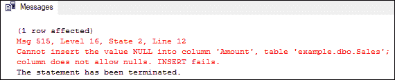

当我们创建一个“销售”表时，我们可以看到对于“供应商名称”列没有应用任何约束。因此，它将插入默认值空。如果我们想将空值限制在这个列中，我们使用下面的语句:

```sql

ALTER TABLE Sales ALTER COLUMN Vendor_Name varchar(75) NOT NULL;

```

SQL Server 还允许我们在不执行 SQL 语句的情况下在表中创建非空约束。我们可以通过使用**管理工作室**来实现这一点，首先右键单击所需的表格并选择**设计**选项。选中在设计窗口中存储空值的“**允许空值**”选项中的所有列。

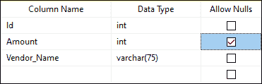

### 唯一约束

UNIQUE 约束确保不能将重复值插入到不属于主键且参与 UNIQUE 约束的列或列组合中。此约束总是在列中插入唯一且不重复的值。它类似于主键，但允许一个空值。它可以在创建表时应用，也可以在使用 ALTER 语句创建表后应用。

**以下示例将在创建表时在列中创建一个 UNIQUE 约束:**

```sql

CREATE TABLE Sales (
    Id INT NOT NULL UNIQUE,
    Amount INT NOT NULL,
    Vendor_Name VARCHAR(85),
    Profit FLOAT
); 

```

接下来，我们将在表中插入一些值，看看这个约束如何工作。

```sql

INSERT INTO Sales VALUES(1, 22000, 'Peter Johnson', 3000);  
INSERT INTO Sales VALUES(1, 22500, 'Amanda Cerni', 1500);

```

执行上面的 insert 语句将返回下面的输出。在这里，我们可以看到第一个 INSERT 查询执行正确，但是第二个语句失败并给出一个错误。此错误表示标识列不允许重复值，并且指定的标识值已经输入到该列中。

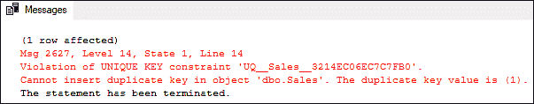

如果我们想在现有表中添加唯一约束以防止输入重复项，我们可以使用以下语句:

```sql

ALTER TABLE Sales ADD CONSTRAINT UQ__Constrai UNIQUE (Vendor_Name); 

```

如果我们不小心在错误的列中添加了约束，我们也可以在 SQL Server 中删除它。以下语句用于从特定列中删除约束:

```sql

ALTER TABLE Sales DROP CONSTRAINT UQ__Constrai;

```

SQL Server 还允许我们在表中创建唯一的约束，而无需执行 SQL 语句。使用**管理工作室**，我们可以通过首先右键单击所需的表格并选择**设计**选项来实现。在设计窗口中，选择要添加约束的列，单击鼠标右键，然后选择**索引/关键点**选项。将出现一个新向导；点击**添加**。接下来，单击常规属性中的**类型**，从下拉列表中选择唯一键，然后单击关闭。最后，保存文件菜单上的表格。

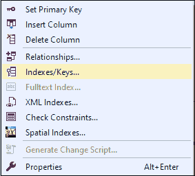

### 检查约束

此约束用于限制列中值的范围。它确保列中所有插入的值都必须遵循特定的规则。换句话说，它确定与列关联的值在给定条件下是否有效。它控制特定列中的值，并确保在列中没有输入损坏的信息。我们可以为特定列指定多个检查约束。当条件中包含空值时，此约束将产生未知值。

我们可以在创建表时或使用 ALTER 语句创建表后应用 CHECK 约束。

下面的示例将在创建表时在薪资列中应用 CHECK 约束。此约束指示薪资列不能存储小于或等于 10000 的数据。

```sql

CREATE TABLE salary_info (
 ID INT PRIMARY KEY,
 Name VARCHAR(250) NOT NULL,
 Salary INT CHECK (Salary>10000)
) 

```

接下来，执行以下 insert 语句将记录添加到表中:

```sql

INSERT INTO salary_info (ID, NAME, Salary) VALUES (1,'Amanda Cerni',10350);
INSERT INTO salary_info (ID, NAME, Salary) VALUES (2,'Nikola Haris', 9500);

```

执行此操作将返回以下结果:

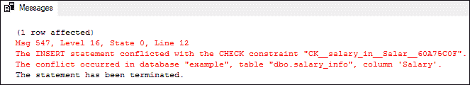

从结果来看，很明显，第一个 insert 语句添加的记录没有任何错误，因为薪资列中提供的值满足检查条件。第二个 insert 语句将会失败，因为由于插入了小于 10000 的值，所以“薪金”列中提供的值不符合检查条件。

我们知道，如果参与的列允许空值，这个约束也可以插入空值。这些空值将被评估为**未知**，不会产生错误。虽然在下面的语句中，薪资列值为**空**，但它已成功执行，并在表中添加了记录:

```sql

INSERT INTO salary_info (ID, NAME, Salary) VALUES (3,'Josh Philip', NULL);

```

验证该表将返回以下输出，其中薪资列在行标识 3 中显示空值。

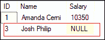

我们在创建表时没有提到约束名称，那么 SQL Server 会自动为这个约束指定一个唯一的名称。要检查约束名称，请使用**信息 _ 模式。检索给定表中所有已定义约束信息的系统对象。以下是声明:**

```sql

SELECT CONSTRAINT_NAME,
     TABLE_SCHEMA ,
     TABLE_NAME,
     CONSTRAINT_TYPE
     FROM INFORMATION_SCHEMA.TABLE_CONSTRAINTS
   WHERE TABLE_NAME='salary_info'

```

它返回下面的输出，其中显示了给定表的所有约束名称。

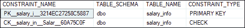

如果我们想要删除 CHECK 约束，请执行以下命令:

```sql

ALTER TABLE salary_info
DROP CONSTRAINT  CK__salary_in__Salar__60A75C0F;

```

如果我们想在现有表中添加 CHECK 约束，请执行以下命令:

```sql

ALTER TABLE salary_info
ADD CONSTRAINT CK_Salary
CHECK (Salary>10000);

```

我们还可以使用管理工作室工具创建 CHECK 约束。为此，首先右键单击所需的表并选择设计选项。在设计窗口中，选择要添加约束的列，单击鼠标右键，然后选择“检查约束”选项。将出现一个新向导，指定约束名称、表达式以及是否需要检查现有数据，然后单击“关闭”。最后，保存文件菜单上的表格。

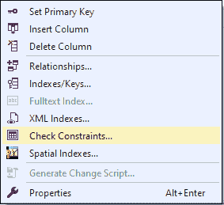

### 默认约束

当用户没有为该列指定任何值时，此约束用于在该列中插入默认值。当指定的默认约束列中没有提供值时，它有助于维护域的完整性。它还确保该列必须包含一个值，包括常数值、系统定义的值或空值。它也可以在创建表的过程中或创建表之后创建。

让我们用一个例子来理解它。下面的语句将创建一个包含四列的表。这里，我们在“薪资日期”列上定义了一个**默认约束，如果我们没有在 INSERT 语句中指定该列的系统日期值，则为该列指定该值:**

```sql

CREATE TABLE salary_info (
 ID INT PRIMARY KEY,
 Name VARCHAR(250) NOT NULL,
 Salary INT,
 Salary_Date DATETIME NOT NULL DEFAULT GETDATE()
) 

```

执行以下语句将记录插入表中:

```sql

INSERT INTO salary_info (ID, NAME, Salary, Salary_Date) VALUES (1,'Andrew Buttler',10350, '2021/07/22');

INSERT INTO salary_info (ID, NAME, Salary) VALUES (2,'Nikola Harris', 9500);

```

上述语句执行成功。我们可以使用 SELECT 语句来验证插入的记录。这里我们看到第二行的“薪资日期”列值分配了当前日期和时间值，因为我们在 INSERT 语句中没有提到它:

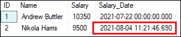

下面的语句将在创建表后添加 DEFAULT 约束。从“薪资日期”列中删除约束后，应该为上表执行此语句。

```sql

ALTER TABLE salary_info
Add Constraint DF__Constraint DEFAULT (GETDATE()) FOR Salary_Date;

```

要从列中删除默认约束，我们需要首先通过展开当前表下的约束节点来获取约束名称。

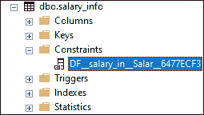

然后，我们可以使用下面的语句从列中删除约束:

```sql

ALTER TABLE salary_info
DROP CONSTRAINT  DF__salary_in__Salar__6477ECF3; 

```

我们还可以使用 management studio 工具创建 DEFAULT 约束。转到**设计选项**，选择要添加约束的列，然后通过浏览**列属性**窗口指定默认值，如下图所示。最后，单击关闭，然后在文件菜单上保存表格。

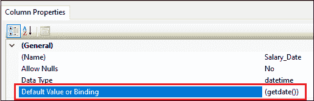

### 主键约束

此约束由一个或多个带值的列组成，并唯一标识表中的每条记录。我们不能在主键约束列中输入空值、空值或重复值。每个表只能包含一个主键列；但是，它可以有重复的列。它总是在一列中包含唯一的值。我们主要使用这个约束来加强表的实体完整性。

如果我们用多个列的组合来定义主键约束，那么就有可能在每个列上分别插入重复的值；但是，所有主键列的组合值必须是唯一的。此约束不同于 unique 约束，因为表可以创建多个 UNIQUE 约束，但每个表的主键只能是一个。

下面的语句创建了一个表“**人**”，该表有三列:**身份证、姓名和国家**。这里，我们将标识列定义为表的主键，通过确保该列不能有空值、空值或重复值来标识表的每条记录。以下是声明:

```sql

CREATE TABLE person (
 ID int NOT NULL PRIMARY KEY,
 Name varchar(65) NOT NULL,
 Country varchar(55)
);

```

接下来，我们将执行以下三个 insert 语句:

```sql

INSERT INTO person(Id, Name, Country)   
VALUES (1, 'Stephen Hughes', 'England'),   
(2, 'Amelia Turner', New Zealand);  

INSERT INTO person(Id, Name, Country)   
VALUES ('Robert Johnson', 'Australia');

INSERT INTO person(Id, Name, Country)   
VALUES (1,'Ella Mills', 'Florida');

```

执行这些语句将返回以下消息。它显示第一个 insert 查询成功执行，并向表中添加了两条记录，因为所有提供的列值都是有效的。第二个 insert 语句失败，因为 ID 列被定义为主键，所以该列是必需的，不能为空。第三次插入操作失败，因为给定的标识值已经存在，并且不能在主键列中输入重复的值。

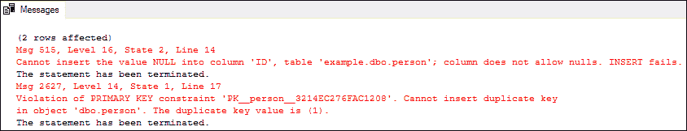

由于我们没有在表定义过程中为主键约束指定名称，所以 SQL Server 将自动为它分配一个唯一的名称。我们可以使用 INFORMATION_SCHEMA 看到主键约束名。系统对象。以下是输出:

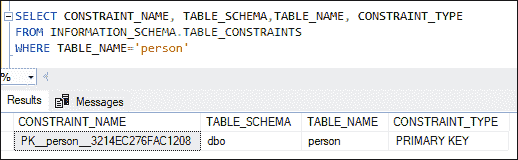

如果我们想为主键约束提供另一个名称，我们首先使用下面的语句删除默认名称:

```sql

ALTER TABLE person
DROP CONSTRAINT  PK__person__3214EC276FAC1208;

```

现在，我们使用下面的语句在创建表或删除指定新名称的默认名称后添加主键约束。

```sql

ALTER TABLE person
ADD CONSTRAINT PK__person PRIMARY KEY(ID);

```

#### 注意:我们确保使用 ALTER TABLE 命令将主键约束添加到列中时，必须声明了 NOT NULL 约束(在第一次创建表时)，并且只有 UNIQUE 值。否则，查询将失败。

我们还可以使用管理工作室创建 PRIMARY KEY 约束。右键单击所需的表，选择设计选项，然后选择要在其中添加约束的列。同样，右键单击您的列并设置一个主键选项，该选项将自动取消选中允许空值复选框:最后，单击关闭，然后在文件菜单上保存该表。

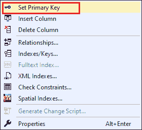

### 外键约束

外键是将两个表链接在一起的数据库键。这种约束也称为引用键，因为它通过将包含外键的子表的列引用到父表的主键列来标识表之间的关系。这意味着一个表中的外键列引用另一个表的主键列。

外键约束不同于主键约束，因为每个表只能有一个主键。相反，通过引用多个父表，每个表可以有几个外键约束。此外，我们不能在主键列中插入空值，但是如果没有为此键定义非空约束，我们可以在外键列中插入空值。

SQL Server 允许在表创建期间或表创建之后添加外键约束。让我们通过首先创建两个新表来理解它的功能，其中第一个表作为父表，第二个表作为子表。父表中的 PID 列被定义为主键，子表中的 CID 列被定义为引用父表的 ID 列的外键列。

**下面是创建两个表的代码脚本:**

```sql

CREATE TABLE Parent_Table(
 PID INT PRIMARY KEY,
 FullName VARCHAR(50) NULL
);

CREATE TABLE Child_Table(
 CID INT PRIMARY KEY,
 ID INT FOREIGN KEY REFERENCES Parent_Table(PID)
); 

```

接下来，我们将执行以下 insert 语句。第一个 insert 语句向父表添加三行，另外两个 insert 语句在子表中添加两条记录:

```sql

INSERT INTO Parent_Table (PID, FullName) 
VALUES (1, 'John'),(2, 'Andrew'),(3, 'Amanda');
GO
INSERT INTO Child_Table (CID, ID) VALUES (1, 1);
GO
INSERT INTO Child_Table (CID, ID) VALUES (2, 4);

```

执行这些语句将显示以下结果:

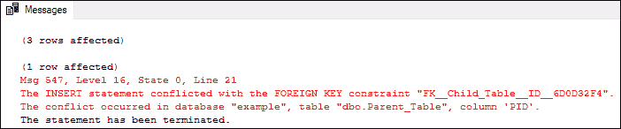

上面的输出图像显示，第一个 insert 查询向父表中添加了三行。第二个 insert 语句会将一条记录添加到子表中，不会有任何错误，因为父表中已经存在标识值 1。第三个 insert 语句将失败，并且不会向子表添加任何记录，因为父表中不存在 ID 值 4。由于外键限制，我们将无法向父表中不存在的子表插入标识值。

我们可以使用 SELECT 语句验证父表和子表中插入的记录。

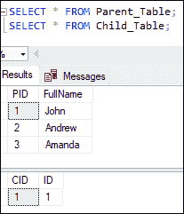

假设我们想在自动创建由 SQL Server 分配的子表之后定义外键约束名。为此，我们首先需要从 **INFORMATION_SCHEMA 中检索约束名称。TABLE_CONSTRAINTS** 语句，删除这个名称，然后使用 ALTER 语句分配一个唯一的名称。下面是代码脚本:

```sql

SELECT CONSTRAINT_NAME, TABLE_SCHEMA, TABLE_NAME, CONSTRAINT_TYPE 
FROM INFORMATION_SCHEMA.TABLE_CONSTRAINTS
WHERE TABLE_NAME='Child_Table'

-- drop foreign key constraint
ALTER TABLE Child_Table
DROP CONSTRAINT  FK__Child_Table__ID__6D0D32F4;

-- add a foreign key constraint
ALTER TABLE Child_Table
ADD CONSTRAINT FK_Constraint_ID
FOREIGN KEY(ID) REFERENCES Parent_Table(PID); 

```

我们还可以使用 SQL Server 管理工作室工具定义外键约束。右键单击所需的表格，选择“设计”选项。我们将看到**设计**窗口框，右键单击它并从菜单中选择**关系**选项:

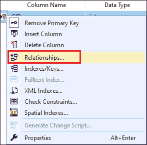

关系选项显示了另一个窗口，我们将通过单击**表和列**规范来指定外键约束名称以及参与该关系的表和列。现在，当父表中引用的记录被删除或修改时，单击确定按钮完成操作。

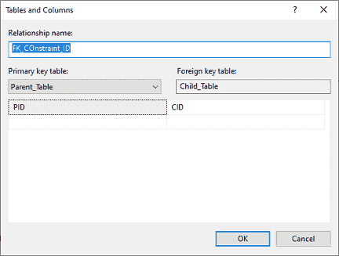

* * *