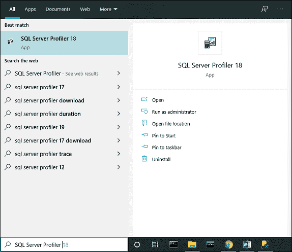
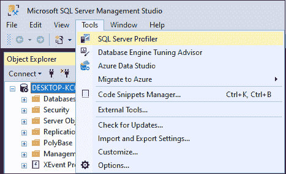
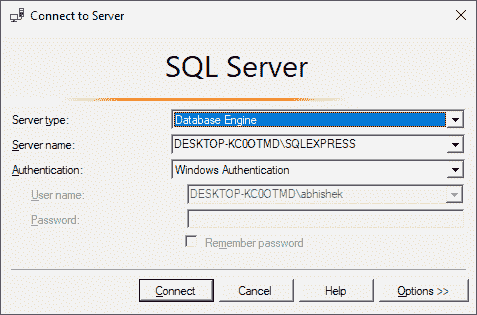
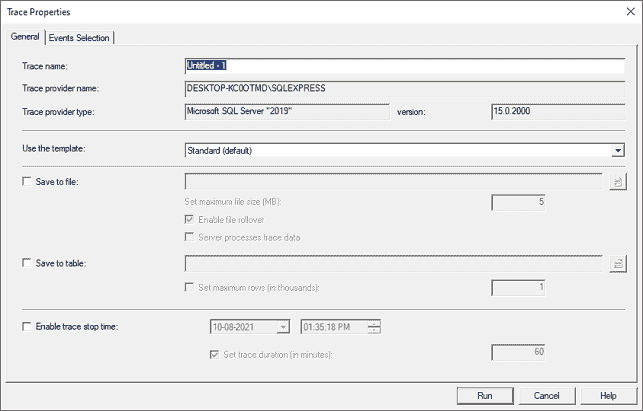
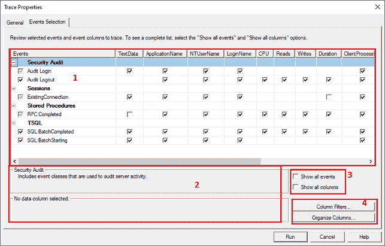
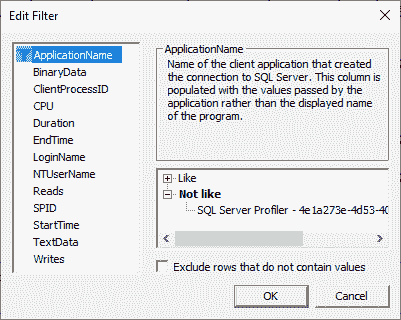
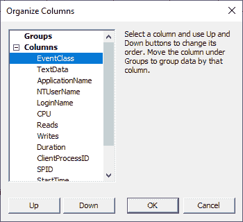

# 事件探查器

> 原文：<https://www.javatpoint.com/sql-server-profiler>

SQL profiler 是 Microsoft SQL Server 关系数据库管理系统中的 GUI 工具，**允许我们监视、分析、排除故障、重新创建和跟踪 SQL 数据库及其环境的问题**。它最初是在 SQL Server 2000 版本中引入的。它跟踪特定数据库引擎上的活动或操作。本文将讨论 profiler，它是如何工作的，它的优点和缺点，以及替代方案。

**开发人员和数据库管理员可以使用 profiler 创建和处理跟踪，以及重放和分析跟踪结果**。它就像一个显示微软 SQL Server 实例运行状况的仪表板。事件探查器将事件保存在跟踪文件中，以便在诊断问题时进行分析或用于重放特定的一系列步骤。我们还可以将跟踪安排在特定的时间运行，例如，一个跟踪将设置为每天早上 9 点运行，以便在数据库处于活动或空闲状态时比较性能。当数据库活动很少或没有活动时，我们还可以将另一个跟踪设置为在凌晨 1 点运行。

**SQL Server Profiler 允许数据库管理员执行以下任务:**

*   创建跟踪
*   跟踪运行时查看结果。
*   将跟踪结果存储在表中
*   根据需要启动、停止、暂停和编辑跟踪结果
*   重放跟踪结果

### 探查器在 SQL Server 中是如何工作的？

探查器是一个独立的软件工具，安装在安装了 SQL Server 安装程序的系统上。它通过为数据库管理员提供系统操作的高级视角来进行操作。数据库管理员创建跟踪来记录数据、监控故障和其他问题，然后使用探查器来保存、检索和以图形方式查看结果，以便进行故障排除和修复。这个功能完全发生在客户端，这意味着它使用它正在监控的同一台机器上的资源。我们可以使用 Windows 资源管理器或 SQL Server 管理工作室来访问探查器。

如果我们使用的是 **Windows 10** ，那么在开始菜单中输入 SQL Server Profiler。我们将在结果中看到如下所示的应用程序:

我们也可以在 SQL Server 管理工作室中打开这个工具。要启动探查器，请打开**管理工作室**，导航至**工具**菜单。在此菜单下，我们将获得如下图所示的 profiler 选项:

### PROFILER 的优势

以下是 profiler 对开发人员和数据库管理员最重要的好处:

*   **清晰度:**它显示了实例如何与客户端交互。
*   **故障排除问题:**它允许我们保存和重放关键事件，这可以帮助我们识别故障区域。它对于压力测试和查找需要很长时间才能执行的查询也很有用。
*   允许非管理员安全地创建跟踪。
*   它还保存了对 SQL、SSIS 和分析服务的跟踪。
*   **将活动与基线进行比较:**它允许用户保存跟踪数据，并将其与新数据进行比较，以识别新问题。

### 如何使用 PROFILER？

当我们打开探查器时，它会要求进行身份验证。这里需要填写**服务器类型**(是连接分析服务实例还是数据库引擎)**服务器名称、认证类型**、**凭证**等详细信息，如下图所示:

当我们点击**连接**按钮时，连接建立，屏幕上出现一个新的跟踪表单。这里我们会看到两个标签名为**通用**标签和**事件选择**如下图所示:

### 常规选项卡

用于设置跟踪数据库引擎。默认情况下，“常规”选项卡处于选中状态，我们需要在其中输入跟踪名称。跟踪提供程序名称和服务器名称是预定义的，不能编辑。提供名称后，我们选择是将跟踪结果保存到表中还是外部文件中。当我们标记“**保存到表**”选项时，它会连接服务器并询问我们要保存哪个数据库的跟踪表信息。此外，我们可以根据需要，通过选中“**启用跟踪停止时间**”来选择在特定日期时间暂停跟踪。

模板是由探查器跟踪捕获的优化事件的集合。在这里，我们可以看到几个预定义的模板，例如 T-SQL 和 Tuning、标准(默认)模板和 Blank 模板，它们允许我们从头开始。我们也可以根据自己的需求从下拉菜单中选择一个跟踪模板。

### 事件选项卡

该事件是在数据库引擎上执行的**操作或操作**。事件选项卡用于添加或删除要监控的选定事件。探查器工具可以跟踪所有事件，每个事件都被归类到特定的事件类中。一些**的例子**有批量完成、批量启动、审核登录、审核注销、锁定:获取、锁定:释放等。下图解释了事件选项卡的每个部分:

**第 1 节**是显示事件和列的所选跟踪的预览。它还允许我们根据需要选择适当的复选框。**第 2 节**显示了所选事件和事件类的详细信息。如果我们勾选**第 3 部分复选框**，我们将获得第 1 部分中事件和栏目的完整列表。**第 4 节**就像定制一样，有一个选项列过滤器和组织列。

当我们点击**列过滤按钮**时，它允许我们使用喜欢或不喜欢等条件过滤更多要保存的数据。完成过滤后，单击确定退出编辑过滤器窗口并保留您的更改。下图是:

当我们点击**组织列按钮**时，它允许我们组织和分组列。完成所有功能后，单击确定按钮保存更改。

#### 注意:一旦跟踪收集过程开始，我们就不能对列进行任何更改，例如分组和排序。

最后，点击**运行**按钮，完成服务器内的任务。现在，我们可以使用各种属性以表格方式监控服务器数据。我们还可以从探查器窗口的底部查看跟踪是否正在运行。

### 数据库引擎优化顾问

这是一个 SQL Server 工具，允许读取和分析探查器创建的跟踪。我们可以使用 SQL Server 管理工作室来访问它。作为输入，该工具接受探查器跟踪。跟踪中捕获的操作提出了某些建议(缺少索引、分区等)。)来优化数据库引擎效率。

### 折旧和替代方案

根据官方文档，不推荐使用数据库引擎的 SQL Server 事件探查器。此功能可能会在未来版本的 MS SQL Server 中删除，建议避免再使用此功能。但是，我们仍然可以使用此工具来跟踪分析服务，因为工作负载并未被弃用。他们反对跟踪和重放这两种操作。

微软在取消跟踪和重放功能后，选择为这些操作构建新的功能。他们建议使用扩展事件在数据库引擎上构建跟踪，使用分布式重放来完成重放操作。他们仍然建议使用 SQL Server 事件探查器在分析服务实例上构建跟踪和重放。

执行类似于 SQL Server 事件探查器功能的其他替代方法有:

**前缀:**这个工具有一个惊人的特性，可以直接从应用程序代码中检查 SQL 查询，以获得不仅正确而且与上下文相关的见解。它是完全免费的，非常强大，并给出了所有网络请求的详细跟踪。

**ExpressProfiler:** 它是 SQL Server profiler 的一个简单的开源最佳替代方案。它使用简单、快速的图形用户界面。它也被称为 SqlExpress Profiler。

**Neor Profile SQL:** 它是一个像代理服务器一样工作的应用程序，拦截客户端的所有请求。这项技术允许我们控制数据库的整个访问，并发现查询瓶颈。它为 MySQL 用户提供了类似的功能。

**服务器端跟踪:**它在服务器上运行，并保存与探查器相同但使用 T-SQL 脚本捕获的跟踪数据。

### 在 SQL Server 事件探查器中重播

SQL Server profiler 提供了一个重放功能，允许我们保存跟踪并根据需要重放它。在对应用程序进行故障排除时，这一点非常重要。“SQL Server 事件探查器重放”菜单为调试提供了“切换断点”和“运行到光标”选项。

探查器将监视在 SQL Server 管理工作室中所做的所有更改。因此，它也可以用来测试数据库性能。SQL Server 还提供了“SQL Server 性能监视器”，用于监视系统和服务器的性能。

### 结论

本文将描述名为 profiler 的旧 SQL Server 跟踪工具。在这里，我们还了解了它的用例和其他可以集成的 SQL Server 工具。它还提到了探查器工具的好处以及在不推荐使用它来跟踪数据库引擎后可以使用的替代工具。

* * *