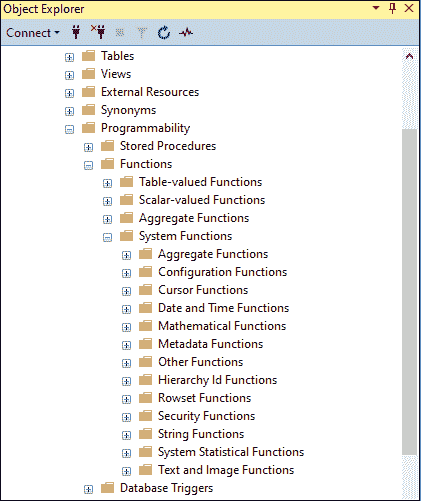
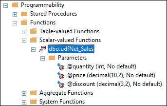
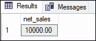
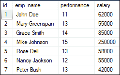
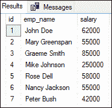

# SQL Server 函数

> 原文：<https://www.javatpoint.com/sql-server-functions>

SQL Server 中的函数是包含一组**SQL 语句来执行特定任务**的数据库对象。函数接受输入参数，执行操作，然后返回结果。我们应该注意，函数总是返回单个值或一个表。函数的主要目的是容易地复制公共任务。我们可以一次构建功能，并可以根据需要在多个位置使用它们。SQL Server 不允许使用函数在数据库表中插入、删除或更新记录。

**以下是创建 SQL Server 函数的规则:**

*   函数必须有名称，并且名称不能以特殊字符开头，如@、$、#，或其他类似字符。
*   SELECT 语句是唯一可以使用函数的语句。
*   我们可以在任何地方使用一个函数，比如 AVG、计数、求和、最小、日期和其他函数。
*   每当调用一个函数时，它都会编译。
*   函数必须返回值或结果。
*   函数只使用输入参数。
*   我们不能在函数中使用 TRY 和 CATCH 语句。

## 函数的类型

SQL Server 将函数分为两种类型:

*   系统功能
*   用户定义的函数

让我们详细描述这两种类型。

### 系统功能

由系统定义的功能称为系统功能。换句话说，服务器支持的所有**内置功能**都被称为系统功能。在执行特定任务时，内置功能可以节省我们的时间。这些类型的函数通常使用 SQL SELECT 语句来计算值和操作数据。

**以下是 SQL Server 中使用的一些系统功能列表:**

*   字符串函数(LEN、SUBSTRING、REPLACE、CONCAT、TRIM)
*   日期和时间函数(日期时间、日期时间 2、小日期时间)
*   聚合函数(计数、最大值、最小值、总和、AVG)
*   数学函数(绝对值、幂、π、EXP、对数)
*   排名函数(排名、密集排名、行数、整数)

下图显示了 SQL Server 中使用的所有内置数据库函数:



### 用户定义的函数

由用户在系统数据库或用户定义的数据库中创建的**函数称为用户定义函数。UDF 函数接受参数，执行操作，并返回结果。这些功能通过封装复杂的业务逻辑并使其可根据需要在任何地方重用，帮助我们简化开发。用户定义的函数使得查询数据所需的代码更容易编写。它们还提高了查询的可读性和功能性，并允许其他用户复制相同的过程。**

**SQL Server 将自定义函数主要分为两种类型:**

1.  标量函数
2.  表值函数

以下是这些 UDF 函数的描述。

**标量函数**

SQL Server 中的标量函数总是**接受单个或多个参数，并返回单个值**。标量函数有助于简化我们的代码。假设我们可能有一个复杂的计算出现在许多查询中。在这种情况下，我们可以构建一个标量函数来封装公式，并在每个查询中使用它，而不是在每个查询中使用。

**以下是说明在 SQL Server 中创建标量函数的语法:**

```sql

CREATE FUNCTION schema_name.function_name (parameter_list)
RETURNS data_type AS
BEGIN
    statements
    RETURN value
END 

```

下面描述了上述语法参数:

我们将首先在 **CREATE FUNCTION** 关键字后定义函数名。架构的名称是可选的。如果我们不定义模式名，SQL Server 将使用默认模式 **dbo** 。接下来，我们将定义括号内的**参数列表**。第三，我们将为函数编写语句，然后在**RETURS**语句中，定义返回值的数据类型。最后，我们添加了 RETURN 语句来返回函数体中的一个值。

**例**

本例将创建一个函数**根据数量、价格和折扣值计算净销售额**:

```sql

CREATE FUNCTION udfNet_Sales(
    @quantity INT,
    @price DEC(10,2),
    @discount DEC(3,2)
)
RETURNS DEC(10,2)
AS 
BEGIN
    RETURN @quantity * @price * (1 - @discount);
END; 

```

现在，我们可以使用这个函数来计算定义表中任何销售订单的净销售额。

下图显示了标量函数:



我们可以像调用内置函数一样调用标量函数。例如，我们可以如下调用上面的 udfNet_Sales 函数:

```sql

SELECT dbo.udfNet_Sales(25, 500, 0.2) AS net_sales;

```

执行此功能将返回净销售额:



SQL Server 还允许我们**使用 ALTER** 关键字修改标量函数。下面是这样做的语法:

```sql

ALTER FUNCTION schema_name.function_name (parameter_list)
RETURNS data_type AS
BEGIN
    statements
    RETURN value
END

```

我们可以使用下面的语句从 SQL Server 数据库中删除标量函数:

```sql

DROP FUNCTION [schema_name.]function_name;

```

**表值函数**

SQL Server 中的表值函数是返回表类型数据的**用户定义函数**。由于这个函数的**返回类型是一个表**，我们可以像使用表一样使用它。

我们可以将表值函数分为两种类型:

**1。内联表-值函数**

这个 UDF 函数根据函数执行的操作返回一个表变量。应该使用一个 SELECT 语句来确定表变量的值。

**例**

以下示例将创建一个表值函数，并检索雇员表的数据:

```sql

--It creates a table-valued function to get employees
CREATE FUNCTION fudf_GetEmployee()
RETURNS TABLE
AS
 RETURN (SELECT * FROM Employee)

```

在该语法中，**返回表**指定函数将返回一个表。既然没有**动手...END** 语句，它只是从员工表中查询数据。另外，如果它没有任何参数，它将被直接调用。

我们可以使用**选择**查询的 **FROM** 子句调用表值函数。**比如**，我们可以把上面的 **udf_GetEmployee** 函数调用如下:

```sql

SELECT * FROM udf_GetEmployee();

```

执行此函数将返回以下结果:



SQL Server 还允许我们使用 ALTER 关键字而不是 CREATE 关键字来修改表值函数。脚本的其余部分是相同的。

**多语句表值函数(MSTVF)**

该 UDF 函数**根据该函数执行的操作返回一个表变量**。它可以包含单个或多个语句来产生结果，它也是一个以表格形式返回多个语句结果的函数。它很有用，因为我们可以在这个函数中执行多个语句，并将聚合结果放入返回的表中。我们可以通过使用一个表变量作为返回值来定义这个函数。在函数内部，我们执行多个查询，并将数据插入这个表变量。

下面的示例创建了一个函数名**“multically”**，该函数返回“**@ Employee”**表。它使用 INSERT 语句从**【员工】**表中包含三个名为 id、emp_name 和薪资的字段，然后使用 UPDATE 语句更新员工姓名。

```sql

CREATE FUNCTION MULTIVALUED()
RETURNS @Employee TABLE
(id INT, emp_name VARCHAR(50), salary INT) AS
BEGIN
    INSERT INTO @Employee
    SELECT E.id, E.emp_name, E.salary FROM Employee E;
	UPDATE @Employee SET emp_name = 'Graeme Smith' WHERE id = 3;
    RETURN
END 

```

我们可以通过使用 SELECT 查询的 FROM 子句来调用多语句表值函数。**例如**，我们可以将上面的函数调用如下:

```sql

SELECT * FROM MULTIVALUED();

```

执行此函数将返回以下结果:



### 什么时候应该使用表值函数？

表值函数通常用作参数化视图。表值函数比存储过程更灵活，因为它们可以在使用表的任何地方使用。

**结论**

本文将解释 SQL Server 中使用的函数的完整概述。在这里，我们主要学习了 SQL Server 中使用的两种类型的函数:系统函数和用户定义函数。

* * *