# SQL Server 日期函数

> 原文：<https://www.javatpoint.com/sql-server-date-functions>

日期和时间功能允许我们有效地处理日期和时间数据。使用数据库时，在将数据插入表中时，日期和时间函数的格式应该匹配。在本文中，我们将深入研究日期和时间函数。SQL Server 有许多内置功能，可以帮助我们从大量数据中过滤出有用的数据。它在设计和维护大规模数据库时也很有用。

在 SQL Server 中，我们有多种数据类型可以用作表中的日期。最流行的日期格式是**‘YYYY-MM-DD’和‘DD-MM-YYYY’。**在某些情况下，我们还需要用数据库中的日期来节省时间。在这些情况下，我们需要工具来分别访问时间和日期。这就是 SQL Server 的时间和功能有用的地方。还建议初学者在数据库中使用日期或时间时要谨慎，因为如果处理不当，这些很容易引发异常。

### SQL Server 中日期和时间的格式

以下是在 SQL Server 中使用的日期和时间格式:

**日期:** YYYY-MM-DD

**日期时间:** YYYY-MM-DD HH: MI: SS

**时间戳:** YYYY-MM-DD HH: MI: SS

**年份:** YYYY 或 YY

#### 注意:在数据库中创建新表时，我们为每一列选择日期数据类型。

### 为什么我们需要日期和时间功能？

在 SQL Server 中，我们有各种各样的日期和时间函数。包括这些是为了确保在创建和访问数据库时可以访问日期和时间模块。

**SQL Server 根据以下类型对日期和时间函数进行分类:**

*   返回系统日期和时间值
*   返回日期和时间部分
*   从零件返回日期和时间值
*   返回日期和时间差值
*   返回修改日期和时间值
*   设置或返回会话格式函数
*   返回验证日期和时间值

### 返回系统日期和时间

所有系统日期和时间值都是从安装了 SQL Server 的计算机操作系统中导出的。下表解释了所有系统日期和时间功能:

| 功能 | 描述 |
| 当前时间戳 | 此函数用于获取当前日期和时间值，不包括时区偏移量。 |
| getuTCDATE(获取 tcdate) | 该函数用于以整数形式获取当前的世界协调时日期和时间值。 |
| 获取日期 | 该函数用于获取系统当前安装 SQL Server 的日期和时间。 |
| SYSDATETIME | 该函数用于获取系统的当前日期和时间，精度更高，不包括时区偏移。 |
| SYSUTCDATETIME | 此函数用于根据整数形式的世界协调时时间戳获取系统的当前日期和时间值。 |
| SYSDATETIMEOFFSET | 该函数用于获取系统当前的日期和时间以及时区偏移量。 |

让我们看一些系统日期和时间函数的例子。

**示例 1:** 本示例使用 **CURRENT_TIMESTAMP()** 函数查看系统的当前日期和时间，而不考虑输出中的时区:

```

SELECT CURRENT_TIMESTAMP AS Date;

```

该语句返回以下输出:


**示例 2:** 本示例使用 **GETDATE()** 函数查看系统当前运行 SQL Server 的日期和时间:

```

SELECT GETDATE() AS Date;

```

该语句返回以下输出:

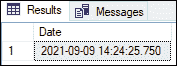

**示例 3:** 本示例使用**getutchdate()**函数，根据整数形式的 UTC 时间戳查看系统的当前日期和时间:

```

SELECT GETUTCDATE() AS Date;

```

该语句返回以下输出:


**示例 4:** 本示例使用 **SYSDATETIME()** 函数以毫秒为单位查看系统的当前日期和时间，精度更高:

```

SELECT SYSDATETIME() AS Date;

```

该语句返回以下输出:

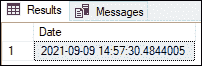

**示例 5:** 本示例使用**sysutdatetime()**函数根据整数形式的 UTC 时间戳查看系统的当前日期和时间:

```

SELECT SYSUTCDATETIME() AS Date;

```

该语句返回以下输出:

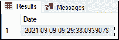

**示例 6:** 本示例使用 **SYSDATETIMEOFFSET()** 函数查看时区偏移后的系统当前日期和时间:

```

SELECT SYSDATETIMEOFFSET() AS Date;

```

该语句返回以下输出:

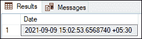

### 返回日期和时间部分

下表中列出的日期和时间函数用于根据日、月、年、小时、分钟、秒、周、纳秒等提取一部分日期和时间。

| 功能 | 描述 |
| DATENAME | 该函数用于以字符串形式获取日期的日、月或年的一部分。 |
| 走吧 | 该函数用于获取整数形式的日期部分。 |
| 天 | 该函数用于从输入日期中获取整数形式的日值。 |
| 月 | 该函数用于从输入日期中获取整数形式的月份值。 |
| 年 | 该函数用于从输入日期中获取整年值。 |

以下示例实际说明了这些日期函数。

**示例 1:** 本示例使用 **DATENAME()** 函数提取日期的一部分，如日、月或年。

```

SELECT DATENAME(day, '2021/09/10') AS Result1,
DATENAME(month, '2021/09/10') AS Result2,
DATENAME(year, '2021/09/10') AS Result3;

```

执行该语句将返回以下输出。这里我们看到函数将日期提取为三个部分**日、月、**和**年**作为字符串:

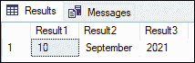

**示例 2:** 本示例使用 **DATEPART()** 函数将日期的一部分提取为整数值，这使其不同于 DATENAME()函数。

```

SELECT DATEPART(day, '2021/09/10') AS Result1,
DATEPART(month, '2021/09/10') AS Result2,
DATEPART(year, '2021/09/10') AS Result3;

```

执行该语句将返回以下输出。在这里，我们看到该函数以整数形式提取日、月和年三个部分的日期:

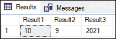

**示例 3:** 本示例使用 **YEAR()** 函数仅提取输入日期的年份部分。

```

SELECT YEAR('2021/09/10') AS Result1,
YEAR('2012/05/17') AS Result2;

```

执行该语句将只返回整数形式的日期的年份部分:

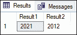

**示例 4:** 本示例使用 **MONTH()** 函数仅提取输入日期的月份部分。

```

SELECT MONTH('2021/09/10') AS Result1,
MONTH('2012/05/17') AS Result2;

```

执行该语句将只返回整数形式的日期的月份部分:

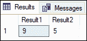

**示例 5:** 本示例使用 **DAY()** 函数仅提取输入日期的日部分。

```

SELECT DAY('2021/09/10') AS Result1,
DAY('2012/05/17') AS Result2;

```

执行该语句将只返回整数形式的日期部分:

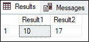

### 返回日期和时间差值

下表中列出的函数用于提取日期之间的差异:

| 功能 | 描述 |
| DATEDIFF(日期差异) | 该函数用于获取两个输入日期值的日期部分的差异。 |

**示例:**本示例使用 **DATEDIFF()** 函数，并显示开始和结束日期表达式之间的差异。

```

SELECT DATEDIFF(dd,'2019/2/3', '2020/3/5') AS TotalDays,
 DATEDIFF(MM,'2019/2/3', '2020/3/5') AS TotalMonths,  
 DATEDIFF(WK,'2019/2/3', '2020/3/5') AS TotalWeeks;

```

执行该语句将返回以下输出:

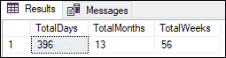

### 返回修改日期和时间值

我们可以使用以下一组 SQL Server 日期函数来操作或更改系统/输入时间戳值。

| 功能 | 描述 |
| 契据 | 此函数用于将整数值添加到输入日期的日期部分，并返回新的日期值。 |
| 伊奥蒙斯 | 此函数用于获取具有指定日期和可选偏移量的月份的最后一天。 |
| 开关偏移 | 此函数用于修改日期时间偏移值的时区偏移，并保留世界协调时值。 |
| todaytetimeoffset | 该函数用于将日期时间 2 值更改为日期时间偏移值。 |

以下示例实际说明了这些日期函数。

**示例 1:** 本示例使用**DATADAD()**函数，并在日期部分添加整数值后返回新的日期值。

```

SELECT DATEADD(second, 1, '2020-12-31 23:59:59') AS Result1,
DATEADD(day, 1, '2020-12-31 20:59:59') AS Result2;

```

执行该语句将返回以下输出。这里我们看到函数首先在 result1 中添加第二个值，然后在 result2 中添加一个 day 值来显示下一个日期:

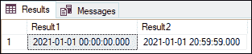

**示例 2:** 本示例使用 **EOMONTH()** 函数，并返回指定日期当月的最后一天。

```

SELECT EOMONTH('2020-02-22') AS end_of_feb2020,
EOMONTH('2021-02-22') AS end_of_feb2021; 

```

执行该语句将返回以下输出。这里我们看到，如果我们传递闰年的日期，函数仍然返回正确的输出。

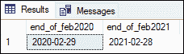

**示例 3:** 本示例使用**开关偏移()**函数将存储的时区偏移值更改为新的时区偏移。

首先，我们将创建一个包含 DATETIMEOFFSET 列的表“testdate”，并使用下面的语句向其中插入一个值:

```

CREATE TABLE testdate(
 ColDTO DATETIMEOFFSET  
);  
INSERT INTO testdate  
VALUES ('2020-09-20 7:45:50.71345 -5:00');

```

如果我们使用 SELECT 语句进行验证，它会在表中显示“2020-09-20 07:45:50.7134500-05:00”的值。现在，我们将使用 SWITCHOFFSET()函数将时区切换到-8:00:

```

SELECT SWITCHOFFSET(ColDTO, '-08:00') AS Result FROM testdate;

```

我们将获得以下输出:

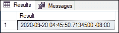

**示例 4:** 本示例使用**todaytimeoffset()**函数，并在指定时区的本地时间 DATETIME2 值之后返回一个新的日期值。

```

SELECT TODATETIMEOFFSET ('2019-03-06 07:43:58', '-08:00') AS Result1,
TODATETIMEOFFSET (GETDATE(), -180) AS Result2;

```

执行该语句将返回以下输出。这里我们看到第一个结果将日期和时间的区域偏移更改为区域-08:00。第二个结果将当前时区更改为-180 分钟:

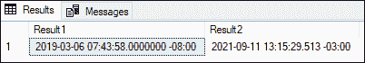

### 根据零件构造日期和时间

我们可以在 SQL Server 中使用下面的日期函数从它们的部分构造日期和时间。

| 功能 | 描述 |
| DATEFROMPARTS | 此函数用于从指定的日、月或年获取日期值。 |
| 日期时间 2 从部件 | 该函数用于从日期和时间参数中获取 DATETIME2 值。 |
| DATETIMEOFFSETFROMPARTS | 该函数用于从日期和时间参数中获取 DATETIMEOFFSET 值。 |
| TIMEFROMPARTS | 该函数用于从精确的时间部分获得时间值。 |

让我们用实际例子来解释这些功能。

**示例 1:** 本示例使用**datefromports()**函数从日、月和年值构建日期。

```

SELECT DATEFROMPARTS(2019, 12, 31) AS Result1,
DATEFROMPARTS(2019, NULL, 31) AS Result2;

```

执行该语句将显示以下输出。这里我们看到**结果 1** 返回日期，但是**结果 2** 返回空，因为月份参数为空。

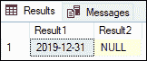

**示例 2:** 本示例使用 **DATETIME2FROMPARTS()** 函数从日、月、年、小时、分钟、秒、分数和精度值构建 datetime2 值。

```

SELECT DATETIME2FROMPARTS ( 2029, 10, 31, 11, 59, 59, 0, 0 ) AS Result1,
DATETIME2FROMPARTS(2019, NULL, 31, 11, 59, 59, 0, 0) AS Result2;  

```

执行该语句将显示以下输出。这里我们看到**结果 1** 返回日期时间值，但是**结果 2** 返回空，因为月份参数为空。

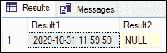

**示例 3:** 示例 3:本示例使用**datetimeoffset from parts()**函数根据日期和时间值构造 datetimeoffset 值。

```

SELECT DATETIMEOFFSETFROMPARTS(2021, 10, 11, 20, 35, 30, 4000, 10, 30, 4) AS Result1,
DATETIMEOFFSETFROMPARTS(NULL, 10, 11, 20, 35, 30, 4000, 10, 30, 4) AS Result2; 

```

执行该语句将显示以下输出。这里我们看到**结果 1** 返回日期时间偏移值，但是**结果 2** 返回空值，因为年份参数为空。

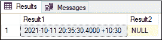

**示例 4:** 本示例使用**timefromports()**函数为指定的时间和精度值构造时间值。

```

SELECT TIMEFROMPARTS(20, 55, 59, 0, 0) AS Result1,
TIMEFROMPARTS(10, 30, 19, 5, 2) AS Result2;

```

执行该语句将显示以下输出。这里我们看到**结果 1** 返回没有分数的时间值，但是**结果 2** 返回有分数的时间。当给定精度为 2 时，分数值计算为 5/100 或 0.05 秒。

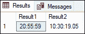

### 日期和时间值的验证

我们可以使用下面的日期函数来检查在 SQL Server 中指定的日期格式是否有效。有效日期格式为 **yyyy-mm-dd。**

| 功能 | 描述 |
| -你好 | 该函数用于检查输入的日期是否遵循日期、时间或日期时间值的标准格式。 |

**示例:**本示例使用 **ISDATE()** 功能检查输入的日期是否符合标准格式。如果日期有效，函数返回 1。如果日期格式不同，函数返回 0。

```

SELECT ISDATE('2020-06-15') AS Result1,
ISDATE('2020-15-06') AS Result2; 

```

执行该语句将显示以下输出。这里我们看到**结果 1** 代表返回的有效日期数据 1。**结果 2** 表示无效日期，因为它返回 0。

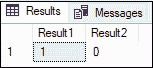

这是检查有效日期时间表达式的另一个示例:

```

SELECT ISDATE('2021-10-05 10:15:30') AS Result;

```

以下是输出:

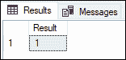

### 设置或返回会话格式功能

我们可以使用以下函数来设置特定会话的日期和时间值。

| 功能 | 描述 |
| DATEFIRST(日期优先) | 该函数用于获取会话的 SET DATEFIRST 的当前值。 |
| 设置 DATEFIRST | 该函数用于将一周的第一天设置为 1 到 7 之间的数字。 |
| 设定日期格式 | 此函数用于确定输入的日期时间或小日期时间数据的日期部分(月、日和年)的顺序。 |
| @@LANGUAGE | 该函数用于获取当前使用的语言名称。 |
| 设定语言 | 该功能用于设置系统和系统消息的语言。 |

下面的例子实际解释了这些功能。

**范例 1:** 这个函数使用**@ @ datefinity()**函数来指定一周的第一天。

```

SET DATEFIRST 2;
GO  
SELECT @@DATEFIRST AS startday;

```

执行该语句会将**星期二**设置为第一个工作日。

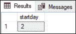

**示例 2:** 该函数使用**DATEFFORMAT()**函数来指定日期的顺序。

```

SET DATEFORMAT dmy;  
GO  
DECLARE @var DATETIME2 = '31/12/2020 10:01:01.1234567';  
SELECT @var AS Result;  

```

执行该语句将返回以下输出。

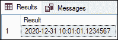

### 结论

此示例将通过示例解释日期和时间函数的完整概述。这些函数是在 SQL Server 中预先定义的，可以用来提取我们在查询中需要的任何细节。

* * *