# 服务器数学函数

> 原文：<https://www.javatpoint.com/sql-server-mathematical-functions>

函数是具有一组 SQL 语句的对象。每个函数接受参数作为输入，并在返回输出之前执行一系列操作。一个函数返回一个结果集。SQL Server 提供了几个数学函数来执行基本的数学计算。**比如**我们可以用这些函数求平方根、对数、圆、地板、初等指数值、三角函数。

**下图将显示 SQL Server 中使用的所有数学函数:**

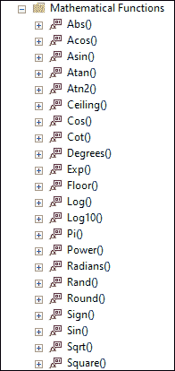

数学函数分为两类:**标准**和**通用。**这些 SQL 数学函数可以让你修改数值数据，这对于数据处理是必不可少的。本文将涵盖 SQL Server 中使用的大多数常见数学函数，并通过示例对每个函数进行解释。下表列出了每个数学函数及其定义:

| 函数名 | 描述 |
| 防抱死制动装置 | 此函数用于获取绝对值或绝对正值。 |
| 阿科斯 | 此函数用于获取以弧度为单位的角度，其余弦值是指定的浮点表达式。它也被称为反余弦。 |
| 印度历的 7 月 | 此函数用于获取以弧度为单位的角度，其正弦值是指定的浮点表达式。它也被称为反正弦。 |
| 阿坦 | 此函数用于获取以弧度为单位的角度，其正切值是指定的浮点表达式。它也被称为反正切。 |
| ATN2 | 该函数用于获取从 X 轴到指定点(y，X)的角度(半径)。这里，x 和 y 是两个浮点表达式。 |
| 天花板 | 此函数用于获取最小值，该值大于或等于指定的数值表达式或给定值。 |
| 装货付款(Cash On Shipment) | 该函数用于获取三角余弦值，该值在给定表达式中以弧度表示。 |
| 小屋 | 该函数用于获取三角余切值，该值在给定表达式中以弧度表示。 |
| 度 | 此函数用于将指定的辐射角度转换为基于度数的等效角度。 |
| 经历 | 该函数用于获取给定浮点表达式的指数值。 |
| 地面 | 此函数用于获取最大整数值，该值小于或等于给定的数值表达式。 |
| 原木 | 这个函数用来得到给定浮点数表达式以 E 为底的自然对数，其中 E 是欧拉数，等于 2.71828。 |
| LOG10 | 该函数用于获取给定浮点表达式的以 10 为底的对数值。 |
| 产品改进(Product Improve) | 这个函数用来得到 PI 的常数值，大约等于 3.14 |
| 力量 | 该函数用于获取用户指定的表达式或值的幂。 |
| 弧度 | 该函数用于将给定角度转换为弧度测量的等效角度。 |
| 边缘 | 此函数用于获取正值，该值将大于或等于 0.0 且小于 1。 |
| 圆形物 | 此函数用于获取最近的数值，该数值四舍五入到指定的长度或精度。 |
| 符号 | 该函数用于获取给定表达式的符号，该符号可以是正(+)、负(-)或零(0)。 |
| 犯罪 | 此方法返回给定角度的三角正弦值，单位为弧度。 |
| SQRT(工作站) | 该函数用于计算给定数字或值的平方根。 |
| 平方 | 此函数计算指定值或单个数字的平方。 |
| 黝黑色 | 这个函数用来得到给定角度的三角正切的弧度值。 |

让我们通过例子来了解最常见的数学函数。

**示例 1:** 本示例使用 **SQRT()** 函数，该函数接受数值并显示平方根值:

```sql

SELECT SQRT(36) AS Result1, SQRT(10.16) AS Result2;

```

执行此语句将返回以下输出:

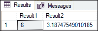

**示例 2:** 本示例使用 **ABS()** 函数，该函数接受正或负的数值，并显示绝对值(正值):

```sql

SELECT ABS(-36) AS Result1, ABS(36) AS Result2;

```

执行此语句将返回下面的输出，我们看到两个结果都只有正值:

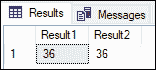

**示例 3:** 本示例使用 **ACOS()** 函数，该函数接受数值并以弧度显示角度，弧度的余弦值是指定的浮点表达式:

```sql

SELECT ACOS(-0.5) AS Result1, ACOS(0.8) AS Result2;

```

执行此语句将返回以下输出:

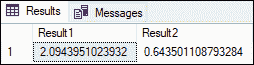

#### 注意:如果我们指定的值不是-1 到 1，这个函数将返回 NULL 并报告一个域错误(无效的浮点运算)。

**示例 4:** 本示例使用 **ASIN()** 函数，该函数接受数值并以弧度显示角度，弧度的正弦值是指定的浮点表达式。如果指定的值不是-1 到 1，它将返回空值并报告域错误。

```sql

SELECT ASIN(-0.5) AS Result1, ASIN(0.8) AS Result2;

```

执行此语句将返回以下输出:

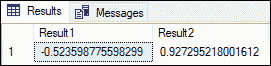

这是我们提供-1 到 1 以外的值的另一种说法:

```sql

SELECT ASIN(1.5) AS Result1, ASIN(0.8) AS Result2;

```

它显示以下错误消息:

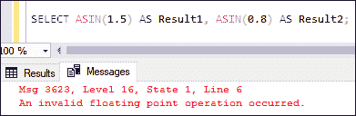

**示例 5:** 本示例使用**天花板()**函数，该函数接受数值并以整数形式显示下一个最高值:

```sql

SELECT CEILING(15) AS Result1, 
CEILING(22.19) AS Result2,
CEILING(-20.15) AS Result3;

```

执行此语句将返回以下输出:

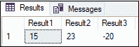

**示例 6:** 本示例使用 **FLOOR()** 函数，该函数接受数值并显示倒数第二个整数值:

```sql

SELECT FLOOR(15) AS Result1, 
FLOOR(22.19) AS Result2,
FLOOR(-20.15) AS Result3;

```

执行此语句将返回以下输出:

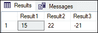

**示例 7:** 本示例使用 **RAND()** 函数，该函数接受数值并显示 0 到 1 之间的随机浮点值。它总是为相同的种子返回相同的输出。

```sql

SELECT RAND(1) AS Result1, RAND(-2) AS Result2;

```

执行此语句将返回以下输出:

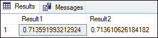

**示例 8:** 本示例使用**度()**函数，并以弧度为单位显示指定角度的相应角度。

```sql

SELECT 'The number of degrees in PI/4 radians is: ' +   
CONVERT(VARCHAR, DEGREES((PI()/4))) AS Result;

```

执行此语句将返回以下输出:

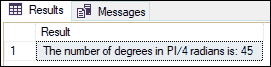

**示例 9:** 本示例使用 **POWER()** 函数，将给定表达式的值显示为指定的幂:

```sql

SELECT POWER(5,2) AS Result1, 
POWER(-4,5) AS Result2, 
POWER(0.8,3) AS Result3;

```

执行此语句将返回以下输出:

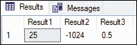

**示例 10:** 本示例使用 **LOG()** 函数，显示给定浮点表达式的自然对数。它的返回类型是 float。如果我们指定负值，它将返回一条错误消息。

```sql

SELECT LOG(12) AS Result1, 
LOG(5) AS Result2, 
LOG(100) AS Result3;

```

执行此语句将返回以下输出:

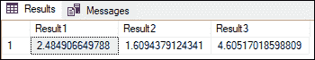

**示例 11:** 本示例使用 **SIGN()** 函数，显示给定表达式的正(+1)、零(0)或负(-1)符号。它的返回类型与数值表达式相同。

```sql

SELECT SIGN(-12) AS Result1, 
SIGN(5) AS Result2, 
SIGN(0.0) AS Result3;

```

执行此语句将返回以下输出:


**示例 12:** 本示例使用 **RADIANS()** 函数将指定度数转换为以弧度为单位的等效度数。它的返回类型是 float。

```sql

SELECT RADIANS(180) AS Result1, 
RADIANS(-45.01) AS Result2,
RADIANS(197.1099392) AS Result3;

```

执行此语句将返回以下输出:

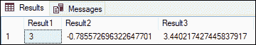

### 结论

本文解释了几个 SQL Server 内置数学函数的完整概述，以及一些示例和输出。绝对值、度数、天花板、地板、功率、符号和弧度是算术函数，它们返回与输入值相同的数据类型。此外，EXP、SQUARE、SQRT、LOG10 和 LOG 函数将它们的输入值转换为 FLOAT 数据类型，并将结果作为 FLOAT 值返回。

* * *