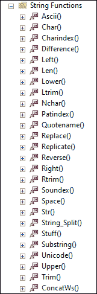
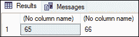
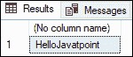
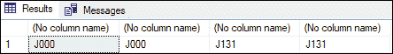
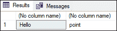
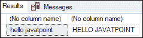
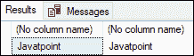
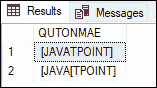
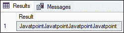

# SQL Server 字符串函数

> 原文：<https://www.javatpoint.com/sql-server-string-functions>

字符串函数**接受字符串值作为输入，并返回字符串值，而不管数据类型**(字符串或数字)。在 SQL Server 中有几个内置的字符串函数，开发人员可以使用它们来有效地操作字符数据。SQL Server 中的字符串方法对于处理字符串数据类型非常有用。SQL Server 使用各种数据类型(如 varchar、nvarchar 和 char)存储字符串和字符数据。因此，可以使用字符串函数来有效地获得所需的精确结果。

**下图将显示 SQL Server 中使用的所有字符串函数:**



本文将涵盖 SQL Server 中使用的大多数常见字符串函数，并通过示例对它们进行解释。下表列出了每个功能，并做了简要说明:

| 函数名 | 描述 |
| 美国信息交换标准代码 | 该函数显示字符的 ASCII 值。 |
| 茶 | 该函数将指定的整数代码(ASCII)转换为单字节字符。 |
| charindex(charindex) | 如果在第二个字符表达式中找到一个字符表达式，此函数将返回第一个表达式的起始位置。 |
| 联结合并多个字符串 | 该函数通过连接两个或多个字符串返回一个字符串。 |
| CONCAT_WS | 该函数将多个字符串连接成一个字符串，并用第一个位置指定的分隔符对它们进行空间分配。 |
| 差异 | 该函数通过比较两个字符串 SOUNDEX()的值返回一个整数值。 |
| 格式 | 此函数用于将字符串的文本格式更改为任何其他格式。 |
| 左边的 | 此函数返回从字符串左侧到指定字符数的子字符串。 |
| 低输入联网（low-entry networking 的缩写） | 此函数返回字符串中的字符数，包括尾随空格。 |
| 降低 | 该函数用于将大写字符转换为小写字符。 |
| LTRIM(即时通讯) | 此函数在删除所有前导空格后，从给定字符串中返回一个字符串。 |
| 断续器 | 该函数用于根据 Unicode 标准获取带有提供的整数代码的 UNICODE 字符。 |
| PATINDEX(耐心指数) | 此函数返回字符串起始位置的第一个模式。如果没有找到该字符串，它将返回零。 |
| QUOTENAME | 此函数返回包含分隔符的 Unicode 字符串，将输入字符串转换为有效的分隔标识符。 |
| 替换 | 此函数用于用另一个字符串值替换指定字符串中出现的所有子字符串。 |
| 复制的 | 该函数以指定的次数重复字符串。 |
| 反面的 | 该函数以相反的顺序显示字符串。 |
| 正确 | 此函数返回从字符串右侧到指定字符数的子字符串。 |
| RTRIM | 此函数在删除所有尾随空格后，从给定字符串中返回一个字符串。 |
| SOUNDEX | 它用于使用四字符(SOUNDEX)代码计算两个字符串的相似度。 |
| 空间 | 该函数用于查找重复空格的字符串。 |
| 力量值 | 该函数用于返回从数字数据转换而来的字符数据。 |
| 字符串 _AGG | 该函数连接字符串表达式的值，并在它们之间插入分隔符值。它不会在字符串的末尾添加分隔符。 |
| 字符串 _ 转义 | 此函数转义字符串中的特殊字符，并生成包含转义字符的新字符串。 |
| 字符串 _ 拆分 | 它是一个表值函数，使用您选择的分隔符将字符串分成多行子字符串。 |
| 材料 | 此函数移除字符串的一部分，并用从指定位置开始的另一个子字符串替换它。 |
| 子链 | 这个函数从一个从特定位置开始到特定长度结束的字符串中提取一个子字符串。 |
| 翻译 | 这个函数将几个一对一的翻译合并成一个操作。 |
| 整齐 | 该函数在删除给定字符串的所有前导和尾随空格后返回一个新字符串。 |
| 采用双字节对字符进行编码 | 该函数返回由 Unicode 标准定义的字符整数值。 |
| 上面的 | 该函数将小写字符转换为大写字符。 |

让我们看看一些最常见的字符串函数示例。

**示例 1:** 本示例将返回字符“A”和“B”的数字 **ASCII** 值:

```

SELECT ASCII('A'), ASCII('B');

```

执行该语句将返回以下结果:



**示例 2:** 本示例将在**“你好 Javatpoint”**中搜索字符串**“Javatpoint”**，如果找到，则返回给定字符串中特定字符串表达式的索引

```

SELECT CHARINDEX('Javatpoint', 'Hello Javatpoint'), CHARINDEX('Javatpoint', 'Hello Javatpoint', 8); 

```

执行该语句将返回以下结果。这里，第一次搜索字符串 Javatpoint 返回了 7，但是当我们将开始位置指定为 8 时，它返回了 0，因为在这个索引之后没有找到任何事件。


**示例 3:** 本示例将使用 **CONCAT()** 函数，该函数接受两个以上的输入字符串，并在连接后将这些字符串返回到单个输出中:

```

SELECT CONCAT('Hello', 'Javatpoint');

```

执行查询将显示以下输出:



**示例 4:** 本示例使用 **SOUNDEX()** 函数，该函数接受字符串作为输入，并根据其发音生成一个四个字符的字符串。它将代码的第一个字符转换为大写，并成为输入字符串的第一个字符。代码剩余的字符是代表表达式字母的数字。

```

SELECT SOUNDEX('J'), SOUNDEX('Ja'), SOUNDEX('Javatpoint'), SOUNDEX('Javatpoint Noida');

```

结果如下:



从结果中我们可以看出，SOUNDEX()方法对“J”和“Ja”产生相同的结果，因为字符“A”被忽略(因为 A、O、U、E、I、Y、H、W 被忽略，直到它们不是第一个字符)。另外，因为 SOUNDEX()函数只需要前四个字符，所以 javapoint 和 Javatpoint Noida 的结果是相同的。

**示例 5:** 本示例使用 **DIFFERENCE()** 函数来测量两个字符串的相似度。

```

SELECT DIFFERENCE('Hello', 'Bicycle'), DIFFERENCE('Hello', 'Hello World');

```

该语句给出以下输出:


在这里，我们可以看到 DIFFERENCE()函数返回的值为 4，因为 SOUNDEX()函数为 Hello 和 Hello World 返回的值相同，这表明它们都基于 SOUNDEX()值。另一方面，DIFFERENCE()函数为 Hello 和 Bicycle 返回 1，表示它们不相似。

**示例 6:** 本示例使用 **LEFT()** 和 **RIGHT()** 函数从字符串的左侧或右侧提取特定数量的字符。

```

SELECT LEFT('Hello Javatpoint', 5), RIGHT('Hello Javatpoint', 5);

```

执行该语句将返回以下结果:



**示例 7:** 本示例使用 **LOWER()** 和 **UPPER()** 来更改输入字符串的字符大小写。函数 LOWER()和 UPPER()分别用于将字母大小写修改为小写和大写。

```

SELECT LOWER('Hello Javatpoint'), UPPER('Hello Javatpoint');

```

执行该语句将返回以下结果:



**示例 8:** 本示例将使用 **LTRIM()** 和 **RTRIM()** 功能从输入字符串的左侧或右侧移除额外的空格。

```

SELECT RTRIM('Javatpoint  '), LTRIM('   Javatpoint');

```

执行该语句将返回下面的，我们看到字符串 javatpoint 左右两边的空格被删除了:



**示例 9:** 本示例使用 **QUOTENAME()** 函数返回包含分隔符的 Unicode 字符串，将输入字符串转换为有效的分隔标识符:

```

DECLARE @QUTO1 [nvarchar](MAX);  
DECLARE @QUTO2 [nvarchar](MAX);   
SET @QUTO1='JAVATPOINT';  
SET @QUTO2='JAVA[TPOINT';   
SELECT QUOTENAME(@QUTO1) [QUTONMAE] UNION ALL  
SELECT QUOTENAME(@QUTO2) [QUTONMAE]  

```

执行该语句将返回以下输出:



**示例 10:** 本示例使用 **REPLICATE()** 函数将字符串重复指定的次数。

```

SELECT REPLICATE('Javatpoint', 4) AS Result;

```

执行该语句将返回以下结果:



### 结论

本文解释了几个 SQL Server 内置字符串函数的完整概述，以及一些示例和图片。

* * *