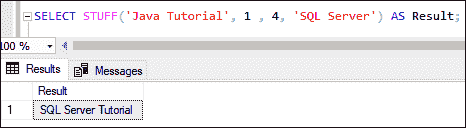
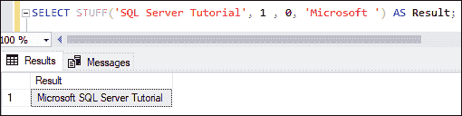
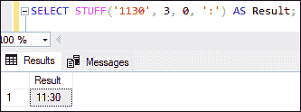
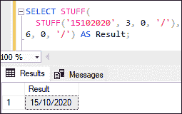
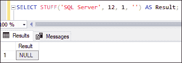
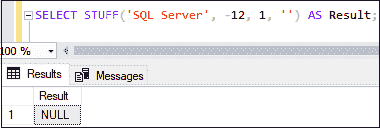
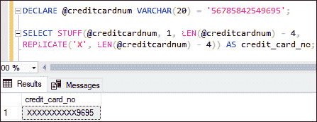

# SQL Server STUFF()函数

> 原文：<https://www.javatpoint.com/sql-server-stuff-function>

本文将对 SQL Server 中的 STUFF 函数进行完整的概述。大多数与微软 SQL Server 一起工作的数据库管理员都有更改已输入的数据部分的情况。这种情况可能是由于人为错误或数据变化造成的。STUFF 函数用于完成这项任务。该函数总是与字符串一起使用，用给定的字符或字符串替换字符串的一部分。

SQL Server 也有一个 REPLACE 函数来完成同样的任务。使 STILD 函数在 REPLACE 函数上流行的区别在于“***”REPLACE 函数替换字符的所有出现，但是 STILD 函数只替换特定的子字符串*** ”

### 什么是 STUFF()函数？

SQL Server 中的 STUFF 函数用于**从源字符串中删除一部分特定长度的字符**，然后从提供的起始位置插入相同的字符序列。

**该功能完成以下任务:**

*   它首先从字符串中删除指定长度的字符。长度选项用于指定字符数。如果我们将该值设置为零，则不会从字符串中删除任何字符。
*   指定字符串中的起始位置，长度选项定义的字符数必须从该位置开始擦除。
*   在新的 substring 参数中，我们还必须提供替换子字符串。这个新字符串被添加到字符串的开头。

### 句法

以下语法说明了 SQL Server 中的 STUFF 函数:

```sql

STUFF(source_string, start, length, replace_string)

```

该函数有四个参数，描述如下:

**Source_string:** 表示我们要修改的原始字符串。

**Start:** 表示指定删除和插入从何处开始的整数值。如果其值为负、零或长于字符串长度，则函数将返回空值。

**长度:**表示将删除多少字符。如果长度为负，则返回空值。如果长度超过源字符串的长度，它将删除整个字符串。如果为 0，替换子字符串将被追加到源字符串的开头。

**Replace_string:** 表示从给定的开始位置开始，将添加的子串代替删除的子串。

### STUFF()函数示例

让我们通过各种例子来理解 STILD()函数在 SQL Server 中是如何工作的。

**示例 1:** 本示例使用 STUFF()函数**在给定位置向源字符串中添加子字符串**。下面的语句删除了字符串**“Java 教程”**的前四个字符，并用字符串**“SQL Server”:**替换它们

```sql

SELECT STUFF('Java Tutorial', 1 , 4, 'SQL Server') AS Result;

```

用 SQL Server 替换 JAVA 后，执行该语句将显示以下输出:



**示例 2:** 本示例使用 STUFF 函数**添加一个子字符串，而不删除任何字符**。下面的语句将在位置 1 插入子字符串 Microsoft，不删除任何字符:

```sql

SELECT STUFF('SQL Server Tutorial', 1 , 0, 'Microsoft ') AS Result;

```

执行该语句将在输入字符串的开头显示成功添加 Microsoft 的以下输出:



**示例 3:** 本示例使用 STUFF 函数**将时间从 HHMM 转换为 HH:MM** 。以下语句将在 HHMM 时间值格式中间插入一个冒号(:)，并以 HH:MM:格式显示新的时间值。

```sql

SELECT STUFF('1130', 3, 0, ':') AS Result;

```

执行该语句将显示以下输出，该输出成功地在 HHMM 中间添加了一个**冒号(:)**:



**例 4:** 本例使用 STUFF 函数**将日期从 MMDDYYY 转换为 MM/DD/YYYY 格式**。下面的语句将调用该函数两次，并在日期值格式中插入一个**正斜杠(\)** ，以 MM/DD/YYY 格式显示新的日期值:

```sql

SELECT STUFF(
  STUFF('15102020', 3, 0, '/'),
6, 0, '/') AS Result; 

```

执行该语句将显示以下输出，该输出成功地将日期 MMDDYYY 转换为 MM/DD/YYYY 格式:



**例 5:** 本例使用了**起始位置值大于原始字符串长度**的 STUFF 函数。假设我们有一个长度为十个字符的字符串“SQL Server”。让我们看看如果我们提供一个起始位置 12，那么 STILD 函数的结果会是什么？

```sql

SELECT STUFF('SQL Server', 12, 1, '') AS Result;

```

执行该语句将返回以下输出，因为起始位置比输入字符串长:



如果我们在起始位置提供负值，那么 STILD 函数总是返回空值。下图更清楚地解释了这一点:



**示例 6:** 本示例使用 STUFF 功能**屏蔽敏感信息**。假设我们想屏蔽信用卡号，只显示最后四个字符。它可以很容易地用 STUFF 函数来完成。以下是查询:

```sql

DECLARE @creditcardnum VARCHAR(20) = '56785842549695';

SELECT STUFF(@creditcardnum, 1, LEN(@creditcardnum) - 4, 
REPLICATE('X', LEN(@creditcardnum) - 4)) AS credit_card_no;

```

该查询使用以下函数:

*   它首先声明信用卡号。
*   接下来，使用 LEN()函数检查信用卡号的长度。
*   接下来，从位置 1 开始掩蔽。
*   最后，复制从字符为 X 的起始数字开始，一直到信用卡号的长度减去 4。

当我们执行该语句时，我们将看到信用卡号仅显示最后四个字符:



### 结论

本文将详细解释 SQL Server 中的 STUFF 函数。在这里，我们通过几个例子看到了这个函数如何在指定位置用另一个字符串替换一个子字符串。

* * *