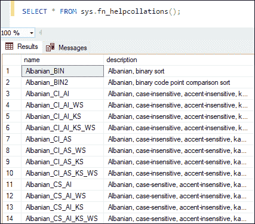
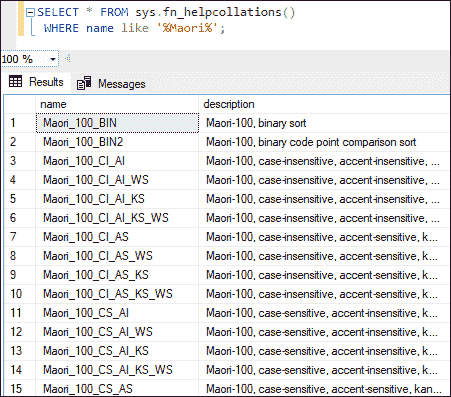
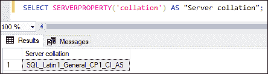
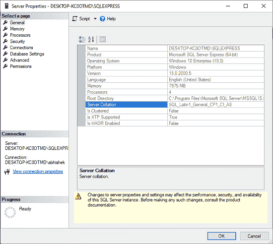
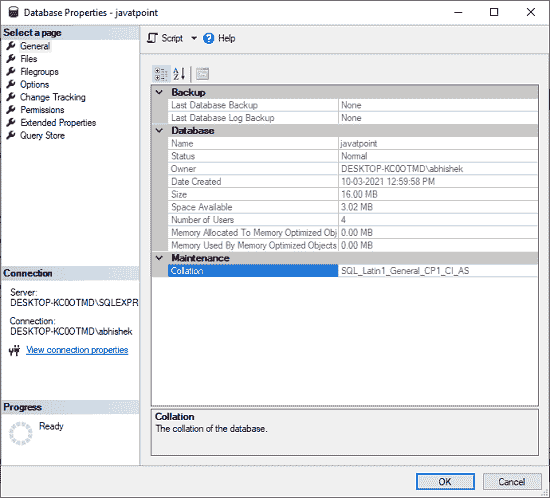
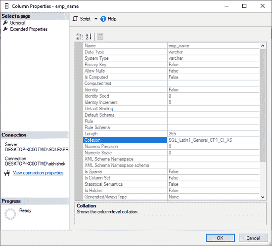

# SQL 服务器排序规则

> 原文：<https://www.javatpoint.com/sql-server-collation>

SQL Server 中的排序规则是一组**预定义的规则，用于确定如何保存、访问和比较数据**。换句话说，它是一个配置设置，指示数据库引擎应该如何处理字符数据。SQL Server 有大量的排序规则，用于处理全球支持用户和应用程序带来的语言和区域差异。本文将讨论排序规则，并展示一些处理排序规则的示例。

### 我在哪里可以找到归类？

可以在服务器、数据库和列级别找到 SQL 排序规则。应该注意的是，在服务器、数据库和列上不需要相同的排序规则设置。我们还可以通过更新查询来使用某些排序规则。如果排序规则不一致，我们将意识到在整个环境中定义正确排序规则的必要性，因为存在不可预见的错误的高风险。

### SQL Server 中有哪些不同类型的排序规则？

SQL Server 提供以下系统函数来获取可用排序规则的完整列表:

```

SELECT * FROM sys.fn_helpcollations();

```

下面是上述函数返回的一些排序规则名称及其描述:



如果我们想通过语言获得任何特定的排序规则，SQL Server 会在 WHERE 子句中提供 like 子句来过滤名称。**例如**，我们正在寻找**毛利语**支持的整理。我们可以通过以下语句获得这些信息:

```

SELECT * FROM sys.fn_helpcollations()
 WHERE name like '%Maori%';

```

它返回以下排序规则名称:



### 排序规则名称中有哪些不同的选项？

排序规则名称包含以下选项。这些选项在处理排序和搜索操作的字符数据时表现不同:

**CS:** 区分大小写

**AI:** 不区分重音

**KS:** 假名类型敏感

**WS:** 宽度敏感

**SC:** 补充字符

**UTF8:** 编码标准

假设我们在 SQL 排序规则中使用了区分大小写的选项。当查询操作寻找“ **Andrew** ”或“ **andrew** ”时，数据库引擎的行为会有所不同。如果查询没有找到名为“Andrew”的行，查询将不会返回任何结果。这是由于排序规则的“**CS-区分大小写**”选项。

## 排序规则级别

在 SQL Server 中，可以在数据库引擎的多个级别指定排序规则，但是默认情况下，每个级别都继承父级别的排序规则设置。以下是 SQL Server 中支持的排序规则列表，按降序排列:

*   SQL Server 实例级排序规则
*   数据库级排序规则
*   列级排序规则
*   查询级别排序规则

让我们详细讨论每一个。

### SQL Server 实例级排序规则

系统数据库和用户数据库的默认排序规则是 SQL Server 实例排序规则。它是在 SQL Server 启动期间设置的，由三部分组成:**主、tempdb 和模型**。它支持除 **Unicode 排序规则**之外的所有排序规则。当进行文本数据比较时，如果用户的数据库排序规则不同于某个 SQL Server 实例排序规则，则该数据库中的表与 **tempdb** 之间的比较将导致错误。这是因为 tempdb 将始终使用实例级默认排序规则。

假设临时表用在使用 WHERE 子句或 JOIN 条件比较基于文本的列的用户数据库中的任何 SQL 语句或函数中，并且其中一个用户数据库用 tempdb 以外的排序规则还原。在这种情况下，查询将返回一个错误，因为表没有相同的排序规则。

**我们可以使用下面的查询来获取 SQL Server 实例级别的排序规则:**

```

SELECT SERVERPROPERTY('collation') AS "Server collation";

```

它显示了以下输出:



或者，我们也可以在**SQL Server Management Studio**中获取排序规则，方法是右键单击 SQL 实例，选择“**属性**”，然后选中“**常规**”选项卡。默认情况下，安装 SQL Server 时会选择此排序规则。



### SQL Server 数据库排序规则

它继承自用于数据库恢复的 SQL Server 实例排序规则。当我们创建备份时，排序规则会复制到备份中。它是所有字符串列、临时对象、变量名和其他字符串的默认值，因为此排序规则用于数据库中的所有元数据。如果我们没有指定创建数据库的时间，则使用默认的服务器排序规则。

**我们可以使用下面的 SQL 语句来获取当前的数据库排序:**

```

SELECT name, collation_name AS "database collation" FROM sys.databases;

```

或者，我们也可以通过右键单击 SQL 数据库并转到显示以下屏幕的“属性”来获取 SSMS 的数据库排序规则:



我们还可以使用 CREATE DATABASE 语句创建一个具有排序规则的数据库:

```

CREATE DATABASE javatpoint COLLATE SQL_Latin1_General_CP1_CI_AS;

```

这里 **javatpoint** 是数据库名称，**SQL _ Latin1 _ General _ CP1 _ CI _ AS**是整理类型。如果我们想更改用户数据库的排序规则，我们可以使用 ALTER DATABASE 语句:

```

ALTER DATABASE javatpoint COLLATE Greek_CS_AI;

```

#### 注意:在更改服务器的排序规则之前，我们无法更改系统数据库的排序规则。此外，更改数据库级别的排序规则不会影响列或表达式级别的排序规则。

如果用户更改了数据库的默认排序规则，则 SQL Server 不会更改现有用户定义表的排序规则。但是，新表将通过不同的数据库排序规则来区分。但是，如果数据库包含具有不同排序规则的表，则在尝试连接它们时可能会出现问题。如果我们想要对现有的数据库表进行新的排序，我们可以在表的 TEXT 列上设置新的排序。

### SQL Server 列级排序规则

数据库指定的排序规则用作 SQL Server 用户定义列的默认排序规则。如果数据库排序规则发生更改，现有列将保留其原始排序规则，但将使用当前数据库排序规则生成新列。

**我们可以使用下面的语法来更改列的排序规则:**

```

ALTER TABLE table_name ALTER COLUMN col_name COLLATE collation_type;

```

我们可以使用下面的命令来查找特定列的排序规则:

```

SELECT OBJECT_NAME(OBJECT_ID), name ColumnName, collation_name AS ColumnCollation
FROM sys.columns
WHERE collation_name IS NOT NULL
AND OBJECT_NAME(OBJECT_ID) = '?'
AND name = '?'

```

或者，我们也可以通过导航到表、列，然后右键单击特定的列来查看上下文菜单，从而获得 SSMS 的列排序规则。现在，为排序规则类型选择“属性”选项。只有当列的排序规则是字符数据类型时，我们才会看到排序规则的详细信息。否则，它会显示一个空字段。



### SQL Server 查询级别排序规则

我们在运行语句时使用查询级排序规则，它们对输出的返回方式有影响。因此，ORDER BY 排序结果现在可以更加具体。

当我们执行比较具有不同排序规则的两列的查询时，SQL Server 不支持自动排序规则转换。我们之前也说过，排序遵循父级。如果我们有多个 **UNICODE** 字符，我们应该使用 **COLLATE casting** 。我们可以使用 COLLATE 关键字通过向查询添加排序规则名称来排序 SQL。collate 是执行 COLLATE 操作的列排序规则转换关键字。它也可以与输入字符串和列名一起使用。

**我们可以使用以下语法进行查询级别的排序:**

```

SELECT * FROM table_name ORDER BY column_name COLLATE collation_type;

```

让我们通过示例了解查询级排序的用法。假设我们有两个排序规则相似的表，并且希望使用联接或子查询来比较它们的列。具有小写字符串的数据存在于这些表的选定列中，并且这些表的选定列使用小写字符串存储数据。我们要求以区分大小写的方式比较两列，但是两列的排序规则并不相同。在这种情况下，当执行查询时，查询级排序规则允许我们覆盖数据库或列级排序规则。

### 排序规则冲突

SQL Server 支持多种排序规则。但是，它不能处理排序规则不匹配。当我们尝试比较具有不同排序规则的字段时，SQL Server 将抛出排序规则名称错误。以下是错误消息:

***无法解决 like 操作中“Latin1_General_CI_AI”和“SQL_Latin1_General_CP1_CI_AS”之间的排序冲突。*T3】**

如果我们想避免这些冲突，我们需要在 SQL 语句中添加一个默认排序规则设置:

```

COLLATE DATABASE_DEFAULT
WHERE Column1 COLLATE DATABASE_DEFAULT = Column2

```

此问题可能会导致在为 SQL Server 编程时出现问题。如上所述，我们可以通过使用 COLLATE 子句和 SQL Server 列比较子句来解决这个问题。首次安装 SQL Server 时，如果发现不正确的排序规则选项，可能会导致 tempdb 使用出现问题。当重新启动 SQL Server 服务时，将使用默认的服务器级排序规则创建 tempdb。

### 是否可以更改系统数据库的排序规则？

不可能更改系统数据库的排序规则。如果我们试图修改系统数据库的排序规则，例如 master、model、msdb 或 tempdb，我们将会收到一条错误消息。

以下是错误消息:

***无法更改数据库“主数据库”，因为它是系统数据库。*T3】**

### 结论

本文将解释 SQL Server 中排序规则概念的完整概述。我们还了解了各种排序规则选项、如何查找任何 SQL 实例、数据库或列的排序规则详细信息、在 SQL 查询中使用排序规则选项的几个示例、如何在实例、数据库和列级别更改排序规则、如何更改系统数据库的排序规则以及如何解决排序规则冲突。

* * *