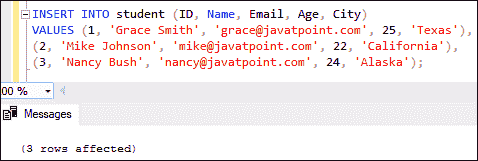
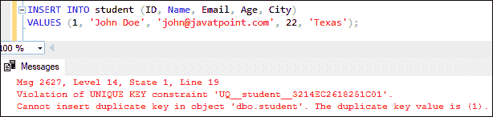
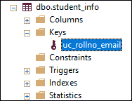
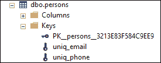
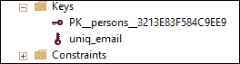
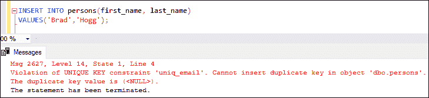

# SQL Server 唯一键

> 原文：<https://www.javatpoint.com/sql-server-unique-key>

唯一键是 SQL Server 中的一个约束。**这个约束确保我们不能在列**中输入重复的值。这意味着存储在列中的数据在表中的行中是唯一的。我们可以在单列和多列上创建唯一的键**。例如**“学生”表中的学生电子邮件地址和学号应该是唯一的。此外，“员工”表中员工的联系电话也应该是唯一的。

唯一键允许在表中插入空值。虽然它接受空值，但 SQL Server 只允许每列有一个空值。它维护用于在表中存储各种值的一列或一组列的完整性。

### 需要唯一的密钥

我们使用唯一密钥的原因如下:

*   这对于防止重复值存储在两个记录之间的列中非常有用。
*   当以结构化方式检索数据时，它只保留不同的值来确保数据库的完整性和可靠性。
*   它还可以与外键结合使用，以保持表的唯一性。
*   该表可能具有空值。

### 如何在表中创建唯一键？

SQL Server 提供了两种在表中创建唯一键的方法:

**1。我们可以使用下面的语法创建一个唯一的键列:**

```sql

CREATE TABLE table_name(  
    column1 datatype,  
    column2 datatype UNIQUE,  
    ...  
);  

```

**2。我们可以使用以下语法创建多个唯一键列:**

```sql

CREATE TABLE table_name(  
  col1 col_definition,  
  col2 col_definition,  
  ...  
  [CONSTRAINT constraint_name]  
  UNIQUE(column_name(s))  
);

```

#### 注意:建议在创建表时提供约束名称。如果我们不提供约束名称，SQL Server 将自动生成它的名称。

### **例**

借助一个例子，让我们了解如何在表中创建唯一键。下面的语句创建了一个名为**“学生”**的表，该表具有唯一的键:

```sql

CREATE TABLE student (  
    ID int NOT NULL UNIQUE,   
    Name varchar(55),   
    Email varchar(40),  
    Age int,   
    City varchar(35)  
); 

```

接下来，我们将插入一些记录来理解这个约束是如何工作的:

```sql

INSERT INTO student (ID, Name, Email, Age, City)  
VALUES (1, 'Grace Smith', 'grace@javatpoint.com', 25, 'Texas'),  
(2, 'Mike Johnson', 'mike@javatpoint.com', 22, 'California'),  
(3, 'Nancy Bush', 'nancy@javatpoint.com', 24, 'Alaska');

```

执行该语句会将记录成功添加到表中，因为没有找到重复的记录。以下是输出:



让我们在表中插入另一条记录:

```sql

INSERT INTO student (ID, Name, Email, Age, City)  
VALUES (1, 'John Doe', 'john@javatpoint.com', 22, 'Texas');

```

执行该语句将引发错误，因为已经插入了值为 1 的标识列。以下是输出:



现在，我们将看到如何在一个表中定义多个唯一键。以下语句将在“**student _ info”**表的多列上创建唯一键:

```sql

CREATE TABLE student_info (  
    ID int,   
    Roll_No int,  
    Name varchar(45) NOT NULL,   
    Email varchar(45),  
    City varchar(25),  
    CONSTRAINT uc_rollno_email Unique(Roll_No, Email)  
);

```

执行该语句将为列 ***辊号和电子邮件*** 定义唯一的键。我们可以验证如下:



### 如何向现有列添加唯一约束？

SQL Server 提供了一个 **ALTER 命令**在现有列中添加唯一约束。当我们向表中的现有列或一组列添加唯一键时，SQL Server 会查看这些列中的现有数据，以确保所有值都是唯一的。如果它检测到重复数据，则会生成一个错误，并且不会添加唯一约束。

**我们可以使用以下语法在表中添加唯一约束:**

```sql

ALTER TABLE table_name
ADD CONSTRAINT constraint_name 
UNIQUE(column1, column2,...);

```

**例**

假设我们用下面的语句创建了一个名为 **persons** 的表:

```sql

CREATE TABLE persons (
    id INT IDENTITY PRIMARY KEY,
    first_name VARCHAR(55) NOT NULL,
    last_name VARCHAR(55) NOT NULL,
    email VARCHAR(55),
    phone VARCHAR(20),
); 

```

创建表后，我们需要向该表添加一个唯一的约束。在这种情况下，以下 ALTER 语句将为电子邮件列添加一个唯一的约束:

```sql

ALTER TABLE persons
ADD CONSTRAINT uniq_email UNIQUE(email); 

```

同样，下面的语句在电话列上添加了一个唯一的键:

```sql

ALTER TABLE persons
ADD CONSTRAINT uniq_phone UNIQUE(phone);

```

我们可以验证如下所示的唯一约束，显示 **uniq_email，uniq_phone** 键添加成功:



### 如何从表中删除唯一键？

SQL Server 使用 ALTER TABLE 语句从表中删除唯一键。我们可以使用下面的语法删除一个唯一的键:

```sql

ALTER TABLE table_name
DROP CONSTRAINT constraint_name;

```

**例**

假设我们想从人员表中删除 **uniq_phone** 唯一约束。我们可以这样做，如下陈述:

```sql

ALTER TABLE persons
DROP CONSTRAINT uniq_phone;

```

验证该表，我们看到 uniq_phone 被成功删除:



### 如何修改唯一键？

SQL Server 不提供任何直接查询来修改唯一键。因此，如果我们想修改唯一键，我们必须先删除该键，然后重新创建它来更新它。

### 唯一键和主键有什么不同？

我们知道，唯一和主键约束都保证了数据的唯一性。但是，当我们想要保证一列或一组非主键列的唯一性时，我们应该使用唯一性而不是主键。它们之间的主要区别是主键标识表中的每条记录，唯一键防止列中除空值之外的重复条目。还有一些不同之处:

*   在关系数据库中，一个表不能有多个主键，但它可以有多个唯一键。
*   主键列不能有空值。但是，唯一键列可以，尽管每个表只允许一个空值。
*   主键应该是唯一的，但唯一键不一定是主键。

**以下示例解释了它们的不同之处，即我们插入的记录在电子邮件列中的值为空:**

```sql

INSERT INTO persons(first_name, last_name)
VALUES('Peter','Smith');

```

让我们使用下面的查询在电子邮件列中再插入一个空值:

```sql

INSERT INTO persons(first_name, last_name)
VALUES('Brad','Hogg');

```

SQL Server 抛出一条错误消息:



### 结论

本文将全面概述独特的关键约束。它解释了如何使用 SQL Server 唯一键来保证一列或一组列中的数据是唯一的。此外，如何独特是不同于主键的。

* * *