# SSRS 教程

> 原文：<https://www.javatpoint.com/ssrs>

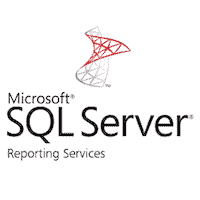

SSRS 教程提供了 SQL Server 报告服务的基本和高级概念。我们的 SSRS 教程是为初学者和专业人士设计的。

**SQL Server Reporting Services**(SSRS)是*一款由微软*提供的报告工具，用于生成图形、数据表和图表等格式化报告。

在这里，我们将在本教程中介绍以下主题:

*   [什么是 SSRS？](#whatisssrs)
*   [什么是数据可视化？](#whatisdatavisualization)
*   [我们为什么需要可视化？](#whyvisualization)
*   [为什么是 SRS？](#whyssrs)
*   [SSRS 建筑](#ssrsarchitecture)
*   [报告周期](#reportinglifecycle)
*   [报告服务要求](#requirements)
*   [SSRS 报道](#reports)

* * *

## 什么是 SSRS？

SSRS 代表 **SQL Server 报告服务**。这是一个由微软开发的报告工具，与 SQL Server 一起免费提供。它生成带有数据表、图表和报告的格式化报告。报告托管在服务器上，可以配置为使用用户提供的参数运行。当我们运行报告时，当前数据出现在数据库、XML 文件或其他数据源中。它提供了控制谁可以查看哪些报告的安全功能。

* * *

## 什么是数据可视化？

数据可视化是对我们拥有的数据的虚拟访问。设计良好的数据可以是图形、图表或报告，数据的可视化表示是任何数据最简单和最强大的表示。例如，我是一名业务分析师，所以从我开始工作以来，我就习惯于处理数字，但是如果我想向所有者显示有关业务的信息，那么我需要提供更容易理解的数据的可视化表示。

* * *

## 为什么我们需要可视化？

如今，我们每天创建近 250 亿字节的数据，这是一个巨大的数据集。我们需要理解这些数据意味着什么，所以我们需要这些数据以可视化的形式呈现出来。数据可视化是首选，因为我们的眼睛比我们的阅读感知得更好。数据可视化的主要目的是人类的大脑比阅读更好地理解数据。与使用电子表格分析数据相比，人类可以更好地通过图表分析数据或信息。数据可视化是以通用方式传达概念的一种快速简单的方法。

**数据可视化很有用，原因如下:**

*   它有助于您确定需要更多改进或关注的领域。
*   它还可以帮助您识别影响客户行为的因素。
*   它也用于预测销量。

* * *

## 为什么是 SSRS？

SSRS 很有用，原因如下:

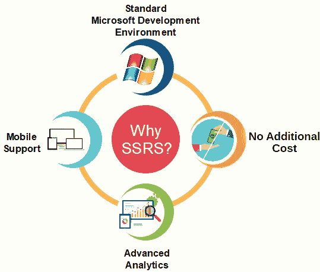

### 标准微软开发环境

这是一个处理所有数据的标准环境。

**由三个服务组成:**

1.  **微软 SQL Server 分析服务:**帮助分析数据。
2.  **微软 SQL Server 集成服务:**处理多个数据源的集成。
3.  **微软 SQL Server 报表服务:**为数据生成可视化报表。

当您使用完整的产品时，它可以确保产品的整体质量和标准化，这是其他工具无法提供的。例如，Tableau 或 Power BI 用于从单个数据源或多个数据源检索数据，然后执行质量检查，即检查数据的不一致性。如果您使用 SSRS，它提供了完整的标准流程，这意味着您正在处理的数据已经通过了执行质量检查的其他服务，因此 reporting service 不需要执行质量检查。

### 移动支持

当您在任何网址上发布报告时，每个人都可以看到它，即使您想在手机上查看报告，也可以通过打开网址来查看报告。假设我的客户坐在美国，想要我这边的报告，那么我就发布报告，并向他提供报告细节，以便他可以查看报告。

### 无额外费用

**SSDT** (SQL Server 数据工具)在安装 SQL Server 时免费附带了 SQL Server 软件包。成本是组织中要考虑的最重要的因素。作为一个组织，如果您为报告工具付费，那么它就会成为一个障碍，因为您已经为数据处理和数据集成服务付费了。SSRS 的主要优势是它不产生任何费用，因为它是免费的微软 SQL Server。您只需要购买 SQL Server 的许可证，所有服务都是免费的。

### 高级分析

您还可以进行高级可视化和分析。SSRS 还允许您在进行可视化之前，根据您的要求过滤或处理数据。

* * *

## SSRS 建筑

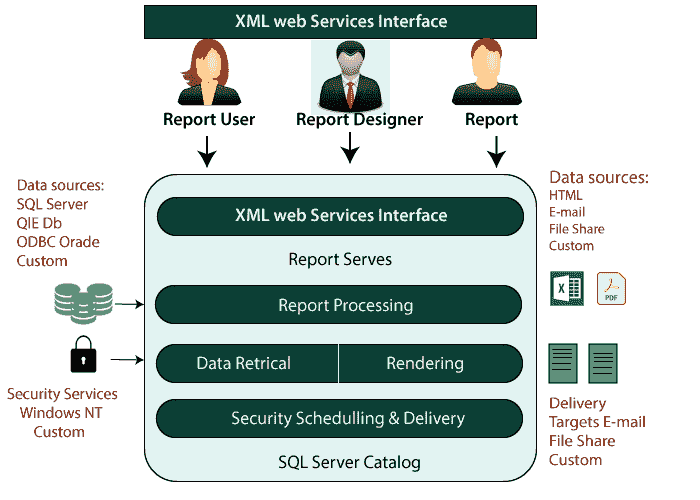

**举报服务的用户有三种类型:**

1.  **报表用户**
    报表用户是处理数据的用户。他们主要使用前两个工具，即 SSIS (SQL Server 集成服务)和 SSAS (SQL Server 分析服务)。如果他们想做报告，那么他们也可以使用 **SQL Server 报告服务**。
2.  **报告设计者**
    报告设计者是根据现有数据设计报告的专业人员。
3.  **报表管理器**
    报表管理器是查看报表或者我们需要向其提交报表的人员。他们查看报告以检查它们是否满足要求。

**现在我们来了解一下 SSRS 建筑的建筑。**

可以有任何数据源，比如 Oracle、MySQL、SQL Server 等。您可以将这些数据源中的任何一个链接到 Microsoft SQL Server。一旦您将数据源附加到了 SQL Server，那么数据检索和呈现过程就开始了。**渲染**是对数据进行过滤分析以满足要求的过程。**报表处理:**报表处理在渲染后进行。报告处理是发布、过滤和修改现有报告的过程。 **XML web 服务接口:**当您发布报告时，然后将报告发布到网站，可以通过 XML web 服务接口。安全、计划和交付都是由 SQL Server 提供的。

* * *

## 报告生命周期

每个组织都遵循一些方法来生成称为报告生命周期的报告。报告生命周期可以分为三个阶段:

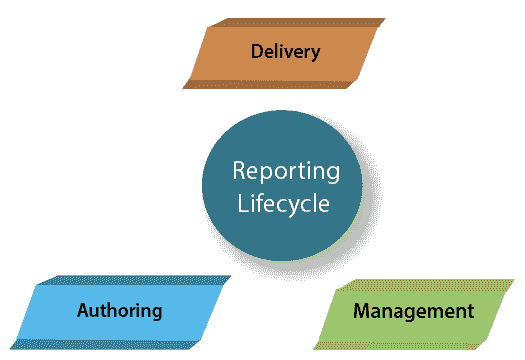

### 程序编写

报告作者定义数据的布局和来源。定义报告的语法称为报告定义语言。一些用于创作的工具是报表生成器等。

### 管理

管理是报告生命周期的第二个阶段。它包括管理公开发布的报告，目前，这些报告可以在 web 服务中获得。当前在 web 界面上可用的报告，您需要创建基于角色的安全模型。它用于确定谁需要访问报告，谁可以查看报告。管理阶段的主要职责是控制执行，即报告何时应该得到数据。所有的报告也应该实时更新。从任何数据源获取的数据都必须定期更新。处理静态数据并不重要。当我们处理动态数据时，您应该定义更新何时发生。可能是一天、几小时或几周。

### 交货

在交付阶段，我们决定何时将报告交付给客户。它可以是按需的，也可以是预定义的时间表。您还可以添加自动订阅功能，该功能可以自动创建报告并将报告发送给客户端。

* * *

## 报告服务的要求

以下是安装报告服务的要求:

### 安装 SQL Server

**以下是安装 SQL Server 的步骤:**

**第一步:**点击下面的链接下载 SQL Server:[https://www.microsoft.com/en-us/download/details.aspx?id=29066](https://www.microsoft.com/en-us/download/details.aspx?id=29066)

**第二步:**选择语言，然后点击**下载**按钮。

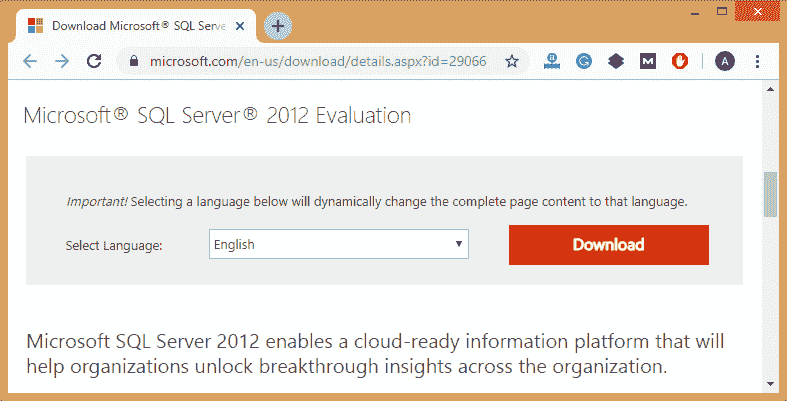

**第三步:**选择想要下载的选项，然后点击下一步按钮。

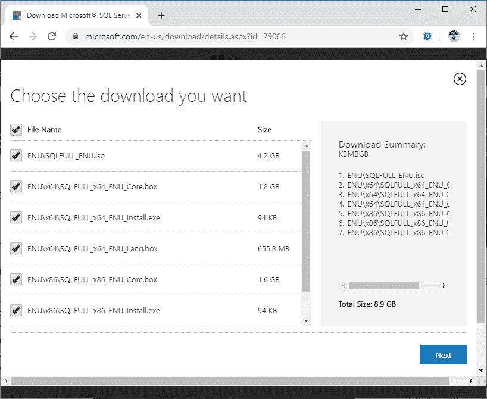

**第四步:**点击已经下载到电脑中的**SQLFULL _ x64 _ ENU _ 安装**文件。点击文件后，屏幕出现，如下所示:

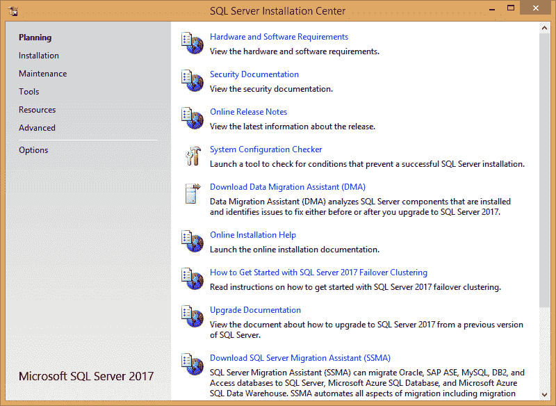

**第五步:**点击面板左侧出现的**安装**。

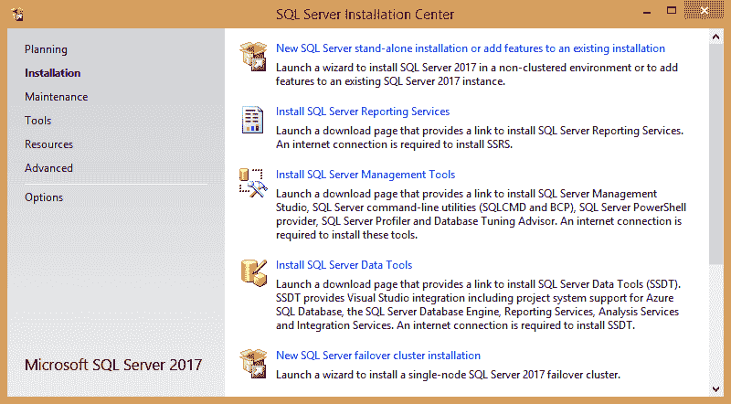

**第六步:**点击第一个选项，即**新增 SQL Server 单机安装**。

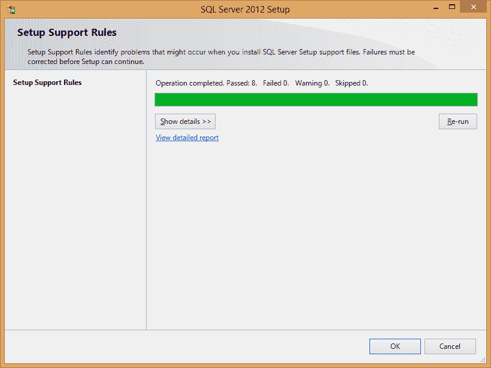

**第七步:**点击**确定**按钮。

**第 8 步:**点击**产品键**选项，然后点击**下一步**按钮。

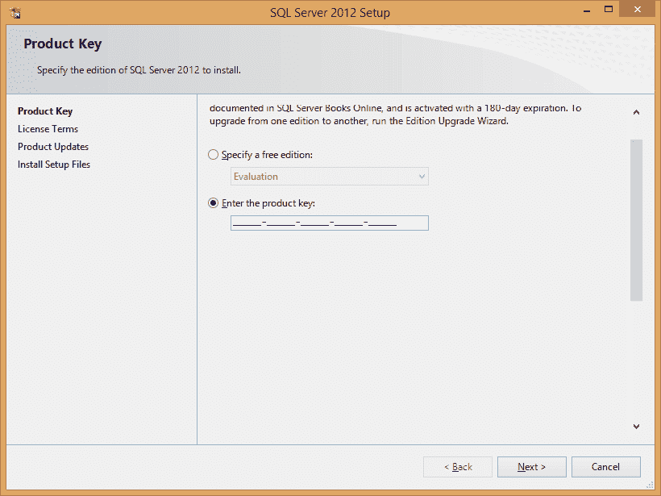

**第 9 步:**勾选“我接受许可子句”框。

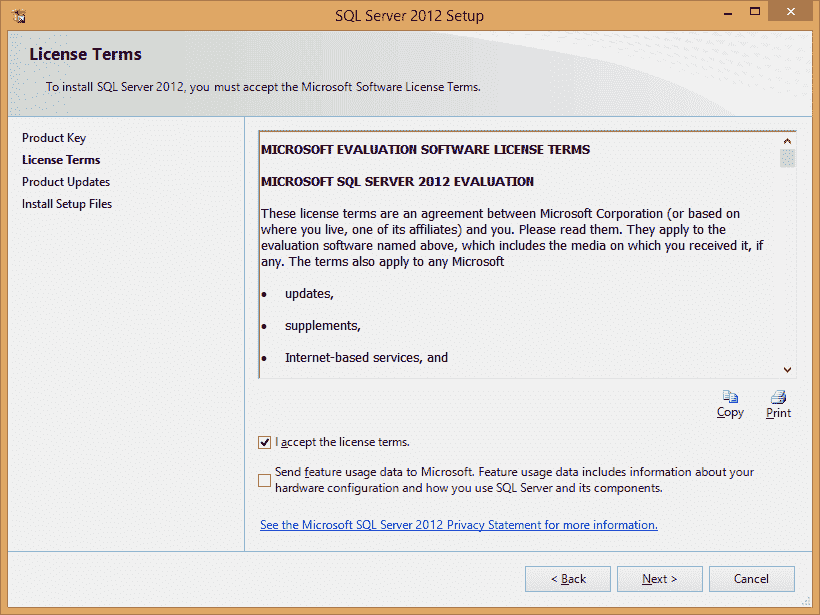

**步骤 10:** 选择 SQL Server 安装。

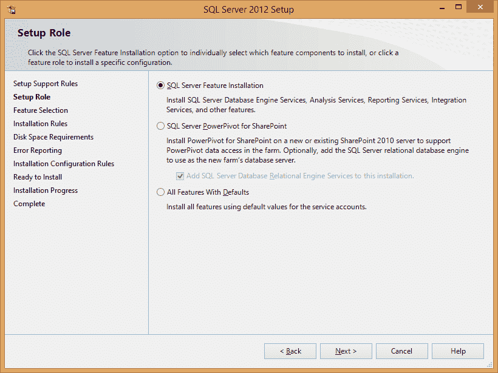

**步骤 11:** 选择**数据库引擎服务**，然后点击**下一步**按钮。

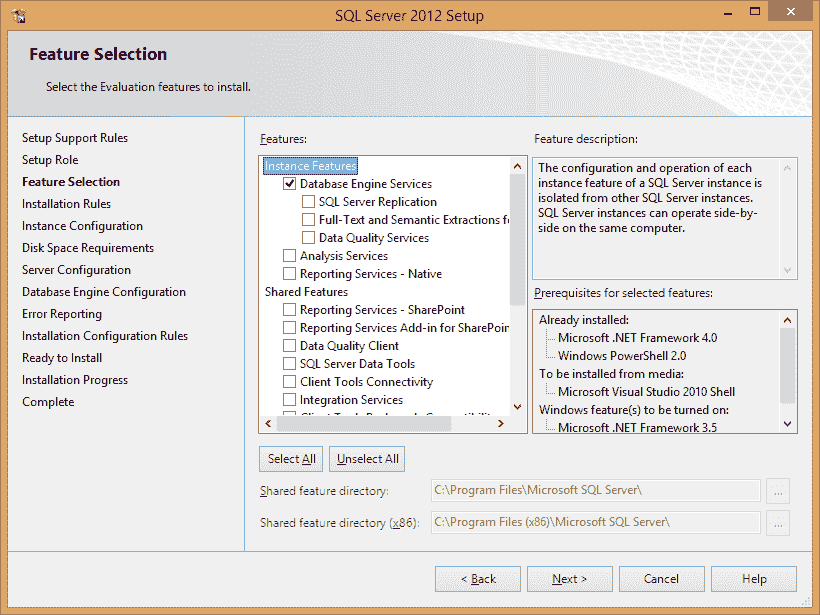

**第 12 步:**选择命名实例，输入实例名称。点击**下一步**按钮。

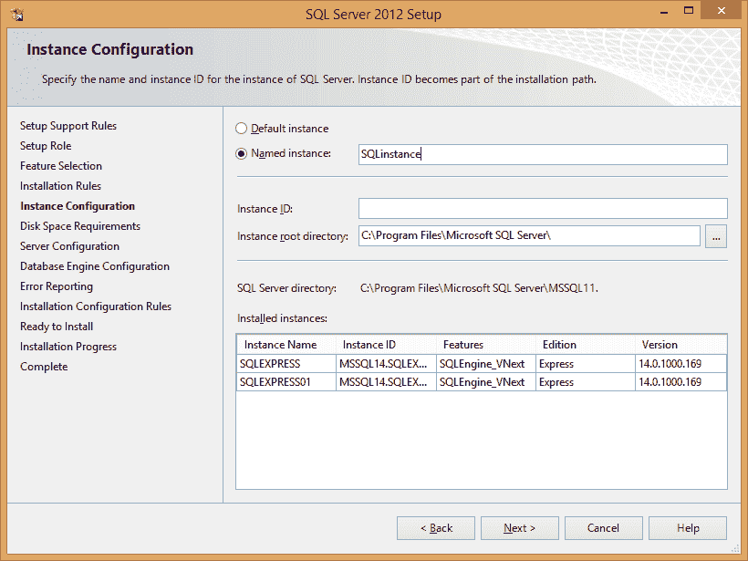

**第 13 步:**点击**下一步**按钮后，屏幕出现，如下图:

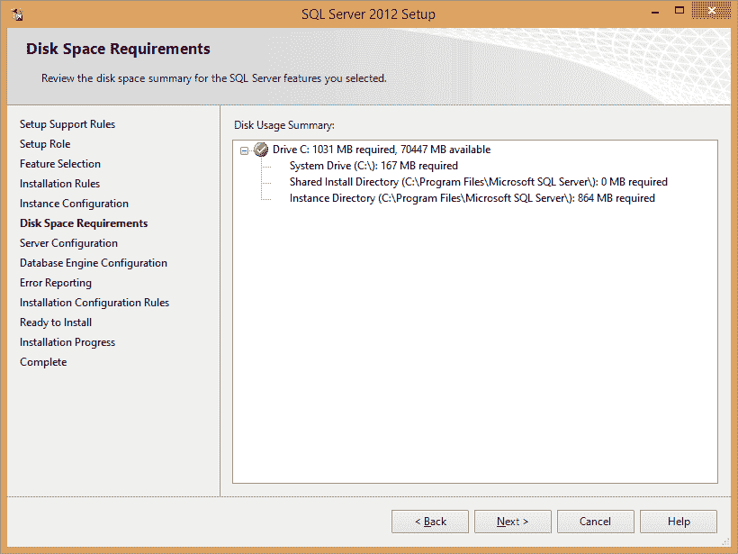

**第 14 步:**在上面的屏幕上点击**下一步**时，屏幕出现，如下图:

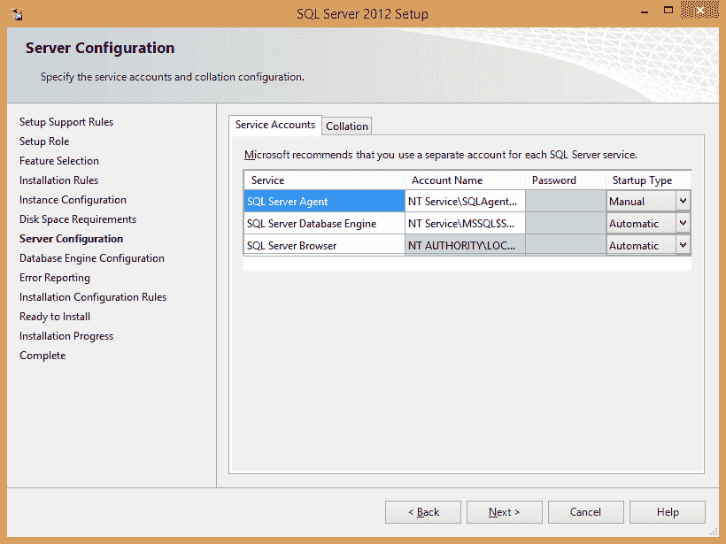

**步骤 15:** 选择**窗口身份验证模式**和至少一个管理员。

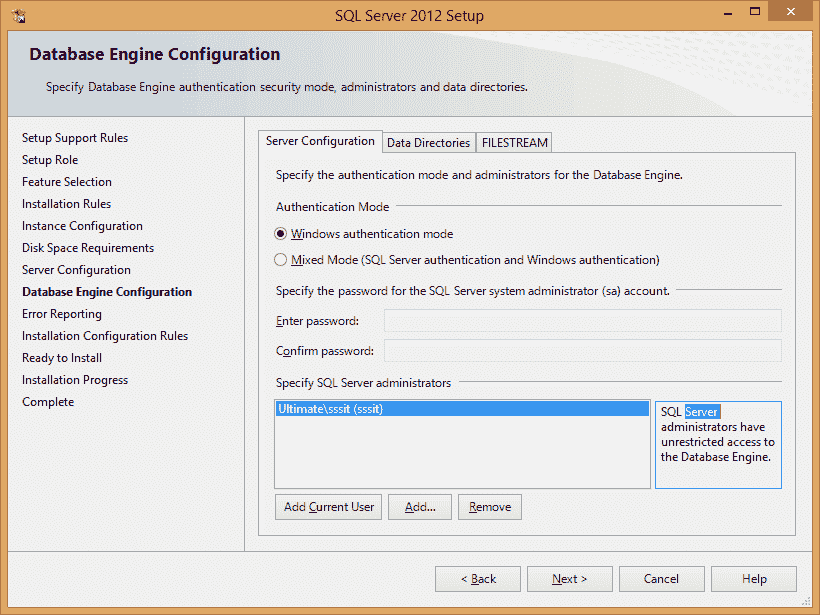

**第 16 步:**点击屏幕上的**下一步**按钮，如下图所示:

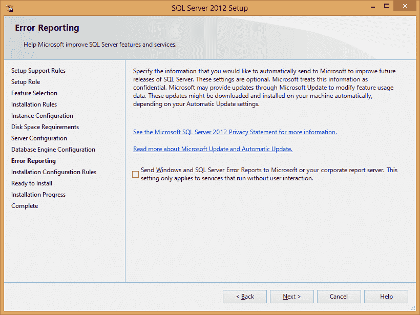

**第 17 步:**点击**下一步**按钮。

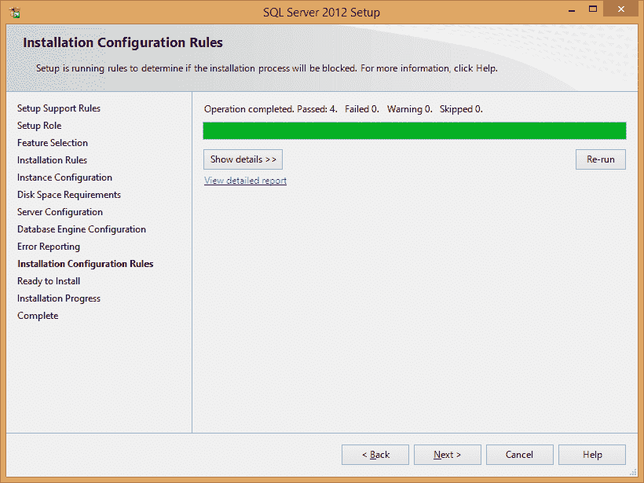

**第 18 步:**点击**安装**按钮，如下图截图所示:

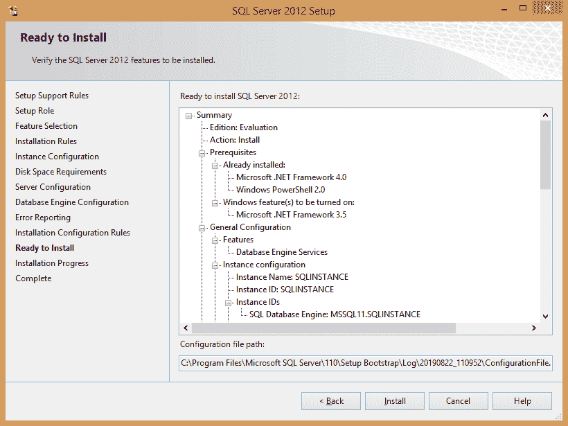

### 第二个要求是安装 visual studio，然后向其中添加报表服务。

**按照以下步骤在 visual studio 中安装 Reporting 服务:**

**第一步:**打开 visual studio。

**步骤 2:** 点击菜单栏出现的工具，然后选择**扩展和更新**选项。

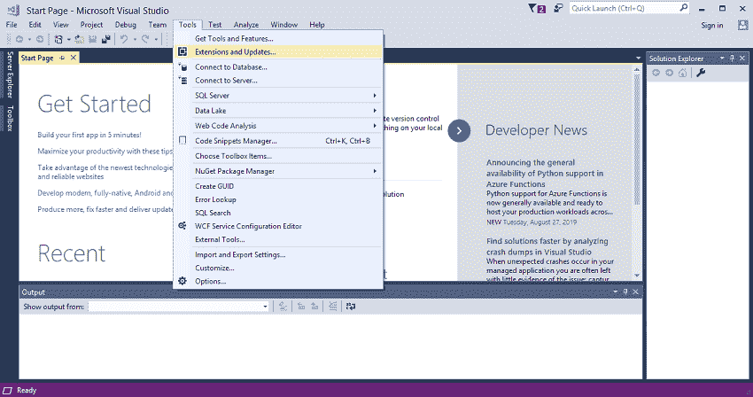

**步骤 3:** 选择**微软报告服务项目**选项进行安装。

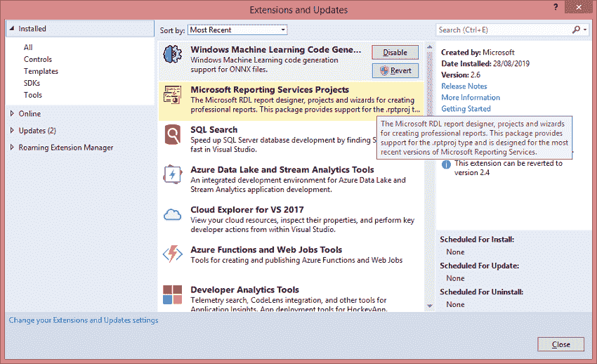

* * *

## SSRS 的报道

SSRS 有六种类型的报告:

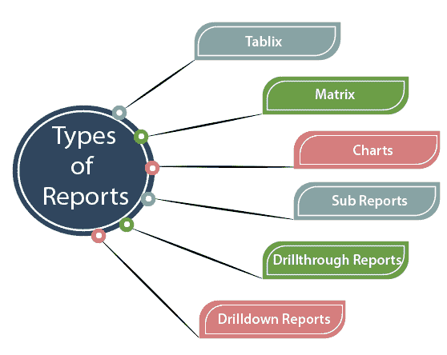

*   **Tablix**
*   **矩阵**
*   **图表**
*   **子报告**
*   **明细报告**
*   **钻取报告**

### 资料区

Tablix 报表格式类似于表格格式。它以表格的形式表示数据。您所表示的通常是一个单一的数据源表。

### [数]矩阵

它与 Tablix 报告非常相似。但不同的是，这里我们使用的不仅仅是一个单一的值。列和行都属于某些特定的数据。它用于通过使用行和列组中的多个字段对数据进行分组。在矩阵报表中，当数据在运行时合并时，报表水平和垂直增长。您甚至可以格式化要强调的行和列组。例如，我们想知道一个产品的销量，也想知道各地区的销量，那么我们就选择矩阵报告，而不是 tablix 报告。

### 图表

图表由不同类型的视觉表示组成，如条形图表示、饼图表示、折线图表示等。所有这些图形表示都代表图表。根据数据的类型，选择图形表示。例如，如果我们有一系列数据，那么选择条形图，因为条形图水平表示图形， 饼图表示整体的比例，例如您想要表示男性和女性成员之间的比例，或者您想要表示不同销售项目的比例，而折线图由一系列连接到一条线的点组成，它评估连续时间段内的数据，例如固定时间段内的销售量，或者评估固定时间段内的员工数量。

### 子报告

子报告是报告本身。它基本上嵌入在另一份报告中。这是一份独立的报告。根据您的需求，它可以与您当前正在处理的报告相关，也可以作为独立的。假设你正在做一份**主报告**，也就是说，告诉你整体的销量，你也想知道各地区的销量，那么我们使用**子报告**。

### 明细报告

明细报告取决于数据的处理方式。它显示了顶层和子层之间的关系。您可以用各种方式来放置数据，以显示顶层和子层之间的关系。您可以在报告中排列数据，但是您需要将其设置为隐藏，直到用户单击它来显示详细信息。您可以在数据区域(如表格或图表)中显示数据，该数据区域嵌套在另一个数据区域(如表格或矩阵)中。

### 钻取报告

钻取报告还取决于数据的处理方式。这是一个用户可以通过打开另一个报告中的链接来查看的报告。钻取报表显示包含在另一个报表中的项目的所有详细信息。例如，销售报告包含所有销售订单的列表，当您单击任何销售订单时，您将看到包含销售订单详细信息的报告。

现在我们将从创建三种类型的报告开始，即 **Tablix** 、**矩阵**和**图表**。首先，我们将创建 **Tablix** 报告。

## 如何创建 Tablix 报表

**步骤 1:** 要创建一个 **Tablix** 报告，我们首先需要启动 visual studio 数据工具。下面的屏幕显示了 visual studio 的外观:

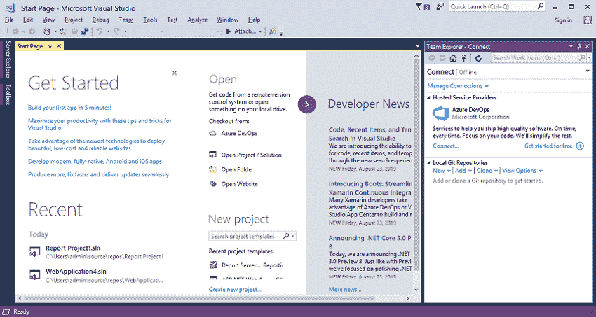

**第二步:**首先，我们将创建一个新项目。点击**文件- >新建- >项目**。

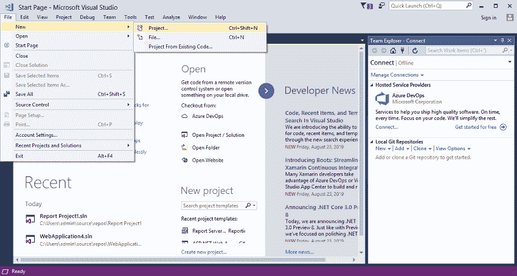

**第三步:**点击项目，出现新建项目窗口，选择**报表服务**，然后点击**报表服务器项目**。

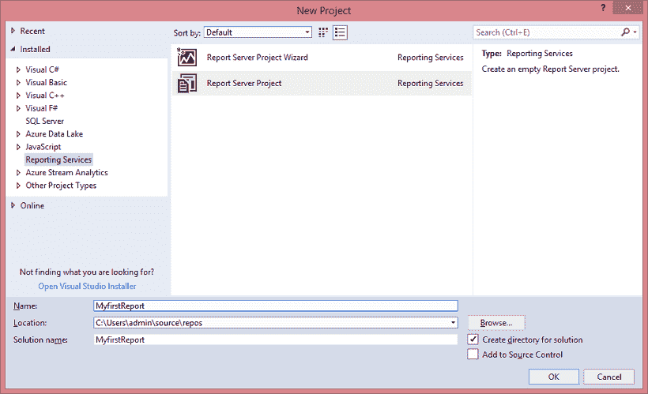

**第四步:**点击上图中**确定**按钮，屏幕出现，如下图:

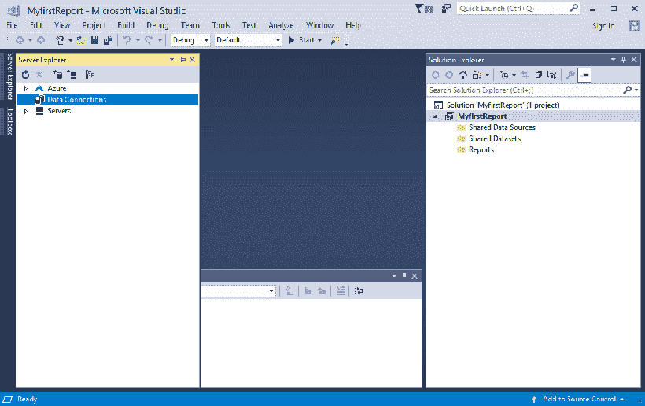

在上面的屏幕中，最右边的屏幕代表解决方案资源管理器，最左边的屏幕代表服务器资源管理器，底部的屏幕是输出屏幕。

**第五步:**在这一步中，我们将创建数据源。右键单击共享数据源，然后单击**添加新数据源**。

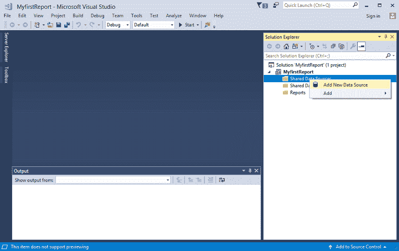

**第 6 步:**点击**添加新数据源**选项，屏幕出现，如下图所示:

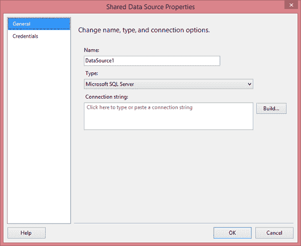

在上面的屏幕中，您需要输入以下字段:

*   **名称:**在名称字段中，输入数据源的名称。我将数据源的名称命名为数据源 1。
*   **类型:**选择数据库的类型。我选择了像**微软 SQL Server** 这样的数据库。
*   **连接字符串:**可以修改连接字符串。点击**建立**按钮修改连接字符串。

**当您点击构建按钮时，屏幕显示如下:**

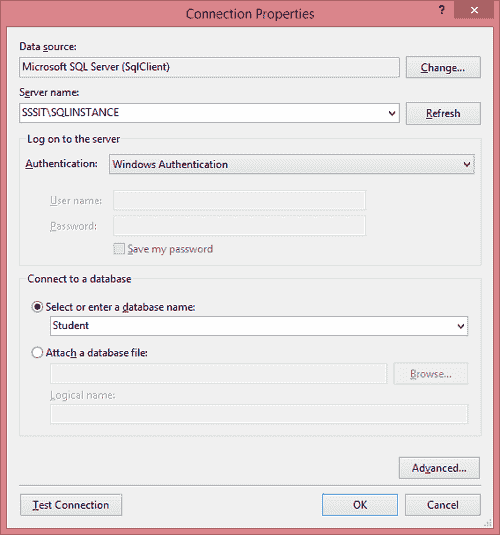

**步骤 7:** 到目前为止，我们已经创建了数据源，但是我们不想处理数据库的所有表，所以我们将创建数据集。右键单击**共享数据集**，然后单击**添加新数据集**。

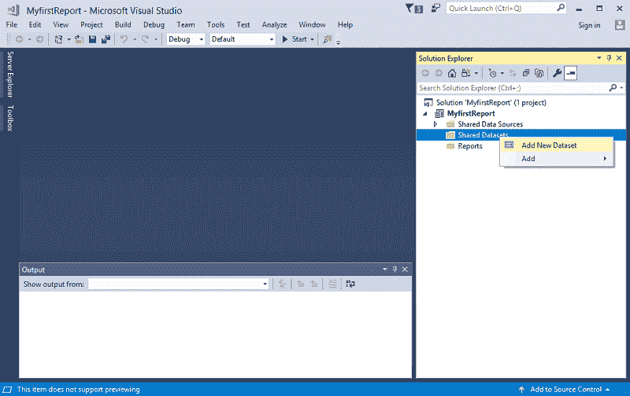

**第 8 步:**点击**添加新数据集**选项，屏幕出现，如下图:

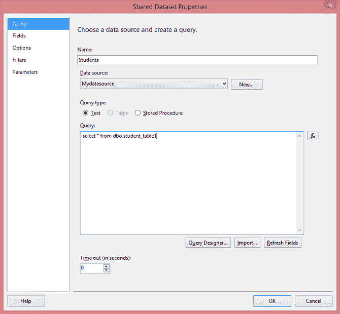

**第九步:**点击**确定**按钮。

**步骤 10:** 现在，我们创建一个报告。右键单击报告文件夹，然后在**添加新报告选项**上**单击**。

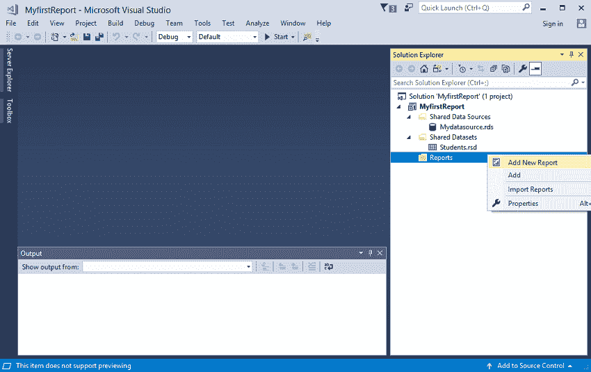

**步骤 11:** 点击**添加新报告**选项后，出现如下画面:

点击**下一步**按钮。

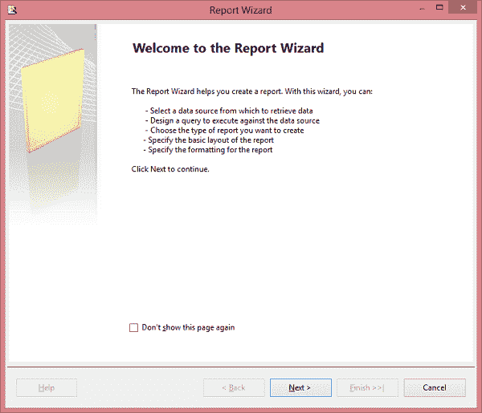

**第 12 步:**点击**下一步**按钮。

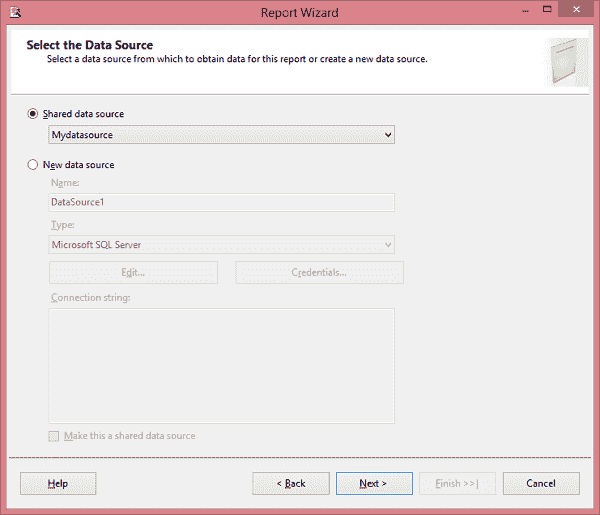

**第 13 步:**点击**查询生成器**按钮。

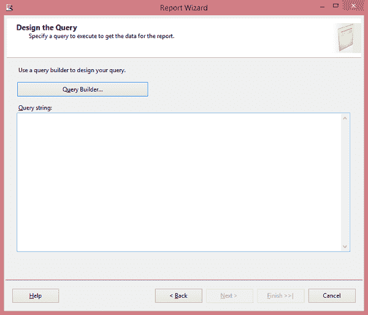

**第 14 步:**点击**确定**按钮。

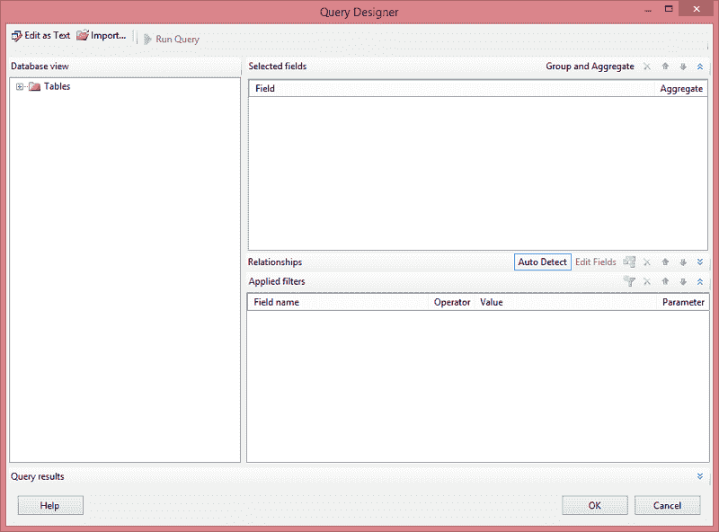

**第 15 步:**右键单击**报告**，然后移至**添加**选项，并单击**新项目**选项。

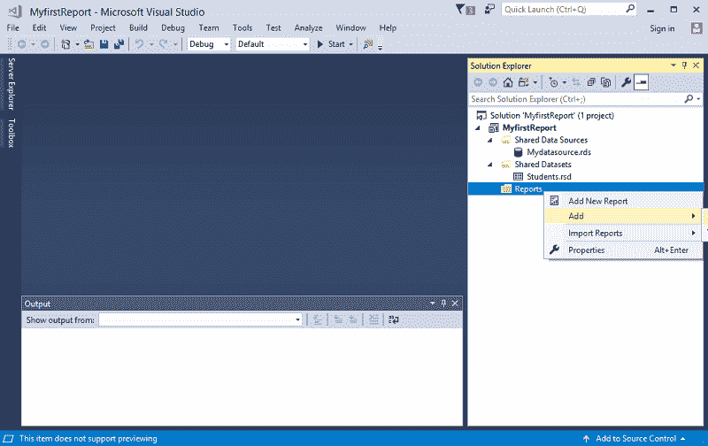

**第 16 步:**点击**新增项目**选项后，屏幕出现，如下图:

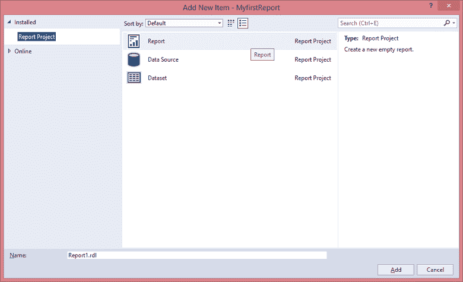

**第 17 步:**点击上图截图所示的**报告**选项。单击报告时，屏幕显示如下:

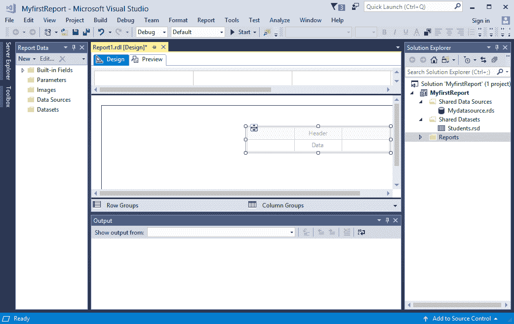

在上面的屏幕中，中间的屏幕代表报告工作区，我们在这里创建报告的设计。

**步骤 18:** 现在，我们将为报告选择我们想要的视觉类型。要创建 Tablix 报告，右键单击工作区，选择**插入**选项，然后单击**表格**。

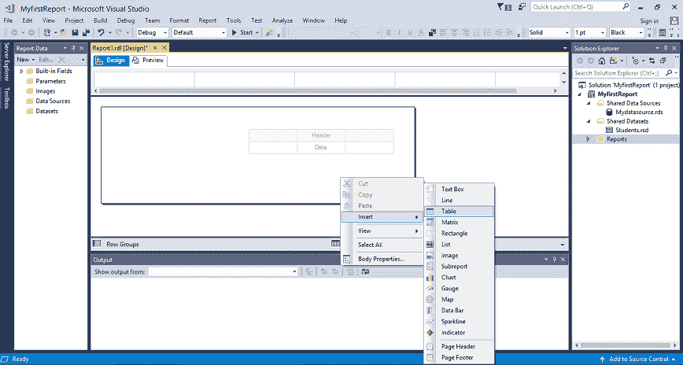

**第 19 步:**在“设计”选项卡中，我们根据报告的外观创建报告的设计。我们设计了一个报告，其中我添加了学生表的四个字段(学生证、学名、分数、地点)。

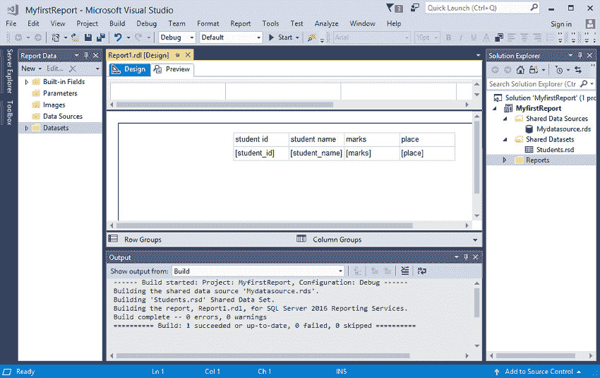

“预览”选项卡显示报表在发布前的外观。

**第 20 步:**点击**预览**选项卡。在预览选项卡中，我们可以查看我们的报告，如下图所示

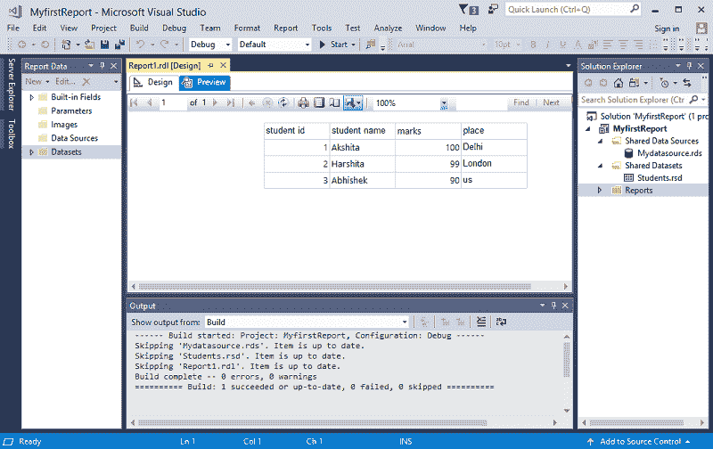

## 如何创建矩阵报告

**步骤 1:** 创建与我们在 **Tablix** 报告中创建的数据源相同的数据源。

**步骤 2:** 按照我们在 **Tablix** 报告中创建的相同方式创建数据集。

**第三步:**右键点击**报告**并添加新项目。当您点击**新项目**时，屏幕出现如下所示:

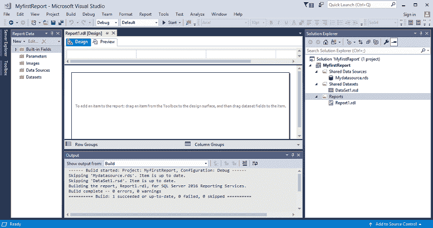

**第 4 步:**右键单击报告工作区，选择**插入**选项，然后单击**矩阵**。

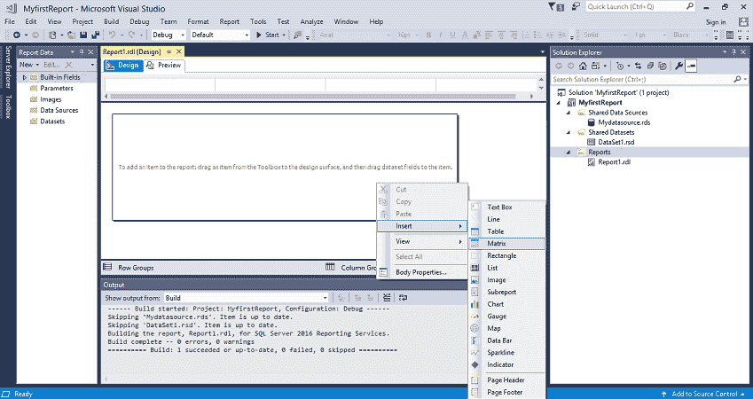

**步骤 5:** 现在，我在矩阵报告中添加学生表的两个字段(学生姓名和城市)。

**第 6 步:**现在，我想根据学生的国家对他们进行分组，所以我从“数据集”中拖动国家列，并将其添加到下面截图所示的蓝线上:

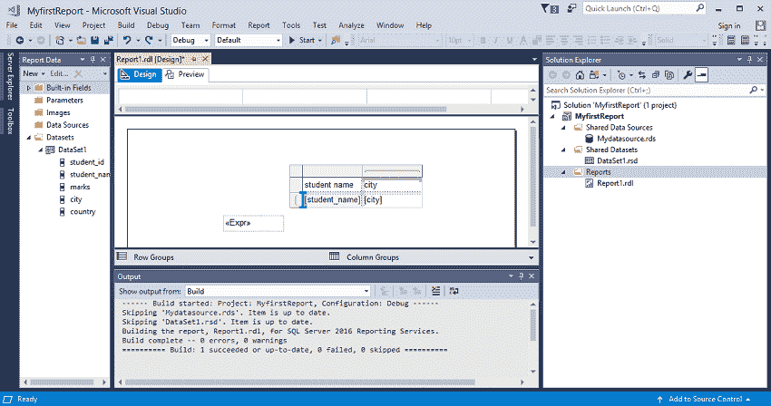

**步骤 7:** 在报告中添加国家/地区列后，设计将如下所示:

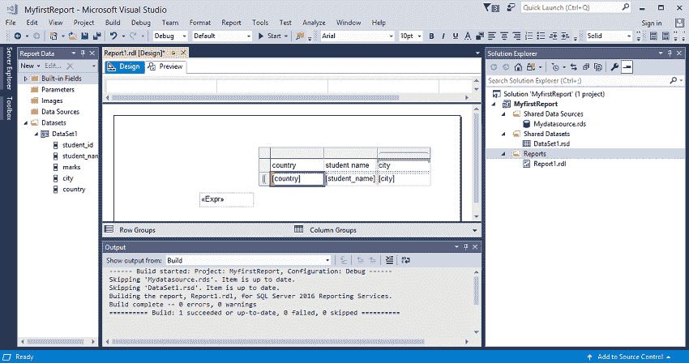

**第 8 步:**点击**预览**选项卡。

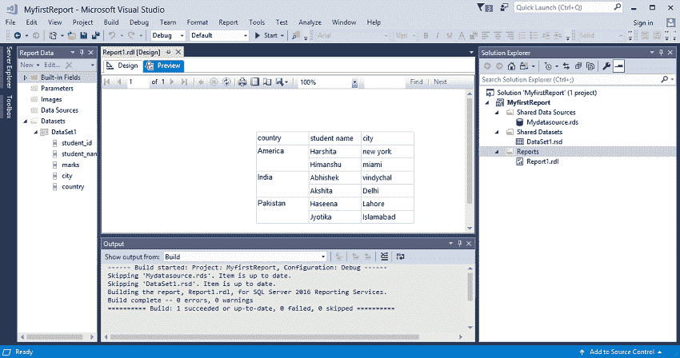

上面的屏幕显示学生根据他们的国家进行分类。因此，我们得出结论，当需要分类时，使用矩阵报告。

## 如何创建图表

**步骤 1:** 我创建了一个新表，即在 SQL Server 中有三个字段的 employee，即 employee_id、employee_name 和性别。现在，我们需要以类似于在其他报告中创建的方式创建一个新的数据源。

**步骤 2:** 创建新数据集。

**步骤 3:** 在报告中添加新项目。

**第 4 步:**右键单击报告工作区，选择**插入**选项，然后单击**图表**。

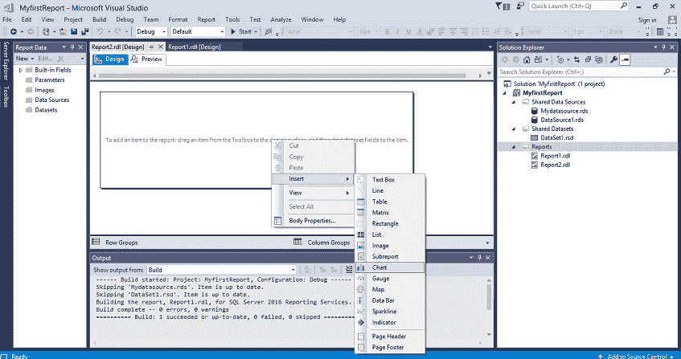

**第五步:**选择图表类型。

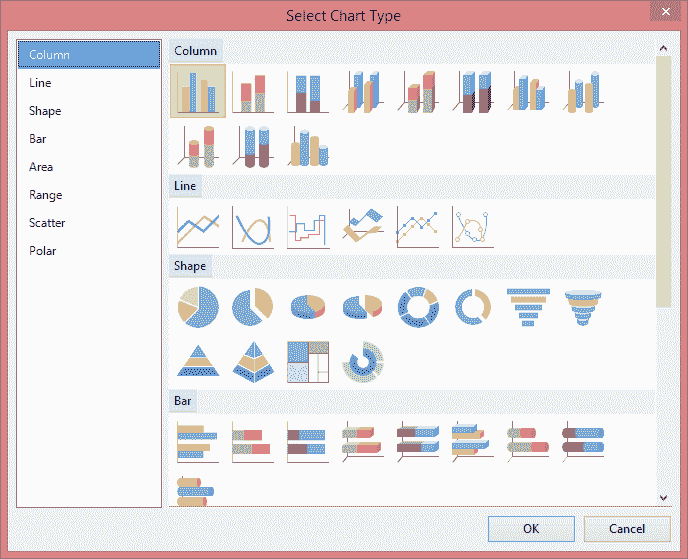

我选择了饼图。

**第六步:**选择饼图后，屏幕出现，如下图:

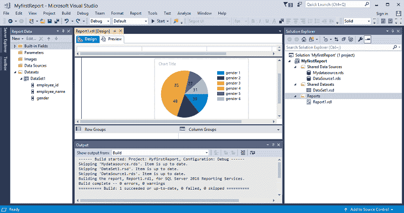

**第 7 步:**将性别列添加到图表数据的类别组和值中。

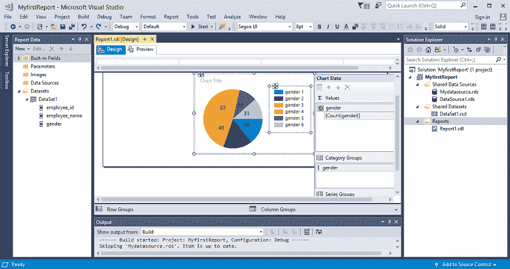

**第 8 步:**点击性别的下拉图标，选择**显示数据标签**选项。

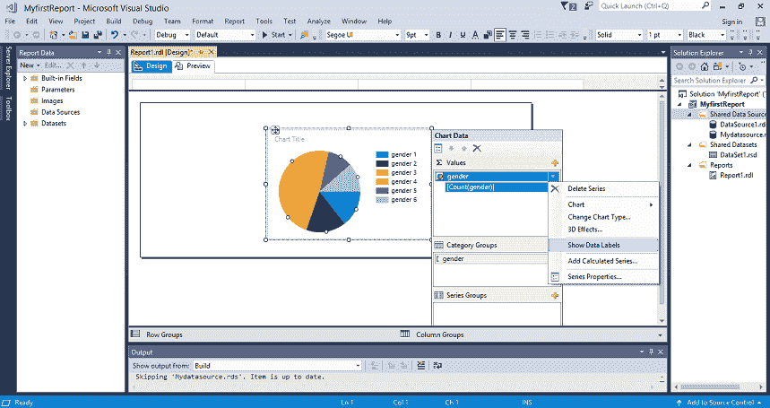

**第 9 步:**点击**预览**选项卡查看报告。

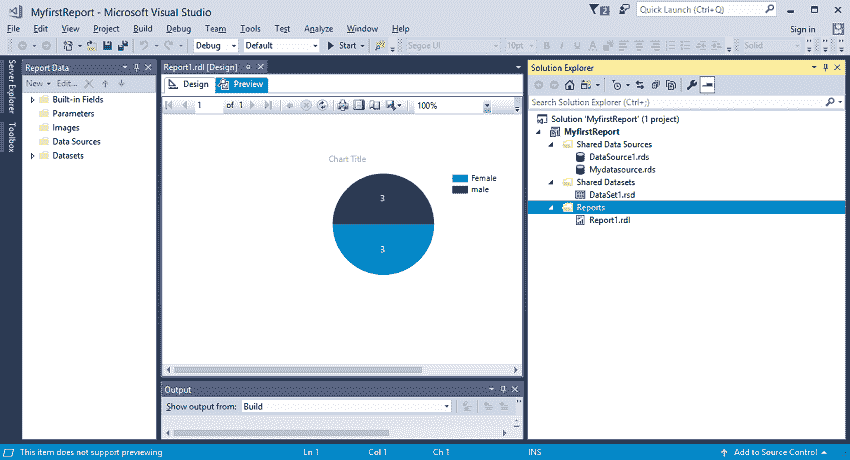

在上图中，饼图显示 3 名男性和 3 名女性。

## 先决条件

在学习 SSRS 之前，你应该对 SQL Server 和 Visual Studio 有一个基本的了解。

## 观众

我们的 SSRS 教程旨在帮助初学者和专业人士。

## 问题

我们保证您在本 SSRS 教程中不会发现任何问题。但是如果有任何错误，请在联系表格中发布问题。

* * *