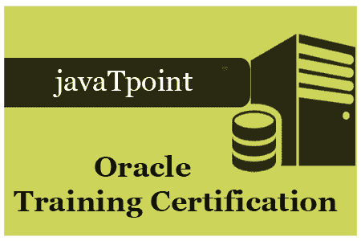

# Oracle 教程

> 原文：<https://www.javatpoint.com/oracle-tutorial>

Oracle 教程提供了 Oracle 的基本和高级概念。我们的 Oracle 教程是为初学者和专业人士设计的。

Oracle 是一个关系数据库管理系统。它广泛应用于企业应用中。

我们的 Oracle 教程包括 Oracle 数据库的所有主题，如插入记录、更新记录、删除记录、选择记录、创建表、删除表等。还提供 Oracle 面试问题，帮助您更好地了解 Oracle 数据库。

* * *

## Oracle 索引

* * *

Oracle 教程

*   Oracle 教程
*   [什么是 Oracle](what-is-oracle)

Oracle 表

*   [创建表格](oracle-create-table)
*   [将表格创建为](oracle-create-table-as)
*   [更改表格](oracle-alter-table)
*   [下降表](oracle-drop-table)
*   [全球温度表](oracle-global-temp-tables)
*   [本地温度表](oracle-local-temp-tables)

**Oracle 视图**

*   [创建视图](oracle-view)

**Oracle 查询**

*   [Oracle 查询](oracle-queries)
*   [Oracle 选择](oracle-select)
*   Oracle 插入
*   [Oracle 全部插入](oracle-insert-all)
*   [Oracle 更新](oracle-update)
*   [Oracle 删除](oracle-delete)
*   [截断表格](oracle-truncate-table)

Oracle 子句

*   [Oracle DISTINCT](oracle-distinct-clause)
*   [Oracle FROM](oracle-from-clause)
*   [Oracle 订单人](oracle-order-by-clause)
*   [Oracle 集团 BY](oracle-group-by-clause)
*   [Oracle HAVING](oracle-having-clause)

**Oracle 运营商**

*   [Oracle 联盟](oracle-union)
*   [Oracle 联合所有](oracle-union-all)
*   [Oracle 交集](oracle-intersect)
*   [Oracle 减](oracle-minus)

**Oracle 连接**

*   [Oracle 连接](oracle-joins)
*   [内部连接](oracle-inner-join)
*   [外部连接](oracle-outer-join)
*   [同等加入](oracle-equi-join)
*   [自加入](oracle-self-join)
*   [交叉连接](oracle-cross-join)
*   [反加入](oracle-anti-join)
*   [半连接](oracle-semi-join)

**Oracle 进阶**

*   [Oracle 程序](oracle-procedure)
*   [Oracle 功能](oracle-function)
*   Oracle 游标
*   [Oracle 触发器](oracle-trigger)
*   [触发前的预言](oracle-before-trigger)
*   [触发后的 Oracle](oracle-after-trigger)
*   [Oracle DROP 触发器](oracle-drop-trigger)
*   [Oracle 禁用触发器](oracle-disable-trigger)
*   [Oracle 启用触发器](oracle-enable-trigger)

**面试问题**

*   [Oracle 面试](oracle-interview-questions)
*   [SQL 面试](sql-interview-questions)
*   [PL/SQL 面试](pl-sql-interview-questions)
*   [MongoDB 面试](mongodb-interview-questions)

* * *

## 先决条件

在学习 Oracle 之前，你必须具备计算机基础的基本知识。

## 观众

我们的 Oracle 教程旨在帮助初学者和专业人士。

## 问题

我们保证您在本 Oracle 教程中不会发现任何问题。但是如果有任何错误，请在联系表格中发布问题。