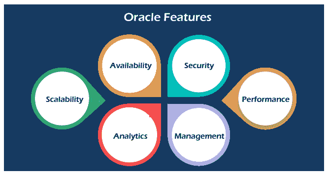

# 什么是甲骨文？

> 原文：<https://www.javatpoint.com/what-is-oracle>

Oracle 数据库是来自 Oracle 公司的关系数据库管理系统。本文将解释 Oracle 数据库、特性、历史和版本的完整概述。在讨论甲骨文之前，我们首先需要了解数据库。

## 什么是数据库？

数据库是指以电子方式存储在设备中的结构化数据的**有组织的集合**。它允许我们频繁地访问、管理和查找相关信息。在数据库系统发明之前，平面文件结构被广泛用于存储数据。与平面文件模型相比，关系数据库方法变得流行起来，因为它消除了冗余数据。**例如**，假设我们有一个员工和联系信息存储在同一个文件中。在这种情况下，有多个联系人的员工会出现在多行中。

[关系数据库管理系统](https://www.javatpoint.com/what-is-rdbms)系统管理关系数据。Oracle 数据库是最著名的关系数据库系统，因为它在其他关系数据库中占有最大的市场份额。其他一些流行的关系数据库有 [MySQL](https://www.javatpoint.com/mysql-tutorial) 、 [DB2](https://www.javatpoint.com/what-is-db2) 、 [SQL Server](https://www.javatpoint.com/sql-server-tutorial) 、 [PostgreSQL](https://www.javatpoint.com/postgresql-tutorial) 等。

## 什么是甲骨文数据库？

Oracle 数据库是一个关系数据库管理系统。它也被称为**甲骨文数据库**，或者简称为**甲骨文**。由**甲骨文公司**生产销售。它是由劳伦斯·埃里森和其他工程师在 1977 年创造的。它是信息技术市场上最流行的存储、组织和检索数据的关系数据库引擎之一。

Oracle 数据库是第一个为**企业网格计算**和数据仓库设计的数据库。企业网格计算为管理信息和应用程序提供了最灵活、最经济的方式。它使用 SQL 查询作为与数据库交互的语言。

## 甲骨文数据库的版本

Oracle 数据库与各种平台兼容，如 Windows、UNIX、Linux 和 macOS。它支持多种操作系统，如 IBM AIX、惠普-UX、Linux、微软视窗服务器、Solaris、SunOS、macOS 等。在 20 世纪 90 年代末，甲骨文开始支持开放平台，如 GNU/Linux。

**以下是按优先级排序的 Oracle 数据库版本列表:**

*   **企业版:**是最健壮最安全的版本。它提供所有功能，包括卓越的性能和安全性。
*   **标准版:**它为不需要 Enterprise Edition 健壮包的用户提供基础功能。
*   **Express Edition (XE):** 它是轻量级的、免费的、有限的 Windows、Linux 版。
*   **甲骨文 Lite:** 专为移动设备设计。
*   **个人版:**与企业版相当，但没有 Oracle 真实应用集群功能。

## 甲骨文公司

甲骨文公司是为商业开发和销售计算机软件应用的最大软件公司。该公司以其甲骨文数据库产品以及最近的云产品和服务而闻名。它的关系数据库是第一个支持 [SQL](https://www.javatpoint.com/sql-tutorial) 的数据库，这已经成为行业标准。

Oracle 数据库是最受信任和使用最广泛的关系数据库引擎之一。甲骨文数据库最大的竞争对手是微软的 SQL Server。

## 甲骨文的历史

**甲骨文公司由劳伦斯·埃里森(Larry Ellison)、鲍勃·迈纳、埃德·奥茨和布鲁斯·斯科特于 1977 年 8 月创立**。他们在为几家公司建立数据库程序方面有很多经验，并为中央情报局(中央情报局)T2 建立了他们的第一个项目(一个特殊的数据库程序)。甲骨文以“甲骨文项目”命名，这是他们的一个客户中央情报局的项目，创建甲骨文的公司名为**系统开发实验室(SDL)** 。系统开发实验室于 1978 年更名为关系软件公司，以扩大新数据库的市场。1982 年，他们再次将公司名称从 RSI 改为甲骨文系统公司。

第一个商业上可用的名为**甲骨文 V2 公司(版本 2)** 的关系数据库管理系统是使用 PDP-11 汇编语言(基于 SQL 的关系数据库管理系统)构建的。尽管他们在 1977 年已经开发了一个商业 RDBMS，但直到 1979 年甲骨文第 2 版发布时，它才可供购买。

**1983 年**发布了名为“Oracle 第 3 版”的 Oracle 数据库便携版。这个版本是用 C 语言编写的。它是第一个可以在大型机、小型机、pc 机或任何带有 C 编译器的硬件上运行的关系数据库。它还支持 SQL 查询和事务执行。

其他后续版本包括:

*   **1984 年**发布了 Oracle 4，支持 Transactions [Commit/Rollback]、导出/导入实用程序和报告编写器。
*   **1985 年**发布了 Oracle 5，为客户端-服务器架构提供支持。这项新功能能够通过网络将客户端软件连接到数据库服务器。
*   **1989 年**Oracle 6 增加了对 PL/SQL 语言的支持。它还带有新功能，如 OLTP 高速系统、热备份功能和行级锁定。
*   **1992 年**甲骨文 7 发布。经过四年的努力和两年的客户测试，该版本已经上市。它在安全、管理、开发和性能领域增加了一些令人兴奋的特性和功能。
*   **1997 年**甲骨文 8 发布。这个版本得到了 ORDBMS 的支持，ORDBMS 旨在与甲骨文的网络计算机(NC)一起工作。它还增加了对 Java、HTML 和 OLTP 的支持。
*   **1998 年**甲骨文 8i 发布。这里的“我”代表互联网。这是第一个增加了对网络技术(如 Java 和 HTTP)支持的数据库版本。
*   **2001 年**发布了 Oracle 9i，新增了 XML、RAC(真实应用集群)等 400 项功能。这些特性减小了数据库大小，并提供了高可用性&增强的性能。
*   **2003 年**Oracle 10g 发布，网格计算技术意味着网格。这是第一个支持 64 位 LINUX 操作系统的版本。
*   **2006 年**甲骨文 11g 发布。此版本附带了新功能，如 Oracle 数据库重放、使用日志挖掘器的事务管理、虚拟列分区、区分大小写的密码、在线修补、使用 RMAN 对同一文件进行并行备份等。
*   【2014 年 7 月发布了支持 Cloud 的 Oracle 12C。
*   【2018 年 2 月甲骨文 18 C 发布。这个版本是世界上第一个自主数据库。

## 甲骨文的重要性

它是世界上最古老的数据库管理公司之一。它始终关注企业需求，紧跟最新技术发展。因此，其产品不断更新新功能。例如，最新的甲骨文数据库 19C 也可以在甲骨文云上使用。Oracle 允许用户从各种数据库版本中进行选择，以经济高效的解决方案满足他们的特定需求。

## 甲骨文数据库功能

Oracle 数据库借助开放、完整和集成的方法来管理数据。以下功能满足了对强大数据库管理的需求:

**可用性:**从不离线或停止服务意味着支持数据库的 24*7 可用性。由于 Oracle 数据保护功能，它提供了数据库的高可用性。此功能允许在任何故障期间将辅助数据库用作主数据库的副本。因此，所有正常进程(如备份和部分故障)都不会中断数据库的使用。

**安全性:** Oracle 有一个控制和访问数据库的机制，以防止未经授权的访问。由于 Oracle 高级安全功能，它提供了很高的安全性。它提供了两种保护数据库的解决方案，即 TDE(透明数据加密)和数据编辑。TDE 支持源端和导出后的数据加密。编校在应用程序级别执行。甲骨文还有其他一些安全功能，如管理用户权限的甲骨文数据库保管库和甲骨文标签安全。

**可扩展性:**它提供了 RAC(真实应用集群)和可移植性等特性，这使得 Oracle 数据库可以根据使用情况进行扩展。在群集环境中，它包括滚动实例迁移、执行升级、维护应用程序连续性、服务质量管理等功能。

**性能:** Oracle 提供性能优化工具，如 Oracle 高级压缩、Oracle 数据库内存、Oracle 真实应用测试和 Oracle 十倍应用层数据库缓存。他们的主要目标是尽可能提高系统性能。

**分析:**甲骨文在分析领域有以下解决方案:

*   **OLAP(Oracle Analytic Processing):**它是 Oracle 的一个实现，用于对业务数据进行复杂的分析计算。
*   **Oracle 高级分析:**它是 Oracle R Enterprise 和 Oracle Data Mining 的技术结合，通过数据和文本挖掘以及统计数据计算，帮助客户确定预测性业务模型。

**管理:**Oracle multitanint 是一个数据库管理工具，它将单个容器数据库与许多可插拔数据库结合在一个统一的设计中。

## 甲骨文数据库的优势

以下是 Oracle 数据库的主要优势:

**性能:** Oracle 有一些程序和原则可以帮助我们获得高水平的数据库性能。我们可以通过在其数据库中使用性能优化技术来增加查询执行时间和操作。这项技术有助于更快地检索和修改数据。

**可移植性:**Oracle 数据库可以比任何竞争对手在所有不同的平台上移植。我们可以在大约 20 个网络协议以及 100 多个硬件平台上使用这个数据库。通过以安全的方式对操作系统和硬件进行更改，该数据库使得编写 Oracle 应用程序变得简单。

**备份和恢复:**最好对整个 oracle 在线备份和恢复进行适当的备份。Oracle 数据库使得使用。RMAN(恢复管理器)功能。它可以在停机或中断期间恢复或还原数据库文件。它可用于在线备份、归档备份和连续归档。我们还可以使用 SQL* PLUS 进行恢复，这就是所谓的用户管理恢复。

**PL/SQL:** 使用 Oracle 数据库的最大好处之一就是支持 PL/SQL 扩展进行过程编程。

**多数据库:** Oracle 数据库允许在一台服务器上管理多个数据库实例。它提供了一种实例锁定方法，用于管理托管数据库实例的服务器上的 CPU 分配。数据库资源管理和实例锁定可以一起工作来管理跨多个实例的服务。

**闪回技术:**这个优势来自于最近的甲骨文版本。它允许我们恢复那些因人为错误而被错误删除或丢失的数据，如意外删除有价值的数据、删除错误的数据或删除表。

## 甲骨文数据库的缺点

以下是 Oracle 数据库的缺点:

**复杂性:**当用户不精通技术并且处理 Oracle 数据库所需的技术技能有限时，不建议使用 Oracle。如果公司正在寻找功能有限且易于使用的数据库，也不建议使用。

**成本:**与其他数据库相比，Oracle 产品的价格非常高。因此用户更倾向于选择其他不太贵的选项，如 MS SQL Server、MySQL 等。

**难以管理:**就某些活动的管理而言，Oracle 数据库通常要复杂和困难得多。

* * *