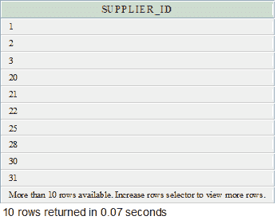
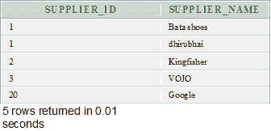

# Oracle 联合运营商

> 原文：<https://www.javatpoint.com/oracle-union>

在 Oracle 中，UNION 运算符用于组合两个或多个 Oracle SELECT 语句的结果集。它结合了两个 SELECT 语句，并删除了它们之间的重复行。/p >

UNION 运算符中的每个 SELECT 语句在具有相似数据类型的结果集中必须具有相同数量的字段。

**语法**

```sql
SELECT expression1, expression2, ... expression_n
FROM table1
WHERE conditions
UNION
SELECT expression1, expression2, ... expression_n
FROM table2
WHERE conditions; 

```

## 因素

**1)表达式 1，表达式 2，...expression_n:** 它指定要检索的列。

**2)表 1，表 2:** 它指定了从中检索记录的表。

**3)条件:**指定要选择的记录必须满足的条件。

**注意:**两个 SELECT 语句中的表达式数量必须相同。

## Oracle UNION 示例:(获取单个字段)

```sql
SELECT supplier_id
FROM suppliers
UNION
SELECT supplier_id
FROM order_details

```

**输出**



在本例中，在表“供应商”和“订单详细信息”中都定义了供应商 id。在 UNION 之后，它将在结果集中出现一次，因为 Oracle UNION 运算符删除了重复的集合。

#### 注意:如果不想删除重复项，请使用 Oracle UNION ALL 运算符。

## Oracle 联合示例:(使用订单依据)

Oracle UNION 运算符可以与 ORDER BY 子句一起使用，对查询结果进行排序。

```sql
SELECT supplier_id, supplier_name
FROM suppliers
WHERE supplier_id <= 20
UNION
SELECT s_id, s_name
FROM shopkeepers
WHERE s_name = 'dhirubhai'
ORDER BY 1;

```

**输出**



在上面的例子中，结果按供应商名称/供应商名称升序排序，如 ORDER BY 1 所示。