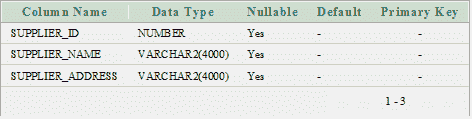
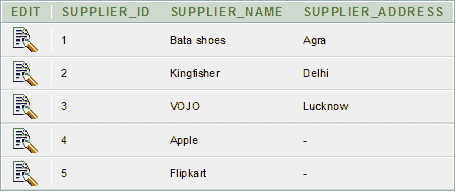
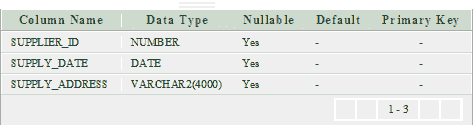
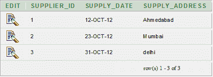
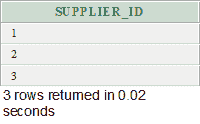
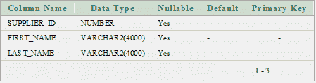
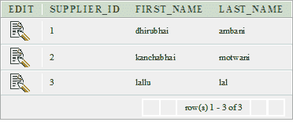
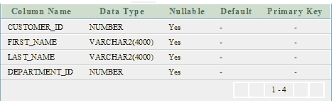
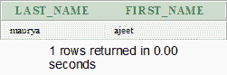

# Oracle 交集运算符

> 原文：<https://www.javatpoint.com/oracle-intersect>

在 Oracle 中，INTERSECT 运算符用于返回两个或更多 SELECT 语句的结果。它从复合选择查询中挑选公共或交叉记录。

**语法**

```sql
SELECT expression1, expression2, ... expression_n
FROM table1
WHERE conditions
INTERSECT
SELECT expression1, expression2, ... expression_n
FROM table2
WHERE conditions;

```

## 因素

**1)表达式 1，表达式 2，...expression_n:** 它指定要检索的列。

**2)表 1，表 2:** 它指定了要从中检索记录的表。

**3)条件:**指定要选择的记录必须满足的条件。

## Oracle INTERSECT 示例:(带单个表达式)

**供应商表**



**供应商数据**



**订单 _ 明细表**



**订单 _ 明细数据**



```sql
SELECT supplier_id
FROM suppliers
INTERSECT
SELECT supplier_id
FROM order_details;

```

在上面的示例中，supplier_id 同时出现在 suppliers 和 order_details 表中。现在，公共条目将返回到结果集中。

**输出**



## Oracle INTERSECT 示例:(带有多个表达式)

**供应商表**



**供应商数据**



**客户表**



**客户数据**


```sql
SELECT supplier_id, last_name, first_name
FROM supplier
WHERE first_name <> 'dhirubhai'
INTERSECT
SELECT customer_id, last_name, first_name
FROM customer
WHERE customer_id < 5;

```

**输出**



上面的示例返回供应商表中的记录，其中 supplier_id、last_name 和 first_name 值与 customer 表的 customer_id、last_name 和 first_name 值匹配。