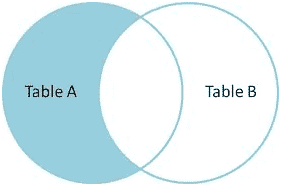
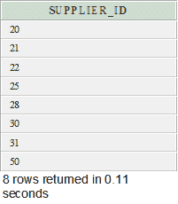

# Oracle 减运算符

> 原文：<https://www.javatpoint.com/oracle-minus>

在 Oracle 中，减运算符用于返回第一条 SELECT 语句中第二条 SELECT 语句未返回的所有行。

每个 SELECT 语句都有一个数据集，减运算符返回第一个数据集中的所有文档，然后从第二个数据集中移除所有文档。

**例如**



**语法**

```
SELECT expression1, expression2, ... expression_n
FROM table1
WHERE conditions
MINUS
SELECT expression1, expression2, ... expression_n
FROM table2
WHERE conditions;

```

## 因素

**1)表达式 1，表达式 2，...expression_n:** 它指定要检索的列。

**2)表 1，表 2:** 它指定了要从中检索记录的表。

**3)条件:**指定要选择的记录必须满足的条件。

#### 注意:对于 SELECT 语句，表达式的数量必须相同，并且具有相似的数据类型。

## Oracle 减例

本示例将从两个表“供应商”和“订单详细信息”中返回一个具有相同数据类型的字段。

```
SELECT supplier_id
FROM suppliers
MINUS
SELECT supplier_id
FROM order_details;

```

**输出**

