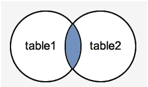
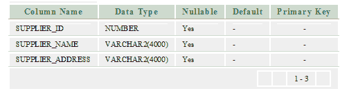
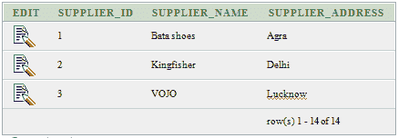
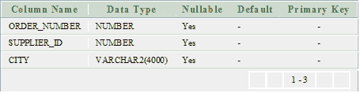
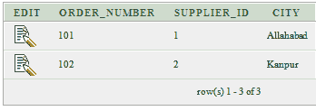
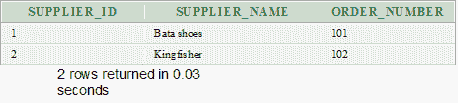

# Oracle INNER JOIN

> 原文：<https://www.javatpoint.com/oracle-inner-join>

内部联接是最简单也是最常见的联接类型。它也被称为简单连接。它返回多个表中满足联接条件的所有行。

**语法**

```
SELECT columns
FROM table1 
INNER JOIN table2
ON table1.column = table2.column; 

```

**内部连接的图像表示**



## Oracle 内部连接示例

让我们举一个例子，在两个表“供应商”和“订单 1”上执行内部连接。

**供应商**




**订单 1**




本示例将返回“供应商”和“订单 1”表中的所有行，其中在“供应商”和“订单 1”表中都有匹配的 supplier_id 值。

## 执行以下查询

```
SELECT suppliers.supplier_id, suppliers.supplier_name, order1.order_number
FROM suppliers 
INNER JOIN order1
ON suppliers.supplier_id = order1.supplier_id;

```

**输出**

