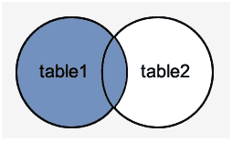
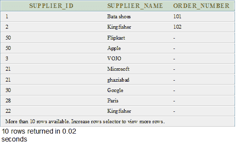
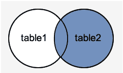
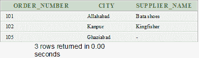
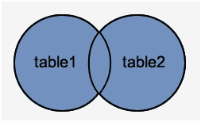
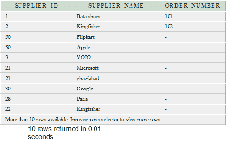

# Oracle OUTER JOIN

> 原文：<https://www.javatpoint.com/oracle-outer-join>

外部联接类似于等联接，但它也从表中获取不匹配的行。Oracle 9i ANSI/ISO 1999 标准将其分为左外连接、右外连接和全外连接。

## 左外连接

左外联接返回开条件中指定的左(第一)表中的所有行，并且只返回右(第二)表中满足联接条件的那些行。

**语法**

```
SELECT columns
FROM table1
LEFT [OUTER] JOIN table2
ON table1.column = table2.column; 

```

**左外连接的图像表示**



**例**

在本例中，我们对已经创建的表执行左外连接？供应商？然后呢。订单 1？。

以下示例将返回表中的所有记录。供应商？只有表中的记录吗？订单 1？其中连接字段相等。

**执行该查询**

```
SELECT suppliers.supplier_id, suppliers.supplier_name, order1.order_number
FROM suppliers
LEFT OUTER JOIN order1
ON suppliers.supplier_id = order1.supplier_id;

```

**输出**



## 右外连接

右外联接返回右侧表中在“开”条件下指定的所有行，并且只返回另一个表中满足联接条件的那些行。

**语法**

```
SELECT columns
FROM table1
RIGHT [OUTER] JOIN table2
ON table1.column = table2.column; 

```

**右外连接的图像表示**



**例**

在本例中，我们对已经创建的表执行右外连接？供应商？然后呢。订单 1？。

以下示例将返回 order1 表中的所有行，并且只返回 suppliers 表中满足联接条件的那些行。

**执行该查询**

```
SELECT order1.order_number, order1.city, suppliers.supplier_name
FROM suppliers
RIGHT OUTER JOIN order1
ON suppliers.supplier_id = order1.supplier_id;

```

**输出**



## 完全外部连接

完全外部联接返回左侧表和右侧表中的所有行。它将空值放在不满足连接条件的地方。

**语法**

```
SELECT columns
FROM table1
FULL [OUTER] JOIN table2
ON table1.column = table2.column; 

```

**全外连接的图像表示**



**例**

在本例中，我们对已经创建的表执行完全外部联接？供应商？然后呢。订单 1？。

下面的示例将返回？供应商？表和中的所有行。订单 1？表，每当不满足联接条件时，它就放置空值。

**执行该查询**

```
SELECT suppliers.supplier_id, suppliers.supplier_name, order1.order_number
FROM suppliers
FULL OUTER JOIN order1
ON suppliers.supplier_id = order1.supplier_id;

```

**输出**

