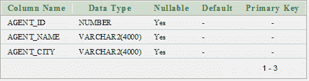
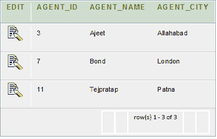
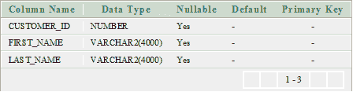
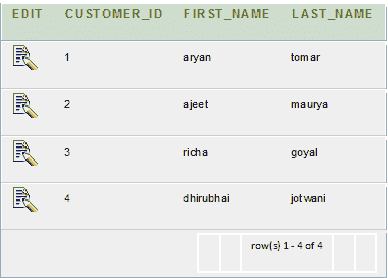
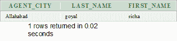

# Oracle 等同连接

> 原文：<https://www.javatpoint.com/oracle-equi-join>

Oracle Equi 联接返回关联表的匹配列值。它在 WHERE 子句中使用比较运算符来引用等式。

**语法**

```sql
SELECT column_list 
FROM table1, table2....
WHERE table1.column_name =
table2.column_name;

```

也可以通过使用连接关键字后跟开关键字，然后指定列名及其关联的表来检查相等性来执行相等连接。

**语法**

```sql
SELECT *
FROM table1 
JOIN table2
[ON (join_condition)] 

```

## Oracle EQUI JOIN 示例

让我们拿两张桌子“代理”和“客户”。

**代理商表**



**代理数据**



**客户表**



**客户数据**



**执行该查询**

```sql
SELECT agents.agent_city,customer.last_name,  
customer.first_name 
FROM agents,customer  
WHERE agents.agent_id=customer.customer_id;  

```

**输出**

