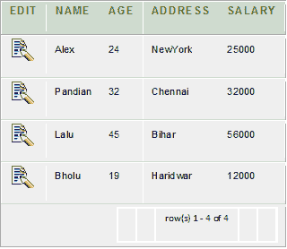
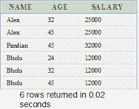

# Oracle SELF JOIN

> 原文：<https://www.javatpoint.com/oracle-self-join>

自联接是联接的一种特定类型。在自连接中，表与其自身连接(一元关系)。自联接只是指定表的每一行都与其自身以及表的每隔一行相结合。

**语法**

```
SELECT a.column_name, b.column_name... 
FROM table1 a, table1 b 
WHERE a.common_filed = b.common_field; 

```

## 甲骨文自联接示例

我们来看一张“顾客”的桌子。



使用 SELF JOIN 连接此表，如下所示:

```
SELECT  a.name, b.age, a.SALARY
FROM CUSTOMERS a, CUSTOMERS b
WHERE a.SALARY < b.SALARY;

```

**输出**

