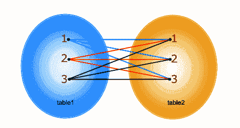
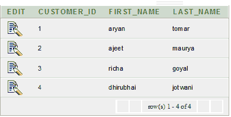
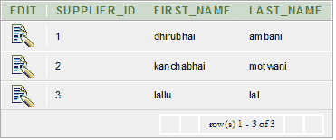
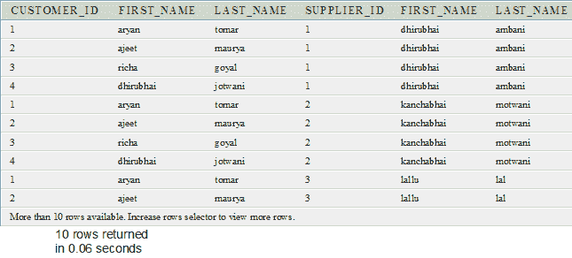

# Oracle 交叉连接(笛卡尔乘积)

> 原文：<https://www.javatpoint.com/oracle-cross-join>

CROSS JOIN 指定第一个表的所有行与第二个表的所有行连接。如果表 1 中有“x”行，表 2 中有“y”行，则交叉连接结果集有 x*y 行。当没有指定匹配的联接列时，通常会出现这种情况。

简单地说，如果连接查询中的两个表没有连接条件，那么 Oracle 返回它们的笛卡尔乘积。

**语法**

```sql
SELECT * 
FROM table1 
CROSS JOIN table2;

```

**或**

```sql
SELECT * FROM table1, table2

```

上述两种语法都是相同的，并且用于笛卡尔乘积。它们在执行后提供类似的结果。

**交叉连接的图像表示**



## Oracle 交叉连接示例

我们来看两张表“客户”和“供应商”。

**客户表明细**

```sql
CREATE TABLE  "CUSTOMER" 
   (	"CUSTOMER_ID" NUMBER, 
	"FIRST_NAME" VARCHAR2(4000), 
	"LAST_NAME" VARCHAR2(4000)
   )
/

```



**供应商表明细**

```sql
CREATE TABLE  "SUPPLIER" 
   (	"SUPPLIER_ID" NUMBER, 
	"FIRST_NAME" VARCHAR2(4000), 
	"LAST_NAME" VARCHAR2(4000)
   )
/

```



**执行该查询**

```sql
SELECT * FROM customer,supplier

```

**输出**

