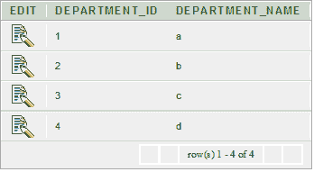
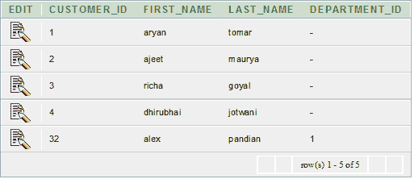
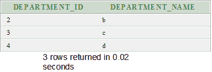

# 甲骨文反加入

> 原文：<https://www.javatpoint.com/oracle-anti-join>

反连接用于使查询运行得更快。这是一个非常强大的 SQL 构造，甲骨文提供了更快的查询。

两个表之间的反连接返回第一个表中在第二个表中找不到匹配项的行。它与半连接相反。反联接返回第一个表中未找到匹配项的每一行的一个副本。

反连接是使用“不存在”或“不在”构造编写的。

**例**

让我们拿两张表“部门”和“客户”

**部门表**

```
CREATE TABLE  "DEPARTMENTS" 
   (	"DEPARTMENT_ID" NUMBER(10,0) NOT NULL ENABLE, 
	"DEPARTMENT_NAME" VARCHAR2(50) NOT NULL ENABLE, 
	 CONSTRAINT "DEPARTMENTS_PK" PRIMARY KEY ("DEPARTMENT_ID") ENABLE
   )
/

```



**客户表**

```
CREATE TABLE  "CUSTOMER" 
   (	"CUSTOMER_ID" NUMBER, 
	"FIRST_NAME" VARCHAR2(4000), 
	"LAST_NAME" VARCHAR2(4000), 
	"DEPARTMENT_ID" NUMBER
   )
/

```



**执行该查询**

```
SELECT   departments.department_id, departments.department_name
        FROM     departments
        WHERE    NOT EXISTS
                 (
                 SELECT 1
                 FROM   customer
                 WHERE customer.department_id = departments.department_id
                 )
        ORDER BY departments.department_id;

```

**输出**

