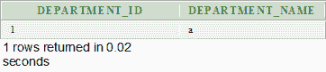

# Oracle 半连接

> 原文：<https://www.javatpoint.com/oracle-semi-join>

Oracle 8.0 引入了半连接。它提供了一种执行 WHERE EXISTS 子查询的有效方法。

半联接返回第一个表中至少找到一个匹配项的每一行的一个副本。

半连接是使用 EXISTS 构造编写的。

## Oracle 半连接示例

让我们拿两张表“部门”和“客户”

**部门表**

```sql
CREATE TABLE  "DEPARTMENTS" 
   (	"DEPARTMENT_ID" NUMBER(10,0) NOT NULL ENABLE, 
	"DEPARTMENT_NAME" VARCHAR2(50) NOT NULL ENABLE, 
	 CONSTRAINT "DEPARTMENTS_PK" PRIMARY KEY ("DEPARTMENT_ID") ENABLE
   )
/

```


**客户表**

```sql
CREATE TABLE  "CUSTOMER" 
   (	"CUSTOMER_ID" NUMBER, 
	"FIRST_NAME" VARCHAR2(4000), 
	"LAST_NAME" VARCHAR2(4000), 
	"DEPARTMENT_ID" NUMBER
   )
/

```


**执行该查询**

```sql
SELECT   departments.department_id, departments.department_name
        FROM     departments
        WHERE    EXISTS
                 (
                 SELECT 1
                 FROM   customer
                 WHERE customer.department_id = departments.department_id
                 )
        ORDER BY departments.department_id;

```

**输出**



## 反连接和半连接的区别

半联接返回第一个表中至少找到一个匹配项的每一行的一个副本，而反联接返回第一个表中没有找到匹配项的每一行的一个副本。