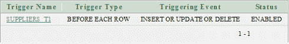

# Oracle 在插入/更新/删除触发器之前

> 原文：<https://www.javatpoint.com/oracle-before-trigger>

该语句指定 Oracle 将在执行插入/更新或删除操作之前触发此触发器**。**

 ****语法**

```sql
CREATE [ OR REPLACE ] TRIGGER trigger_name
BEFORE INSERT or UPDATE or DELETE
 ON table_name
  [ FOR EACH ROW ]
DECLARE
   -- variable declarations
BEGIN
   -- trigger code
EXCEPTION
   WHEN ...
   -- exception handling
END;

```

## 因素

**OR REPLACE:** 为可选参数。如果触发器已经存在，则使用它来重新创建触发器。它便于您在不使用 DROP TRIGGER 语句的情况下更改触发器定义。

**trigger_name:** 指定要创建的触发器的名称。

**INSERT 或 UPDATE 或 DELETE 之前:**指定在执行 INSERT 或 UPDATE 或 DELETE 操作之前触发触发器。

**table_name:** 指定正在执行触发操作的表的名称。

## 限制

*   无法在视图上创建 BEFORE 触发器。
*   您不能更新旧值。
*   您只能更新新值。

## Oracle 触发器前示例

考虑一下，您有一个包含以下参数的“供应商”表。

```sql
CREATE TABLE  "SUPPLIERS" 
   (	"SUPPLIER_ID" NUMBER, 
	"SUPPLIER_NAME" VARCHAR2(4000), 
	"SUPPLIER_ADDRESS" VARCHAR2(4000)
   )
/

```

您可以使用以下**创建触发器查询**来创建插入或更新或删除触发器之前:

```sql
CREATE OR REPLACE TRIGGER  "SUPPLIERS_T1" 
BEFORE
insert or update or delete on "SUPPLIERS"
for each row
begin
when the person performs insert/update/delete operations into the table.
end;
/
ALTER TRIGGER  "SUPPLIERS_T1" ENABLE
/

```

这里的触发器名是“SUPPLIERS _ T1”，在对表“SUPPORTS”执行插入、更新或删除操作之前触发。

**