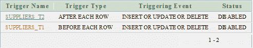

# Oracle 禁用触发器

> 原文：<https://www.javatpoint.com/oracle-disable-trigger>

ALTER TRIGGER 语句用于禁用触发器。

**语法**

```
ALTER TRIGGER trigger_name DISABLE; 

```

## 因素

**trigger_name:** 指定要禁用的触发器的名称。

## 甲骨文禁用触发器示例

```
ALTER TRIGGER SUPPLIERS_T2 DISABLE; 

```

本示例将禁用表“供应商”中名为“供应商 _T2”的触发器。

## 甲骨文禁用所有触发器示例

如果一个表中有多个触发器，并且您想禁用数据库中的所有触发器，那么您可以通过 ALTER TABLE 语句来实现。

**语法**

```
ALTER TABLE table_name DISABLE ALL TRIGGERS; 

```

**例**

```
ALTER TABLE SUPPLIERS DISABLE ALL TRIGGERS;

```

本示例将禁用“供应商”表中的所有触发器。

