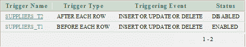
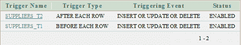

# Oracle 启用触发器

> 原文：<https://www.javatpoint.com/oracle-enable-trigger>

ALTER TRIGGER 语句用于启用触发器。

**语法**

```
ALTER TRIGGER trigger_name ENABLE; 

```

## 因素

**trigger_name:** 指定要启用的触发器的名称。

## Oracle 启用触发器示例

```
ALTER TRIGGER SUPPLIERS_T1 ENABLE; 

```

本示例将启用“供应商”表中名为“供应商 _T1”的触发器。



## Oracle 启用所有触发器示例

**语法**

```
ALTER TABLE table_name ENABLE ALL TRIGGERS;

```

**例**

```
ALTER TABLE SUPPLIERS ENABLE ALL TRIGGERS;

```

此示例将启用表名“SUPPLIERS”中的所有触发器。

