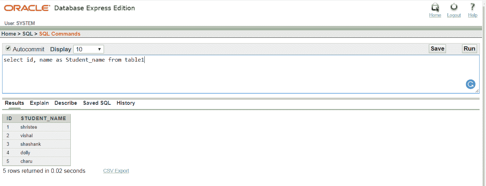

# ORACLE 别名

> 噻:[https://www . javatppoint . com/Oracle-aliases](https://www.javatpoint.com/oracle-aliases)

在 Oracle 中，别名也可以在列名和表名中实现。别名是为了给列或表一个临时的。

## 列的语法:

```sql

Column_name AS alias_name

```

## 表的语法:

```sql

Table_name  alias_name

```

## 因素

**列名:**列的原名称

**表名:**表的原名称

**别名 _ 名称:**临时名称

## 表格:


## 例 1

从表 1 中选择身份证、姓名作为学生姓名



## 例 2

从表 1 s 中选择 s.id，s.name

