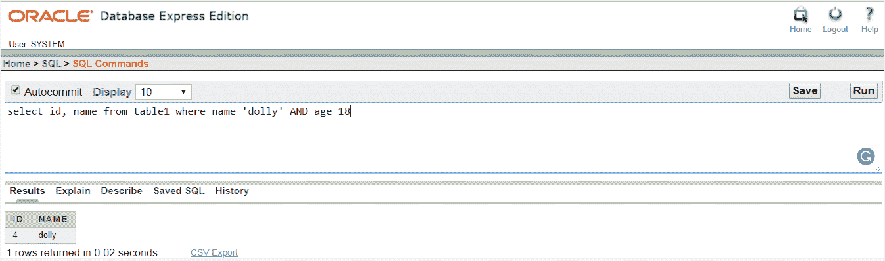
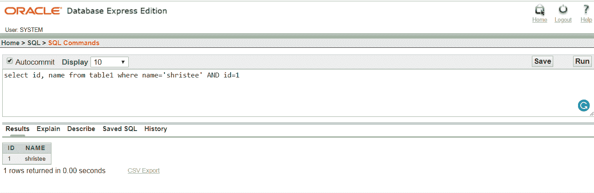

# Oracle 与

> 原文：<https://www.javatpoint.com/oracle-and>

在 Oracle 中，“与”用于选择、插入、删除或更新语句，以检查两个或多个条件。

## 句法

```sql

Where condition 1
AND condition 2
.
.
.
.
AND condition n

```

## 因素

条件 1，条件 2，......，条件 n:匹配记录的条件。

## 表格:


## 例 1

从表 1 中选择身份证、姓名，其中姓名=多莉，年龄=18 岁



## 例 2

从表 1 中选择 id、名称，其中名称='shristee '且 id=1

