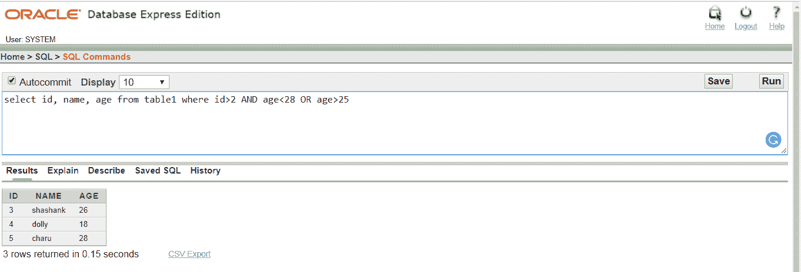

# 甲骨文和或

> 原文：<https://www.javatpoint.com/oracle-and-or>

在 Oracle 中，AND & OR 可以组合使用在 select、insert、delete 或 update 语句中，用于检查两个或多个条件。

## 句法

```

Where condition 1
AND condition 2
.
.
.
.
AND condition n

```

## 因素

条件 1，条件 2，....，条件 n:匹配记录的条件。

## 表格:


## 例 1

从表 1 中选择身份证、姓名、年龄，其中身份证> 2，年龄<28 OR age> 25

