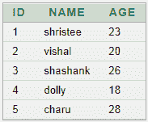
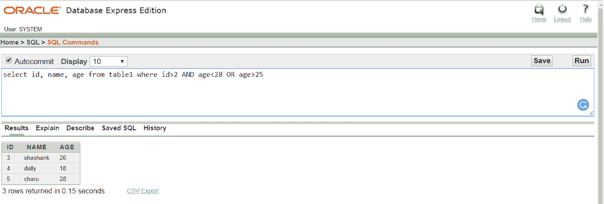

# 甲骨文之间

> 原文：<https://www.javatpoint.com/oracle-between>

在 Oracle 中，BETWEEN 用于获取 select、insert、delete 或 update 语句中给定范围内的值

## 句法

```

Expression BETWEEN value1 AND value2;

```

## 因素

表达式:列名

值 1 和值 2:范围值

## 表格:



## 例 1

从表 1 中选择身份证、姓名、年龄，年龄在 20 至 28 岁之间

