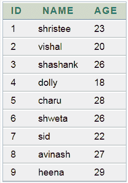
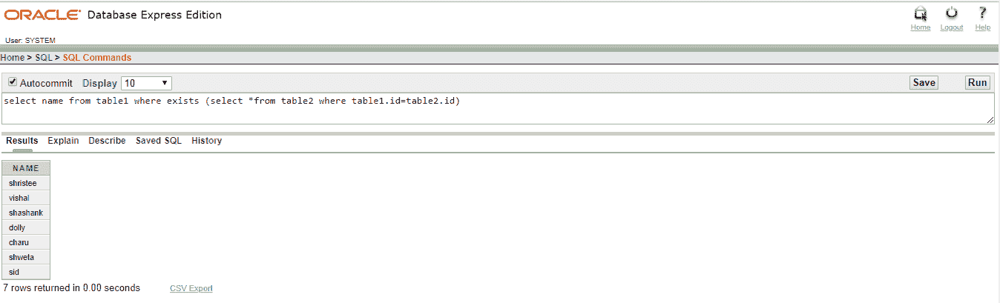
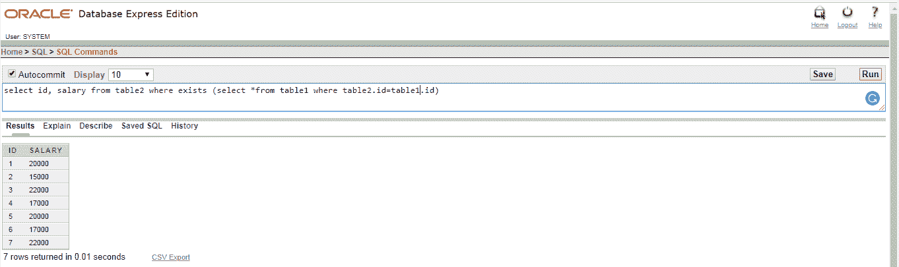
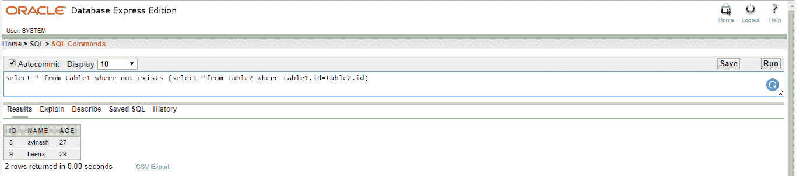

# ORACLE EXISTS

> 原文：<https://www.javatpoint.com/oracle-exists>

在 Oracle 中，exists 子句与 select、insert、update、delete 语句一起使用。它用于组合查询和创建子查询。

## 句法

```sql

Where exists (subquery)

```

## 因素

**子查询:**它是一个 select 语句，至少返回一个记录集。

## 表 1:



## 表 1:


## 例 1

**查询:**从存在的表 1 中选择名称(从表 2 中选择*表 1 . id =表 2.id)



## 例 2

**查询:**从存在的表 2 中选择 id、薪资(从表 2 . id =表 1.id 的表 1 中选择*



## 例 3

**查询:**从表 1 中选择*不存在(从表 2 中选择*表 1 . id =表 2.id)

