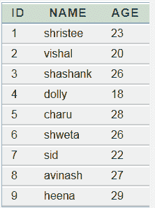
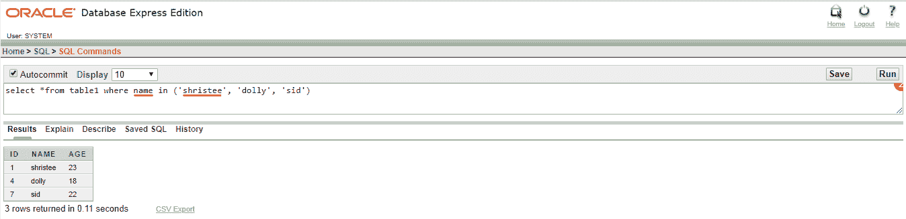

# Oracle

> 原文：<https://www.javatpoint.com/oracle-in>

在 Oracle 中，In 子句与 SELECT、INSERT、UPDATE 或 DELETE 语句一起使用，以减少多个 or 条件的使用。

## 句法

```

expressions IN (value1, value2,.... value n)

```

## 因素

**表达式:**用于获取值的列的名称。

## 表格:



## 例 1

**查询:**从表 1 中选择*其中的名称(‘shristee’、‘dolly’、‘sid’)

