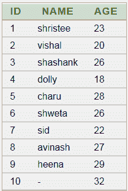
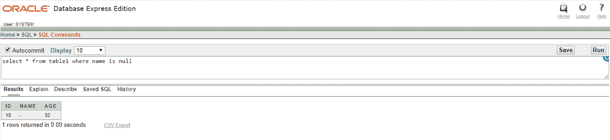

# ORACLE NULL

> 原文：<https://www.javatpoint.com/oracle-is-null>

在甲骨文中，IS NULL 用于检查非空值。它与 select、insert、update 和 delete 语句一起使用。

## 句法

```

expression IS NULL

```

## 因素

**表达式:**列名或任何检查它的值都是空值

### 注意:

1.  在“不为空”中，条件返回真值。
2.  在空值中，条件返回假。

## 表格:



## 例 1

**查询**:从表 1 中选择*名称为空

