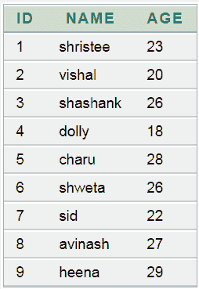
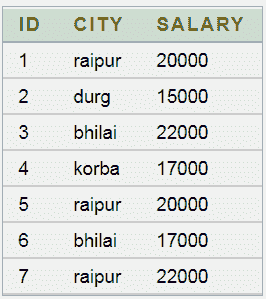
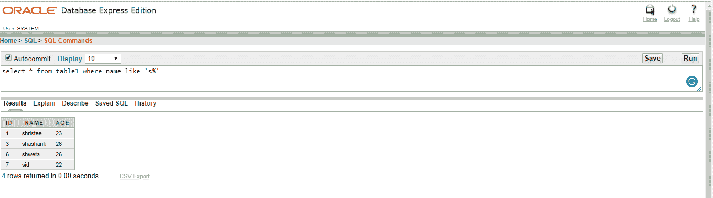
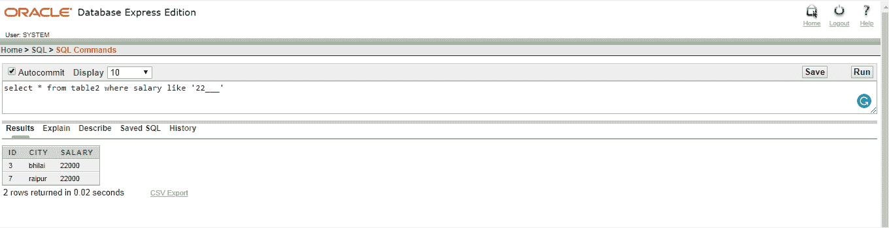
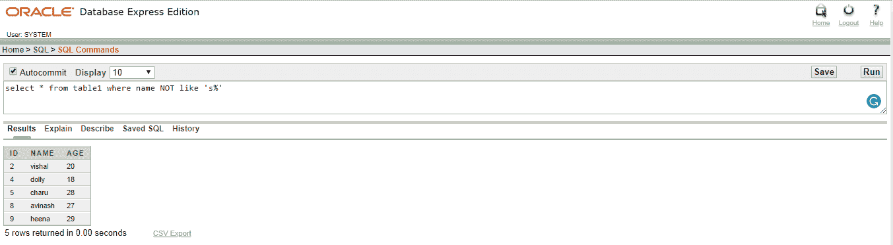

# Oracle 相似条件

> 原文：<https://www.javatpoint.com/oracle-like>

在 oracle 中，like 条件与使用通配符的 where 子句中的 select、insert、update 和 delete 一起使用。它允许模式匹配。

## 句法

```sql

expression LIKE pattern [ESCAPE 'escape_character' ]

```

## 因素

**表达式:**列名。

**模式:**要在表达上匹配的模式。模式可以是下列之一

| 通配符 | 说明 |
| % | 用于匹配字符串 |
| _ | 用于匹配单个字符 |

## 表 1:



## 表 2:



## 例 1

**查询:**从表 1 中选择*名称，如“s%”



## 例 2

**查询:**从表 1 中选择*名称，如“22__”



## 例 3

**查询:**从表 1 中选择*名称不像' s% '

