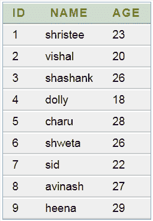
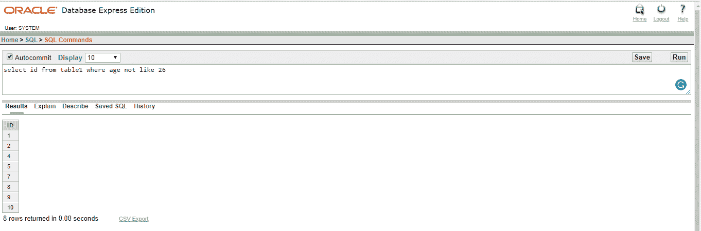
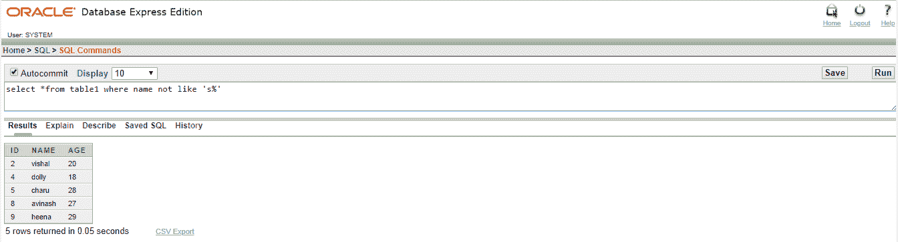

# 甲骨文非条件

> 原文：<https://www.javatpoint.com/oracle-not>

在甲骨文中，非条件用于选择、插入、更新或删除语句。它也被称为非运算符。它用于否定给定的条件。

## 句法

```

NOT condition

```

## 因素

**条件:**要忽略的条件。

## 表格:



## 例 1

**查询:**从表 1 中选择*名称不像 26



## 例 2

**查询:**从表 1 中选择*名称不像“s%”的地方

