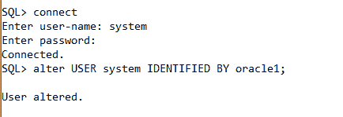

# 修改口令

> 原文：<https://www.javatpoint.com/change-password-in-oracle>

在 Oracle 中，我们可以使用 alter 命令更改密码。

## 语法:

```

ALTER USER user_name IDENTIFIED BY new_password;

```

## 因素

**用户名:**用户名更改密码。

**new_password:** 用户的新密码。

## 例子

