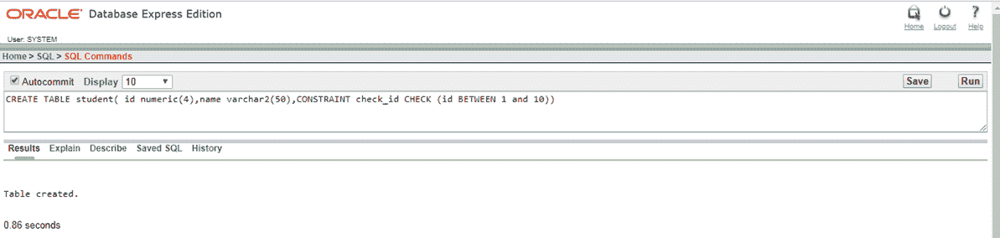
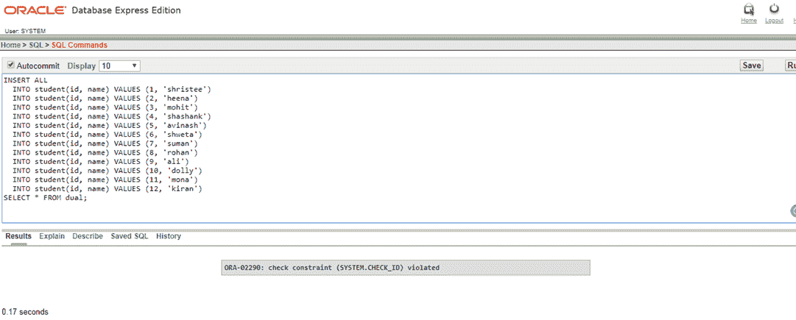
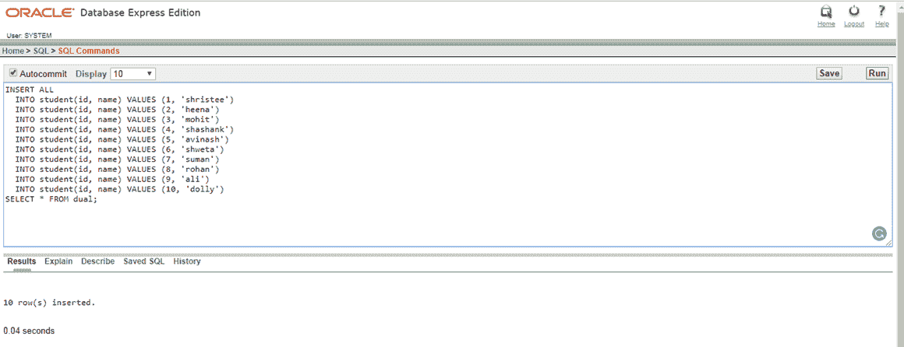

# 检查约束

> 原文：<https://www.javatpoint.com/check-constraints-in-oracle>

在 Oracle 中，检查约束对表的每一行都有特定的条件。

## 使用 CREATE TABLE 语句

## 语法:

```sql

CREATE TABLE table_name
(
  column1 datatype null/not null,
  column2 datatype null/not null,
  ?
  CONSTRAINT constraint_name CHECK (column_name condition) [DISABLE]
);

```

## 例 1

```sql

CREATE TABLE student (id numeric(4), name varchar2(50), CONSTRAINT check_id CHECK(id  BETWEEN 1 and 10))

```



#### 注意:在创建表的过程中，我们应用了一个约束，其中只能插入 1 到 10 行。因此，在下面的查询中插入了 12 个字段。如果将生成错误消息。

```sql

  INSERT ALL
  INTO student(id, name) VALUES (1, 'shristee')
  INTO student(id, name) VALUES (2, 'heena')
  INTO student(id, name) VALUES (3, 'mohit')
  INTO student(id, name) VALUES (4, 'shashank')
  INTO student(id, name) VALUES (5, 'avinash')
  INTO student(id, name) VALUES (6, 'shweta')
  INTO student(id, name) VALUES (7, 'suman')
  INTO student(id, name) VALUES (8, 'rohan')
  INTO student(id, name) VALUES (9, 'ali')
  INTO student(id, name) VALUES (10, 'dolly')
  INTO student(id, name) VALUES (11,?mona?)
  INTO student(id, name) VALUES (12, 'kiran')
  SELECT * FROM dual;

```



```sql

  INSERT ALL
  INTO student(id, name) VALUES (1, 'shristee')
  INTO student(id, name) VALUES (2, 'heena')
  INTO student(id, name) VALUES (3, 'mohit')
  INTO student(id, name) VALUES (4, 'shashank')
  INTO student(id, name) VALUES (5, 'avinash')
  INTO student(id, name) VALUES (6, 'shweta')
  INTO student(id, name) VALUES (7, 'suman')
  INTO student(id, name) VALUES (8, 'rohan')
  INTO student(id, name) VALUES (9, 'ali')
  INTO student(id, name) VALUES (10, 'dolly')
  SELECT * FROM dual;

```

